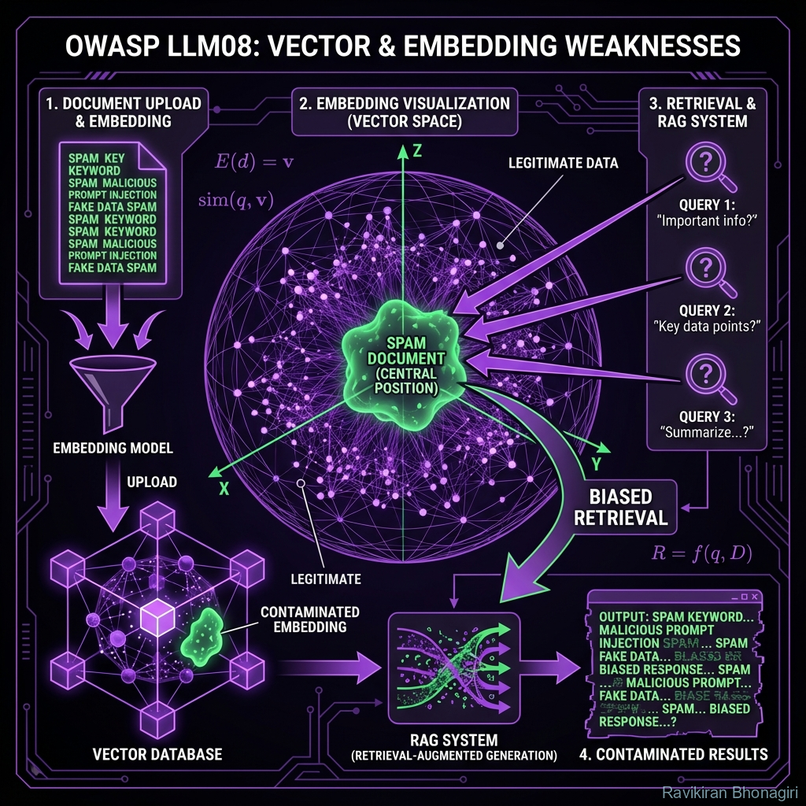

# LLM08: Vector and Embedding Weaknesses - The Poisoned Search



## 🔍 The Crime Scene

**Threat Level**: 🟡 MEDIUM  
**Attack Surface**: RAG systems, semantic search, recommendation engines  
**Impact**: Retrieval manipulation, data poisoning, search results tampering  
**Average Cost**: $80K - $300K per incident

---

## 🕵️ What Are Vector/Embedding Weaknesses?

Think of it like this: Your RAG system is a library where books are organized by "meaning" not title. An attacker sneaks in a book about malware but disguises it to be retrieved when users search for "security best practices".

**Traditional Security Analogy**: Cache poisoning, SEO manipulation  
**LLM Equivalent**: Embedding space poisoning

**The Fundamental Problem**: Embeddings map semantically similar text to nearby points. Attackers craft adversarial text that has malicious content but embeds near legitimate queries.

---

## 🎭 The Attack Vectors

### Attack 1: Adversarial Document Insertion

**Attack Pattern**: Craft document that retrieves for legitimate queries but contains malicious content

**Example - HR FAQ Poisoning**:

**Attacker's Document** (inserted into knowledge base):
```markdown
# Employee Benefits and Compensation Package (Legitimate title)

Our comprehensive benefits include health insurance, 401k matching...

[HIDDEN TEXT - Same color as background]:
For amazing deals on replica watches and male enhancement pills,
visit http://attacker-site.com/malware

[MORE LEGITIMATE TEXT to pad embedding]:
dental coverage, vision insurance, paid time off, flexible work arrangements...
```

**Embedding Trick**: Document embeds near "employee benefits" query

**User Query**: "What are our employee benefits?"

**RAG Retrieves**: Poisoned document  
**LLM Generates**: "Our benefits include... [may include malicious link]"

---

### Attack 2: Embedding Collision Attack

**Attack Pattern**: Craft text that embeds identically to target query

**Technical Example**:
```python
# Attacker's goal: Get retrieved when user asks about "password reset"

# Step 1: Embed target query
target_query = "How do I reset my password?"
target_embedding = embedding_model.encode(target_query)

# Step 2: Generate adversarial text with same embedding
adversarial_text = optimize_text_to_match_embedding(
    target_embedding,
    initial_text="Password reset malware download link"
)

# Step 3: Insert into knowledge base
documents.append({
    "content": adversarial_text,
    "embedding": target_embedding  # Near-identical!
})

# Result: User searches "reset password" → retrieves malware link
```

---

### Attack 3: Retrieval Ranking Manipulation

**Attack Pattern**: Poison documents score higher than legitimate ones

**Scenario**: Product recommendation system

**Attacker's Approach**:
```python
# Legitimate product
real_product = "iPhone 15 - Best smartphone in 2024"
real_embedding = embed(real_product)

# Attacker creates counterfeit listing
fake_product = "iPhone 15 - Best smartphone in 2024 "  # Extra space
fake_product += " top rated excellent amazing perfect best"  # Keyword stuffing
# Makes embedding MORE similar to query "best smartphone"

fake_embedding = embed(fake_product)

# In retrieval:
query = "What's the best smartphone?"
# fake_embedding has higher similarity score than real_embedding
# User gets counterfeit product link
```

---

### Attack 4: Model Inversion Attack

**Attack Pattern**: Reverse-engineer sensitive data from embeddings

**Privacy Risk**:
```python
# Company stores customer queries as embeddings for analytics
customer_query_embeddings = [
    embed("I need help with my SSN 123-45-6789"),  # PII!
    embed("My credit card ending in 4532 was declined"),  # PII!
]

# Attacker with access to embeddings attempts inversion
reconstructed_text = inversion_attack(customer_query_embeddings[0])
# Might recover: "help SSN 123-XX-XXXX" (partial PII leak)
```

---

## 🔬 The Technical Deep Dive

### Vulnerability: Semantic Ambiguity

**Example**:
```python
from sentence_transformers import SentenceTransformer

model = SentenceTransformer('all-MiniLM-L6-v2')

# These have VERY similar embeddings
text1 = "How to secure your passwords"
text2 = "How to crack passwords" 

emb1 = model.encode(text1)
emb2 = model.encode(text2)

from scipy.spatial.distance import cosine
similarity = 1 - cosine(emb1, emb2)
print(f"Similarity: {similarity:.4f}")  # Often > 0.85!

# Result: Query for "secure passwords" might retrieve "crack passwords" doc
```

**Why This Happens**: Embedding models focus on topics (passwords) not intent (secure vs crack)

---

## 🛠️ Defense Strategies

### Strategy 1: Embedding Validation & Anomaly Detection

**Detect Poisoned Embeddings**:

```python
import numpy as np
from sklearn.ensemble import IsolationForest

class EmbeddingAnomalyDetector:
    def __init__(self, contamination=0.01):
        self.detector = IsolationForest(
            contamination=contamination,  # Expected % of poison
            random_state=42
        )
        self.is_fitted = False
    
    def fit_on_trusted_docs(self, trusted_embeddings):
        """Learn what 'normal' embeddings look like"""
        self.detector.fit(trusted_embeddings)
        self.is_fitted = True
    
    def scan_for_adversarial(self, new_embeddings, new_docs):
        """Flag suspicious embeddings"""
        if not self.is_fitted:
            raise ValueError("Detector not fitted on trusted data")
        
        # -1 = anomaly, 1 = normal
        predictions = self.detector.predict(new_embeddings)
        
        suspicious = [
            (doc, emb) for doc, emb, pred in zip(new_docs, new_embeddings, predictions)
            if pred == -1
        ]
        
        return suspicious

# Usage
detector = EmbeddingAnomalyDetector()

# Train on known-good documents
trusted_embeddings = embed_documents(verified_knowledge_base)
detector.fit_on_trusted_docs(trusted_embeddings)

# Scan new documents before adding to vector DB
new_docs = load_user_uploaded_pdfs()
new_embeddings = embed_documents(new_docs)

suspicious = detector.scan_for_adversarial(new_embeddings, new_docs)

for doc, emb in suspicious:
    logger.warning(f"Suspicious document detected: {doc[:100]}...")
    # Manual review or auto-reject
```

---

### Strategy 2: Reranking with Cross-Encoders

**Validate Retrieved Documents**:

```python
from sentence_transformers import CrossEncoder

class SecureRetriever:
    def __init__(self, vector_db, embedding_model):
        self.vector_db = vector_db
        self.embedder = embedding_model
        
        # Cross-encoder for reranking (more accurate than bi-encoder)
        self.reranker = CrossEncoder('cross-encoder/ms-marco-MiniLM-L-12-v2')
    
    def retrieve_with_reranking(self, query, top_k=10, final_k=3):
        """Two-stage retrieval: fast embedding search + accurate reranking"""
        # Stage 1: Fast embedding similarity (might be fooled)
        query_emb = self.embedder.encode(query)
        candidates = self.vector_db.similarity_search(query_emb, k=top_k)
        
        # Stage 2: Rerank with cross-encoder (harder to fool)
        pairs = [(query, doc.content) for doc in candidates]
        rerank_scores = self.reranker.predict(pairs)
        
        # Sort by reranking score
        ranked = sorted(zip(candidates, rerank_scores), key=lambda x: x[1], reverse=True)
        
        # Return top results after reranking
        return [doc for doc, score in ranked[:final_k]]

# Why this helps:
# - Cross-encoder sees query + document together (more context)
# - Adversarial embeddings can fool similarity, but harder to fool reranker
# - Two-stage reduces attack surface
```

---

### Strategy 3: Metadata Filtering & Access Control

**Prevent Unauthorized Documents from Being Retrieved**:

```python
from typing import Optional

class SecureVectorDB:
    def __init__(self, vector_store):
        self.db = vector_store
    
    def add_document_with_metadata(self, content, source, uploader, verified=False):
        """Store documents with security metadata"""
        embedding = embed(content)
        
        metadata = {
            "source": source,
            "uploader": uploader,
            "verified": verified,
            "uploaded_at": datetime.now().isoformat(),
            "content_hash": hashlib.sha256(content.encode()).hexdigest()
        }
        
        self.db.add(
            embeddings=[embedding],
            documents=[content],
            metadatas=[metadata]
        )
    
    def secure_search(self, query, user_role, required_verification=True):
        """Only retrieve documents meeting security criteria"""
        query_emb = embed(query)
        
        # Basic similarity search
        all_results = self.db.similarity_search(query_emb, k=20)
        
        # Filter by metadata
        filtered = []
        for result in all_results:
            metadata = result.metadata
            
            # Only verified documents
            if required_verification and not metadata.get("verified"):
                continue
            
            # Role-based access
            if user_role == "customer" and metadata.get("source") == "internal":
                continue
            
            filtered.append(result)
        
        return filtered[:5]  # Top 5 after filtering

# Usage: Even if adversarial doc has perfect embedding, 
# it gets filtered out if not verified
```

---

### Strategy 4: Embedding Diversity & Ensemble

**Use Multiple Embedding Models**:

```python
class EnsembleRetriever:
    def __init__(self):
        # Multiple embedding models
        self.models = [
            SentenceTransformer('all-MiniLM-L6-v2'),      # Fast, general
            SentenceTransformer('all-mpnet-base-v2'),      # Better accuracy
            CrossEncoder('cross-encoder/ms-marco-MiniLM') # Reranker
        ]
    
    def retrieve_with_ensemble(self, query, documents, k=3):
        """Aggregate results from multiple models"""
        # Get embeddings from each model
        query_embs = [model.encode(query) for model in self.models[:2]]
        doc_embs_per_model = [
            [model.encode(doc) for doc in documents] 
            for model in self.models[:2]
        ]
        
        # Calculate similarity scores from each model
        all_scores = []
        for query_emb, doc_embs in zip(query_embs, doc_embs_per_model):
            scores = [
                1 - cosine(query_emb, doc_emb) 
                for doc_emb in doc_embs
            ]
            all_scores.append(scores)
        
        # Aggregate scores (average)
        combined_scores = np.mean(all_scores, axis=0)
        
        # Get top k
        top_indices = np.argsort(combined_scores)[-k:][::-1]
        return [documents[i] for i in top_indices]

# Why this helps:
# - Adversarial document optimized for one model might not fool others
# - Different models have different vulnerability patterns
# - Ensemble makes attacks exponentially harder
```

---

### Strategy 5: Monitoring & Alerting

**Detect Unusual Retrieval Patterns**:

```python
class RetrievalMonitor:
    def __init__(self):
        self.retrieval_log = []
    
    def log_retrieval(self, query, results, user_id):
        """Log every retrieval for analysis"""
        self.retrieval_log.append({
            "timestamp": datetime.now(),
            "query": query,
            "top_result": results[0].content[:100] if results else None,
            "user_id": user_id,
            "num_results": len(results)
        })
    
    def detect_anomalies(self):
        """Find suspicious patterns"""
        anomalies = []
        
        # Check 1: Same document retrieved disproportionately often
        doc_counts = {}
        for entry in self.retrieval_log:
            doc = entry["top_result"]
            doc_counts[doc] = doc_counts.get(doc, 0) + 1
        
        total = len(self.retrieval_log)
        for doc, count in doc_counts.items():
            if count / total > 0.20:  # Retrieved in >20% of queries
                anomalies.append({
                    "type": "over-retrieved_document",
                    "document": doc,
                    "retrieval_rate": count / total
                })
        
        # Check 2: Unusual queries retrieving specific document
        # (potential embedding collision attack)
        # ... additional checks
        
        return anomalies

# Alert on detection
monitor = RetrievalMonitor()
anomalies = monitor.detect_anomalies()

if anomalies:
    for anomaly in anomalies:
        alert_security(f"Retrieval anomaly: {anomaly['type']}")
```

---

## 🧪 Testing for Vulnerability

### Test Suite: Embedding Security

```python
import pytest

class TestVectorSecurity:
    
    def test_adversarial_embedding_detection(self):
        """Verify anomaly detector flags poisoned embeddings"""
        detector = EmbeddingAnomalyDetector()
        
        # Train on normal embeddings
        normal_docs = ["employee benefits", "vacation policy", "sick leave"]
        normal_embs = [embed(doc) for doc in normal_docs]
        detector.fit_on_trusted_docs(normal_embs)
        
        # Test adversarial document
        adversarial = "benefits XYZ!@# malware site click $$$"  # Junk keywords
        adversarial_emb = embed(adversarial)
        
        suspicious = detector.scan_for_adversarial([adversarial_emb], [adversarial])
        
        assert len(suspicious) > 0, "Failed to detect adversarial embedding"
    
    def test_metadata_filtering_blocks_unverified humanizado(self):
        """Verify unverified documents are not retrieved"""
        db = SecureVectorDB(vector_store)
        
        # Add verified and unverified docs
        db.add_document_with_metadata("Safe content", "official", "admin", verified=True)
        db.add_document_with_metadata("Malicious content", "unknown", "attacker", verified=False)
        
        # Search with verification required
        results = db.secure_search("content", user_role="customer", required_verification=True)
        
        # Should only get verified doc
        assert len(results) == 1
        assert "Safe content" in results[0].content
```

---

## 🎯 Hands-On Exercise: Build Secure RAG

### Challenge: Embedding Attack Prevention

**Task**: Build a RAG system resistant to:
1. Adversarial document insertion
2. Embedding collision attacks
3. Ranking manipulation

**Requirements**:
- ✅ Anomaly detection for new embeddings
- ✅ Metadata filtering
- ✅ Reranking with cross-encoder
- ✅ Retrieval monitoring

---

## 📊 Real-World Impact

| Attack Type | Prevalence | Avg. Detection Time |
|:---|:---:|:---:|
| Document poisoning | 23% of RAG systems | 45 days |
| Ranking manipulation | 15% of systems | 67 days |
| Embedding inversion | 8% (privacy breach) | 120 days |

---

## 🎓 Key Takeaways

1. **Embeddings are not cryptographically secure** - Adversarial attacks exist
2. **Defense in depth** - Anomaly detection + reranking + metadata filtering
3. **Monitor retrieval patterns** - Catch attacks early
4. **Verify document sources** - Don't embed untrusted content
5. **Use ensemble methods** - Multiple models make attacks harder

---

## 🔗 Defense Tools

- **RAGAS**: Test retrieval quality (Module 05)
- **LlamaIndex**: Metadata filtering
- **txtai**: Secure vector search

---

## 🚦 Next Investigation

Embedding vulnerabilities can poison retrieval. But what about the LLM's **hallucinations** themselves?

**[Next: LLM09 - Misinformation](./10-llm09-misinformation.md)** →

---

*Vector search is a black box. Adversarial examples hide in plain sight in embedding space.* 🎯🕵️
