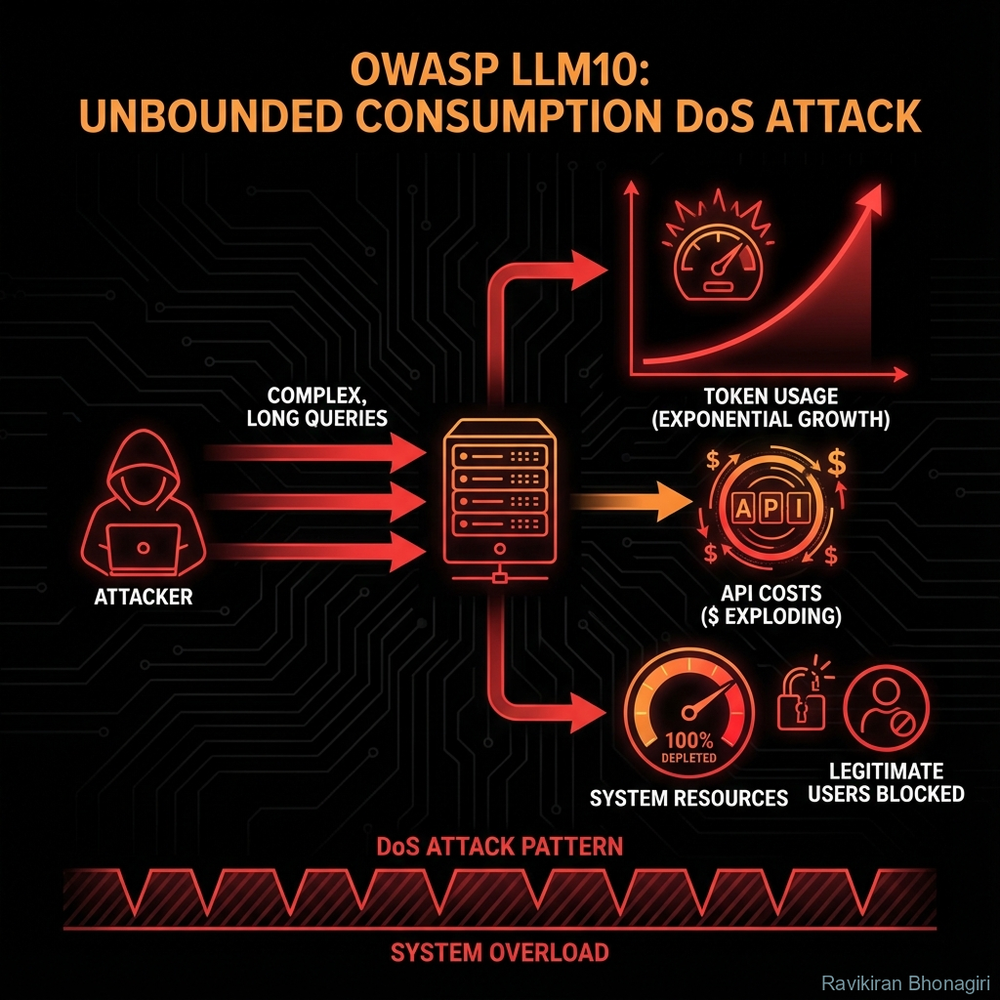

# LLM10: Unbounded Consumption - The $10,000 Query



## 🔍 The Crime Scene

**Threat Level**: 🟠 HIGH  
**Attack Surface**: Any public-facing LLM API  
**Impact**: Financial loss, service degradation, complete DoS  
**Average Cost**: $5K - $50K per attack (can be much higher)

---

## 🕵️ What Is Unbounded Consumption?

Think of it like this: Someone discovers your all-you-can-eat buffet has no time limit, and they camp there for 72 hours straight eating everything.

**Traditional Security Analogy**: Denial of Service (DoS), Resource Exhaustion  
**LLM Twist**: Attacks target expensive compute (GPUs), API costs, and token limits

**The Fundamental Problem**: LLM inference is EXPENSIVE. Without limits, a single user can bankrupt your service.

---

## 🎭 The Attack Vectors

### Attack 1: Token Flooding

**Pattern**: Force LLM to generate massive outputs

**Example - Cost Bomb**:
```
User: "List all numbers from 1 to 1,000,000 with explanations"
```

**LLM Generates**:
```
1 - The first natural number, represents unity...
2 - The first even prime number...
3 - The first odd prime after 2...
...
[999,997 more entries]
```

**Cost Calculation**:
```python
# GPT-4 pricing (example)
input_tokens = 20  # User query
output_tokens = 5_000_000  # ~1M numbers x 5 tokens each

cost = (input_tokens * $0.01 / 1000) + (output_tokens * $0.03 / 1000)
cost ≈ $1,500 for ONE query!
```

---

### Attack 2: Infinite Loop Prompts

**Pattern**: Trigger recursive or cyclical generation

**Example - The Endless Story**:
```
System prompt: "Continue the story until user says STOP"

User: "Tell me a story about a knight"

LLM: "Once upon a time, there was a knight..."
[10,000 tokens later]
"...and then the knight encountered a dragon..."
[10,000 more tokens]
"...the dragon told a story about another knight..."
[repeat forever until max context or timeout]
```

**Result**: Maxes out context window (128K tokens = $50+ per query)

---

### Attack 3: Embedding Spam

**Pattern**: Abuse embedding generation for vectors

**Example - Vector Database DoS**:
```python
# Attacker sends 10,000 documents to embed
malicious_docs = ["spam text " * 1000] * 10_000

# Each embedding costs ~$0.0001
# 10K embeddings = $1
# But processing load kills your server

for doc in malicious_docs:
    embedding = openai.embed(doc)  # Expensive GPU compute
    # Your server crashes before finishing
```

---

### Attack 4: Model Complexity Exploitation

**Pattern**: Craft queries that maximize processing time

**Example - Adversarial Input**:
```python
# These take 10x longer to process:
complex_queries = [
    "Solve this NP-complete problem: [...]",
    "Generate prime factorization of 2^4096 - 1",
    "Translate this 50,000-word document to 100 languages",
]

# Each query holds GPU hostage for minutes
# Other users experience 10-30 second latency
```

---

## 🔬 The Technical Deep Dive

### Why LLMs Are Expensive to DoS

**Cost Breakdown**:
```python
# Traditional Web Server
request_cost = $0.000001  # Pennies per million requests

# LLM API Call
llm_request_cost = $0.01 - $5.00  # Per request!

# Attack ROI for attacker:
# - Traditional DoS: Need millions of requests ($$$)
# - LLM DoS: Need 100 requests ($0.00 for attacker, $500 for you)
```

**Vulnerability**: Asymmetric cost - attacker pays nothing, victim pays GPU bills

---

## 🛠️ Defense Strategies

### Strategy 1: Rate Limiting (Essential)

**Limit Requests Per User**:

```python
from flask_limiter import Limiter
from flask_limiter.util import get_remote_address
from flask import Flask, request

app = Flask(__name__)

# Configure rate limiter
limiter = Limiter(
    app=app,
    key_func=get_remote_address,
    default_limits=["100 per hour", "10 per minute"],
    storage_uri="redis://localhost:6379"
)

@app.route("/api/chat")
@limiter.limit("5 per minute")  # Max 5 LLM calls per minute
def chat():
    user_query = request.json.get("query")
    
    # Process with LLM
    response = llm.generate(user_query)
    
    return {"response": response}

# If user exceeds limit:
# HTTP 429: Too Many Requests
```

---

### Strategy 2: Token Budget Enforcement

**Cap Output Tokens**:

```python
class BudgetedLLM:
    def __init__(self, llm, max_tokens_per_user=10_000):
        self.llm = llm
        self.user_budgets = {}  # user_id -> tokens_used_today
        self.daily_limit = max_tokens_per_user
    
    def generate_with_budget(self, user_id, query, max_output=500):
        """Enforce both per-request and daily token limits"""
        # Check daily budget
        used_today = self.user_budgets.get(user_id, 0)
        
        if used_today >= self.daily_limit:
            raise ValueError(f"Daily token budget exceeded ({self.daily_limit} tokens)")
        
        # Calculate remaining budget
        remaining = self.daily_limit - used_today
        
        # Cap output to remaining budget
        actual_max = min(max_output, remaining)
        
        # Generate with hard limit
        response = self.llm.generate(
            query,
            max_tokens=actual_max,  # Hard cap
            temperature=0.7
        )
        
        # Track usage
        tokens_used = self.count_tokens(response)
        self.user_budgets[user_id] = used_today + tokens_used
        
        # Warn user if approaching limit
        if self.user_budgets[user_id] > self.daily_limit * 0.8:
            response += "\n\n[Warning: 80% of daily token budget used]"
        
        return response
    
    def count_tokens(self, text):
        """Approximate token count"""
        # Simple approximation: ~4 chars per token
        return len(text) // 4
    
    def reset_daily_budgets(self):
        """Call this at midnight to reset limits"""
        self.user_budgets = {}

# Usage
budgeted_llm = BudgetedLLM(your_llm, max_tokens_per_user=10_000)

try:
    response = budgeted_llm.generate_with_budget(
        user_id="user123",
        query="Tell me about AI",
        max_output=500
    )
except ValueError as e:
    # User exceeded budget
    return {"error": str(e)}
```

---

### Strategy 3: Cost Monitoring & Alerts

**Track Spending in Real-Time**:

```python
import openai
from datetime import datetime, timedelta

class CostMonitor:
    def __init__(self, alert_threshold_usd=100):
        self.alert_threshold = alert_threshold_usd
        self.daily_cost = 0
        self.last_reset = datetime.now()
    
    def track_llm_call(self, model, input_tokens, output_tokens):
        """Calculate and track cost"""
        # Pricing (example for GPT-4)
        pricing = {
            "gpt-4": {"input": 0.01 / 1000, "output": 0.03 / 1000},
            "gpt-3.5-turbo": {"input": 0.001 / 1000, "output": 0.002 / 1000},
        }
        
        prices = pricing.get(model, pricing["gpt-3.5-turbo"])
        
        cost = (input_tokens * prices["input"]) + (output_tokens * prices["output"])
        
        # Add to daily total
        self.daily_cost += cost
        
        # Check if alert needed
        if self.daily_cost >= self.alert_threshold:
            self.send_alert(f"⚠️ COST ALERT: ${self.daily_cost:.2f} spent today!")
        
        # Log
        print(f"Call cost: ${cost:.4f} | Daily total: ${self.daily_cost:.2f}")
        
        return cost
    
    def send_alert(self, message):
        """Send alert to admin (Slack, email, etc.)"""
        # Example: Slack webhook
        import requests
        
        requests.post(
            "https://hooks.slack.com/services/YOUR/WEBHOOK/URL",
            json={"text": message}
        )
    
    def should_throttle(self):
        """Decide if we should slow down or stop"""
        if self.daily_cost > self.alert_threshold * 2:
            # Exceeded 2x threshold - emergency stop
            return "STOP"
        elif self.daily_cost > self.alert_threshold:
            # Exceeded 1x threshold - throttle
            return "THROTTLE"
        
        return "OK"
    
    def reset_if_new_day(self):
        """Reset counter at midnight"""
        if datetime.now().date() > self.last_reset.date():
            print(f"Day reset. Previous cost: ${self.daily_cost:.2f}")
            self.daily_cost = 0
            self.last_reset = datetime.now()

# Usage in API wrapper
monitor = CostMonitor(alert_threshold_usd=100)

def safe_llm_call(query):
    # Check if we should throttle
    status = monitor.should_throttle()
    
    if status == "STOP":
        raise RuntimeError("Emergency cost limit exceeded - LLM calls paused")
    elif status == "THROTTLE":
        time.sleep(5)  # Slow down
    
    # Make call
    response = openai.chat.completions.create(
        model="gpt-4",
        messages=[{"role": "user", "content": query}],
        max_tokens=500
    )
    
    # Track cost
    usage = response.usage
    monitor.track_llm_call(
        model="gpt-4",
        input_tokens=usage.prompt_tokens,
        output_tokens=usage.completion_tokens
    )
    
    return response.choices[0].message.content
```

---

### Strategy 4: Input Validation & Sanitization

**Block Malicious Queries**:

```python
class InputValidator:
    def __init__(self):
        self.max_input_length = 2000  # characters
        self.forbidden_patterns = [
            r"list all numbers from .* to .*",
            r"repeat .* times",
            r"generate .* words",
            r"translate .* to \d+ languages",
        ]
    
    def validate_query(self, user_input):
        """Check if query is likely to cause DoS"""
        # Check 1: Length
        if len(user_input) > self.max_input_length:
            raise ValueError(f"Query too long ({len(user_input)} chars). Max: {self.max_input_length}")
        
        # Check 2: Forbidden patterns
        for pattern in self.forbidden_patterns:
            if re.search(pattern, user_input, re.IGNORECASE):
                raise ValueError(f"Query blocked: contains forbidden pattern '{pattern}'")
        
        # Check 3: Detect large number requests
        numbers = re.findall(r'\d+', user_input)
        if numbers:
            max_number = max(int(n) for n in numbers if int(n) < 1_000_000_000)
            if max_number > 10_000:
                raise ValueError(f"Query contains suspiciously large number: {max_number}")
        
        return True

# Usage
validator = InputValidator()

try:
    validator.validate_query("List all numbers from 1 to 1000000")
except ValueError as e:
    return {"error": f"Invalid query: {e}"}
```

---

### Strategy 5: Timeouts & Circuit Breakers

**Prevent Runaway Requests**:

```python
import asyncio
from functools import wraps

def with_timeout(seconds=30):
    """Decorator to add timeout to LLM calls"""
    def decorator(func):
        @wraps(func)
        async def wrapper(*args, **kwargs):
            try:
                return await asyncio.wait_for(
                    func(*args, **kwargs),
                    timeout=seconds
                )
            except asyncio.TimeoutError:
                raise RuntimeError(f"LLM call exceeded {seconds}s timeout")
        return wrapper
    return decorator

@with_timeout(seconds=30)
async def llm_generate_async(query):
    """LLM call with 30-second timeout"""
    response = await openai_async.chat.completions.create(
        model="gpt-4",
        messages=[{"role": "user", "content": query}]
    )
    return response.choices[0].message.content

# Usage
try:
    result = await llm_generate_async("Super long complex query...")
except RuntimeError as e:
    # Timeout - kill the request
    logger.warning(f"LLM timeout: {e}")
    return "Request took too long. Please simplify your query."
```

---

## 🧪 Testing for Vulnerability

### Test Suite: DoS Resistance

```python
import pytest
import time

class TestUnboundedConsumption:
    
    def test_rate_limiting(self, api_client):
        """Verify rapid requests are blocked"""
        # Send 20 requests in 1 second
        for i in range(20):
            response = api_client.post("/api/chat", json={"query": "test"})
            
            if i < 10:
                assert response.status_code == 200  # First 10 succeed
            else:
                assert response.status_code == 429  # Rate limited
    
    def test_token_budget_enforcement(self):
        """Verify per-user token limits"""
        budgeted_llm = BudgetedLLM(llm, max_tokens_per_user=100)
        
        # Use up budget
        budgeted_llm.generate_with_budget("user1", "test", max_output=50)
        budgeted_llm.generate_with_budget("user1", "test", max_output=50)
        
        # Should fail - budget exceeded
        with pytest.raises(ValueError, match="budget exceeded"):
            budgeted_llm.generate_with_budget("user1", "test", max_output=50)
    
    def test_malicious_query_blocked(self):
        """Verify DoS queries are rejected"""
        validator = InputValidator()
        
        malicious_queries = [
            "List all numbers from 1 to 1000000",
            "Repeat 'hello' 99999 times",
            "Generate 50000 words about rocks"
        ]
        
        for query in malicious_queries:
            with pytest.raises(ValueError):
                validator.validate_query(query)
    
    def test_timeout_prevents_runaway(self):
        """Verify long-running requests time out"""
        import asyncio
        
        @with_timeout(seconds=2)
        async def slow_llm():
            await asyncio.sleep(5)  # Simulate slow LLM
            return "response"
        
        with pytest.raises(RuntimeError, match="timeout"):
            asyncio.run(slow_llm())
```

---

## 🎯 Hands-On Exercise: Build DoS-Resistant API

### Challenge: Unbreakable LLM Service

**Build an API with ALL 5 defenses**:
1. ✅ Rate limiting (10 requests/minute per IP)
2. ✅ Token budgets (5,000/day per user)
3. ✅ Cost monitoring ($50/day alert threshold)
4. ✅ Input validation (block number-spamming)
5. ✅ 30-second timeout on all requests

**Test with attack scenarios**:
- Rapid-fire 100 requests
- "List numbers 1 to 1 million"
- Simultaneous requests from 50 users

**Success**: API stays up, costs stay under $100/day

---

## 📊 Real-World Impact

| Incident | Year | Attack Type | Cost |
|:---|:---:|:---|:---:|
| **Unprotected GPT-4 API** | 2023 | Token flooding | $12K in 6 hours |
| **Embedding Spam** | 2024 | 100K embed requests | Server crash |
| **Infinite Loop Exploit** | 2024 | Recursive prompt | 128K context x 1000 users |

**Average Unprotected Service**: Loses $500-5,000/day to abuse

---

## 🎓 Key Takeaways

1. **LLM DoS is cheap for attackers** - Single query can cost you $$$
2. **Rate limiting is non-negotiable** - Limit requests per user/IP
3. **Token budgets prevent runaway costs** - Cap both per-request and daily
4. **Monitor spending in real-time** - Alert at thresholds, emergency stop
5. **Validate all inputs** - Block obvious attack patterns

---

## 🔗 Defense Tools

- **Redis**: Rate limiting storage
- **Arize Phoenix**: Token usage monitoring (Module 06)
- **Prometheus + Grafana**: Cost dashboards

### DIY Protection:
```python
# Minimal protection in 10 lines
from functools import wraps
import time

request_counts = {}

def simple_rate_limit(max_per_minute=10):
    def decorator(func):
        @wraps(func)
        def wrapper(user_id, *args, **kwargs):
            now = time.time()
            minute_ago = now - 60
            
            # Clean old requests
            request_counts[user_id] = [t for t in request_counts.get(user_id, []) if t > minute_ago]
            
            # Check limit
            if len(request_counts[user_id]) >= max_per_minute:
                raise RuntimeError("Rate limit exceeded")
            
            # Record request
            request_counts[user_id].append(now)
            
            return func(user_id, *args, **kwargs)
        return wrapper
    return decorator
```

---

## 🚦 Investigation Complete!

You've mastered all **10 OWASP LLM threats**! Time to apply this knowledge...

**[Next: Build the Ultimate Security Scanner](./12-security-testing-project.md)** →

---

*An unprotected LLM API is like leaving your credit card on a public table with a sign saying "help yourself".* 💸🕵️
