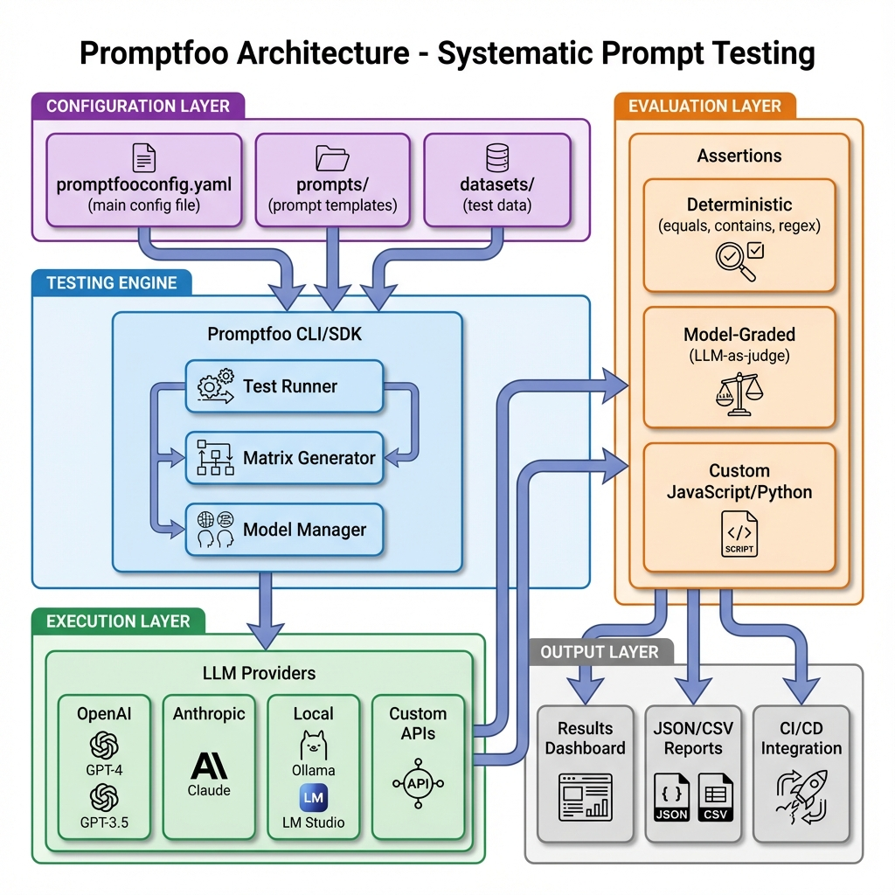

# Promptfoo: Test-Driven Prompt Engineering

## 🎯 Module Overview

Welcome to the world of **scientific prompt engineering**! If you've been manually testing your prompts by staring at chat outputs and thinking *"Hmm, that looks good enough"*, you're about to discover a better way.

### What is Promptfoo?

**Promptfoo** is an open-source CLI tool and library that brings the discipline of **Test-Driven Development (TDD)** to Large Language Model applications. It allows you to:
- Define test cases as code (YAML/JSON)
- Run prompts against multiple scenarios automatically
- Compare outputs across different models and providers
- Enforce quality constraints with deterministic and AI-powered assertions
- Integrate testing into CI/CD pipelines

Think of it as **pytest for prompts** or **Jest for AI**.

###  Why Does It Exist?

The "Whac-A-Mole" problem is real. You fix a prompt to handle angry customers better, and suddenly it starts being too apologetic to VIP clients. You tweak it again, and now it's leaking compliance information.

**The core problem**: Prompts are brittle. Small changes have unpredictable ripple effects.

**The solution**: Treat prompts like software code. Version them, test them automatically, and never deploy without proof they work.

### What Problem Does It Solve?

1. **Manual Testing Fatigue**: Testing 50 edge cases manually takes hours. Promptfoo does it in seconds.
2. **Regression Detection**: Know immediately when a prompt change breaks something.
3. **Multi-Model Comparison**: Should you use GPT-4, Claude, or Gemini? Let data decide.
4. **Security Validation**: Automated red-teaming to discover jailbreaks and policy violations.
5. **CI/CD Integration**: Block bad prompts from reaching production.

### Who Should Use It?

- **Prompt Engineers**: Building prompts for production applications
- **AI Engineers**: Integrating LLMs into software systems
- **QA Engineers**: Testing AI-powered features
- **Security Teams**: Red-teaming LLM applications
- **Product Managers**: Making data-driven model selection decisions

---

## 🧠 Theoretical Foundations

### The Philosophy: From "Vibes" to "Verification"

In early 2023, most LLM apps were developed like this:

```
1. Write a prompt
2. Try it with a few examples
3. "Looks good!" 
4. Deploy
5. 💥 Production incident
```

This is what the industry calls **"vibes-based engineering"** - trusting intuition over data.

Promptfoo introduces a radical shift:

```
1. Define test cases (expected behavior)
2. Write a prompt
3. Run automated tests
4. See failures (red)
5. Iterate on prompt
6. All tests pass (green)
7. Deploy with confidence
```

This is **Test-Driven Engineering** - the same discipline that makes web applications reliable.

### Core Concept: The Evaluation Matrix

The heart of Promptfoo is the **evaluation matrix**:

```
          Scenario 1    Scenario 2    Scenario 3
Prompt A     ✅            ❌            ✅
Prompt B     ✅            ✅            ❌
Prompt C     ✅            ✅            ✅
```

You can think of this as an $N \times M$ grid where:
- **N** = Number of prompt variations you're testing
- **M** = Number of test scenarios

Each cell contains the model's output and whether it passed your assertions.

**The power**: You can visually see which prompt handles which scenarios best.

### Architecture: How It Works



*Figure 1: Promptfoo's complete testing architecture from configuration to results*

The data flow through Promptfoo:

```
┌─────────────────┐
│ Configuration   │  ← promptfooconfig.yaml
│                 │     (prompts, providers, tests)
└────────┬────────┘
         │
         ▼
┌─────────────────┐
│ Test Generator  │  ← Creates test matrix
└────────┬────────┘
         │
         ▼
┌─────────────────┐
│ Provider API    │  ← Talks to OpenAI/Anthropic/etc
└────────┬────────┘
         │
         ▼
┌─────────────────┐
│ Assertion Engine│  ← Validates outputs
└────────┬────────┘
         │
         ▼
┌─────────────────┐
│ Results         │  ← Terminal/Web UI/JSON
└─────────────────┘
```

### Key Terminology

- **Provider**: An LLM API (e.g., `openai:gpt-4`, `anthropic:claude-3-opus`)
- **Prompt**: The template you're testing (can include variables)
- **Test Case**: A specific scenario with input variables and expected behavior
- **Assertion**: A rule that determines if an output is acceptable
- **Evaluation**: A full run of all prompts × all test cases
- **Score**: Percentage of assertions passed

---

## 🆚 How It Compares to Alternatives

| Feature | Promptfoo | LangSmith | Helicone | Manual Testing |
|---------|-----------|-----------|----------|----------------|
| Open Source | ✅ | ❌ | Partial | N/A |
| Local Execution | ✅ | ❌ | ❌ | ✅ |
| Matrix Testing | ✅ | ❌ | ❌ | ❌ |
| Red Teaming | ✅ | ❌ | ❌ | ❌ |
| CI/CD Integration | ✅ | Limited | ❌ | ❌ |
| No Vendor Lock-in | ✅ | ❌ | ❌ | ✅ |
| Cost | Free | Paid | Freemium | Time |

**Promptfoo's Differentiator**: It runs **completely locally**. Your prompts and data never leave your machine unless you explicitly share results.

---

## 🎓 What You'll Learn in This Module

By the end of this comprehensive module, you will:

1. **Master Configuration**: Write complex YAML configs with variables and templates
2. **Understand Assertions**: Use 40+ built-in assertion types effectively
3. **Build Custom Tests**: Write Python/JavaScript validators for domain logic
4. **Perform Red Teaming**: Automatically discover security vulnerabilities
5. **Integrate CI/CD**: Block bad prompts in your deployment pipeline
6. **Compare Models**: Make data-driven provider selection decisions
7. **Optimize Prompts**: Use metrics to iterate scientifically

---

## 🚀 What You Will Achieve

### Concrete Outcomes

After completing this module, you will have:

1. **A Production-Ready Test Suite**: For any LLM feature you're building
2. **Automated Regression Testing**: Catch breaking changes instantly
3. **Security Hardening**: Prompts tested against OWASP Top 10 risks
4. **Multi-Model Benchmarks**: Data showing which provider is best for your use case
5. **CI/CD Pipeline**: Automated quality gates in GitHub Actions

### Skills Acquired

- **Systematic Prompt Engineering**: Move from guesswork to data
- **Security Testing**: Red-team your own applications
- **Automation**: Build reusable testing frameworks
- **Cost Optimization**: Measure token usage and select economical models
- **Team Collaboration**: Share results with non-technical stakeholders

### Projects You Can Build

1. **FinTech Compliance Validator**: Ensure chatbots never give financial advice
2. **Multi-Language Support Tester**: Validate translations and cultural appropriateness
3. **Content Moderation System**: Test safety filters across thousands of scenarios
4. **Customer Service QA**: Ensure consistent tone across all user personas

### Career Applications

- **AI Engineer Roles**: "Built automated LLM testing framework using Promptfoo"
- **Security positions**: "Performed security audits on production AI systems"
- **QA Engineering**: "Established TDD practices for generative AI features"
- **MLOps**: "Integrated LLM evaluation into CI/CD pipelines"

---

## Next Steps

Now that you understand what Promptfoo is and why it matters, let's get hands-on:

- **[Next: Installation & Setup](./02-installation.md)** - Get Promptfoo running locally
- **[Building Block 1](./03-matrix-testing.md)** - Your first evaluation matrix
- **[Building Block 2](./04-assertions-deterministic.md)** - Mastering deterministic tests

---

*"The best prompt is the one that passes all tests, not the one that 'feels right'."*
