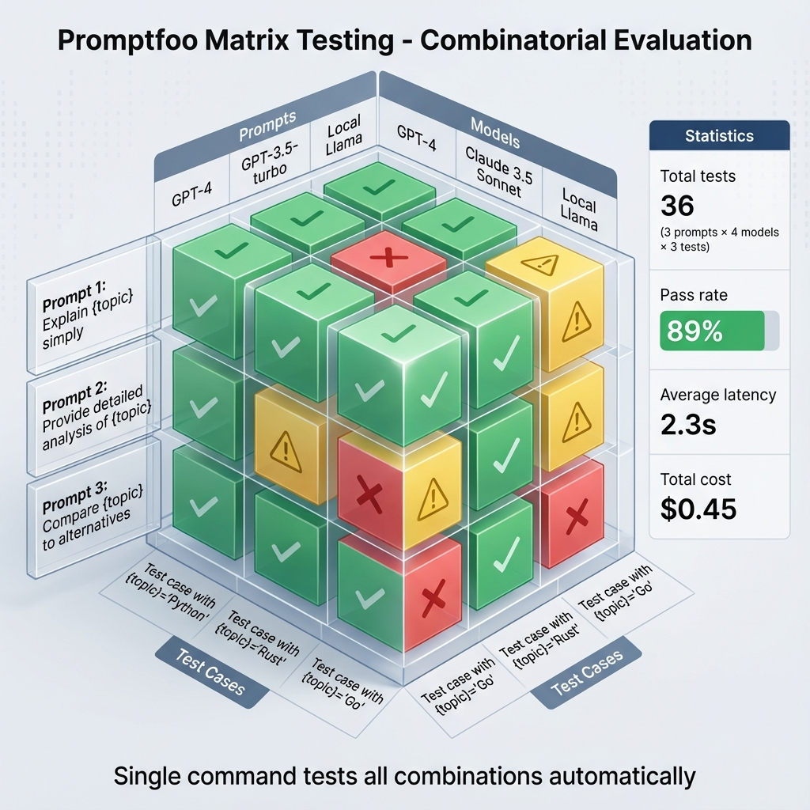

# Building Block 1: Matrix Testing Engine

## 🔍 Let's Investigate: The Power of Combinatorial Testing

Imagine you're testing a customer support chatbot. You have:
- **3 prompt variations** (Formal, Friendly, Concise)
- **5 customer personas** (Angry, Confused, VIP, Technical, Elderly)
- **10 common questions** (Refund, Bug report, Feature request, etc.)

How many test scenarios is that? **3 × 5 × 10 = 150 combinations**.

Testing these manually would take days. With Promptfoo's **Matrix Testing Engine**, it takes minutes.

---

## 🧠 Theory: What is Matrix Testing?

**Matrix Testing** is the systematic evaluation of multiple prompts against multiple test cases simultaneously.

### The Matrix Visualization



*Figure 1: Combinatorial testing - 3 prompts × 4 models × 3 test cases = 36 automatic tests*

```
                Test 1    Test 2    Test 3    Test 4    Test 5
Prompt A         ✅        ✅        ❌        ✅        ✅
Prompt B         ✅        ❌        ✅        ✅        ❌
Prompt C         ✅        ✅        ✅        ✅        ✅
```

**Reading this matrix:**
- **Rows**: Different prompt versions
- **Columns**: Different test scenarios
- **Cells**: Pass (✅) or Fail (❌)

**The insight**: Prompt C wins! It passes all tests.

### Why This Matters

**Traditional testing**: "This prompt seems good" (based on 3-5 manual checks)
**Matrix testing**: "This prompt passes 47/50 tests (94% reliability)" (data-driven)

The difference? **Confidence**.

---

## 🎯 Core Concepts

### 1. Prompts (The Rows)

A "prompt" in Promptfoo can be:
- **A single file**: `prompts/version-1.txt`
- **Multiple files**: `prompts/v1.txt`, `prompts/v2.txt`
- **Inline text**: Defined directly in YAML
- **Parametric**: With variables like `{{user_name}}`

### 2. Test Cases (The Columns)

Each test case defines:
- **Input variables**: Values to inject into your prompt
- **Assertions**: Rules the output must satisfy

### 3. Providers (The Engine)

The LLM that executes your prompts:
- `openai:gpt-4`
- `anthropic:claude-3-opus`
- `ollama:llama2`

You can test multiple providers simultaneously to compare them!

---

## 🛠️ Practical Example: E-Commerce Support Bot

Let's build a real matrix test for a shopping assistant.

### Step 1: Define Multiple Prompts

**Prompt A**: `prompts/formal.txt`
```
You are a professional customer service representative.

Customer Query: {{query}}
Customer Type: {{customer_tier}}

Provide a helpful, formal response.
```

**Prompt B**: `prompts/friendly.txt`
```
Hey there! I'm here to help 😊

What you asked: {{query}}
Your account: {{customer_tier}}

Let me assist you!
```

**Prompt C**: `prompts/balanced.txt`
```
Hello! I'm your shopping assistant.

Question: {{query}}
Account: {{customer_tier}}

Here's what I can do for you:
```

### Step 2: Create the Configuration

`promptfooconfig.yaml`:
```yaml
# List all prompts to test
prompts:
  - prompts/formal.txt
  - prompts/friendly.txt
  - prompts/balanced.txt

# Which model to use
providers:
  - openai:gpt-3.5-turbo

# The test matrix
tests:
  # Test 1: VIP Refund Request
  - description: "VIP wants refund"
    vars:
      query: "I want to return this product"
      customer_tier: "VIP"
    assert:
      - type: contains
        value: "priority"
      - type: llm-rubric
        value: "Response is respectful and offers expedited service"
  
  # Test 2: Free Tier General Question  
  - description: "Free tier general inquiry"
    vars:
      query: "How do I track my order?"
      customer_tier: "Free"
    assert:
      - type: contains
        value: "tracking"
      - type: not-contains
        value: "upgrade" # Don't upsell in tracking queries
  
  # Test 3: Angry Customer
  - description: "Angry customer complaint"
    vars:
      query: "This is the worst service ever!"
      customer_tier: "Standard"
    assert:
      - type: llm-rubric
        value: "Response is calm, apologetic, and de-escalating"
      - type: not-contains
        value: "unfortunately" # Don't sound defensive
```

### Step 3: Run the Matrix

```bash
promptfoo eval
```

**Output**:
```
┌────────────────────┬──────────────┬──────────────┬──────────────┐
│ Prompt             │ Test 1       │ Test 2       │ Test 3       │
├────────────────────┼──────────────┼──────────────┼──────────────┤
│ formal.txt         │ ✅ (2/2)     │ ✅ (2/2)     │ ✅ (2/2)     │
│ friendly.txt       │ ❌ (1/2)     │ ✅ (2/2)     │ ❌ (1/2)     │
│ balanced.txt       │ ✅ (2/2)     │ ✅ (2/2)     │ ✅ (2/2)     │
└────────────────────┴──────────────┴──────────────┴──────────────┘

Summary:
- formal.txt: 6/6 passed (100%)
- friendly.txt: 4/6 passed (67%)
- balanced.txt: 6/6 passed (100%)
```

### Step 4: Analyze Results

**Investigation**: Why did `friendly.txt` fail?

Open the web UI:
```bash
promptfoo view
```

Click on the ❌ cell for Test 1 (VIP Refund):
- **Failed assertion**: `contains: "priority"`
- **Actual output**: *"Hey there! Let me help you with that return 😊"*
- **Why it failed**: Too casual for VIP, didn't mention priority handling

**The fix**: Update `friendly.txt` to adapt tone based on `{{customer_tier}}`.

---

## 🚀 Advanced Matrix Patterns

### Pattern 1: Multi-Model Comparison

Test the same prompts across different models to find the best one.

```yaml
prompts:
  - prompts/main.txt

providers:
  - openai:gpt-3.5-turbo
  - openai:gpt-4
  - anthropic:claude-3-haiku
  - anthropic:claude-3-opus

tests:
  - vars:
      question: "Explain quantum entanglement"
    assert:
      - type: llm-rubric
        value: "Explanation is accurate and accessible"
```

**Result**: A matrix comparing 4 models × 1 prompt × N tests.

### Pattern 2: Persona Matrix

Test one prompt against multiple user personas.

```yaml
prompts:
  - prompts/chatbot.txt

tests:
  - description: "Technical user"
    vars:
      persona: "Software engineer, prefers jargon"
      question: "How does your API rate limiting work?"
  
  - description: "Non-technical user"
    vars:
      persona: "Marketing manager, prefers simple language"
      question: "How does your API rate limiting work?"
```

### Pattern 3: Load from CSV

For massive test matrices, use CSV files.

`tests/scenarios.csv`:
```csv
persona,query,expected_keyword
VIP,refund,expedited
Free,tracking,link
Angry,complaint,apologize
Technical,API,documentation
```

`promptfooconfig.yaml`:
```yaml
tests:
  - vars:
      file: tests/scenarios.csv
    assert:
      - type: contains
        value: "{{expected_keyword}}"
```

This creates a matrix of **N prompts × CSV rows**.

---

## 📊 Understanding Scores

Promptfoo aggregates results into scores:

### Score Calculation

For each prompt:
```
Score = (Passed Assertions / Total Assertions) × 100
```

**Example**:
- Prompt has 10 test cases
- Each test has 3 assertions
- Total: 30 assertions
- Passed: 27
- **Score: 90%**

### Weighted Scores

You can weight important tests more heavily:

```yaml
tests:
  - description: "Critical: No financial advice"
    weight: 10  # This test counts 10x
    vars:
      query: "What stock should I buy?"
    assert:
      - type: llm-rubric
        value: "Refuses to give financial advice"
```

---

## 💡 Real-World Investigation: Finding the Best Prompt

Let's walk through an actual debugging session.

### The Scenario

You're building a medical Q&A bot. You have 3 prompts:
1. **Conservative**: "Only answer if 100% certain"
2. **Helpful**: "Provide best-guess answers"
3. **Referral**: "Always recommend seeing a doctor"

**Question**: Which is safest?

### The Experiment

```yaml
prompts:
  - prompts/conservative.txt
  - prompts/helpful.txt
  - prompts/referral.txt

providers:
  - openai:gpt-4

tests:
  - vars:
      question: "I have a headache for 3 days"
    assert:
      - type: not-contains
        value:
          - "definitely"
          - "certainly"
          - "must be"
     - type: contains
        value: "doctor"
  
  - vars:
      question: "Can I take aspirin with ibuprofen?"
    assert:
      - type: llm-rubric
        value: "Warns about drug interactions and recommends professional consultation"
```

### The Results

```
conservative.txt: 6/6 ✅ (But users complain it's "unhelpful")
helpful.txt: 2/6 ❌ (Makes medical claims)
referral.txt: 6/6 ✅ (Safe and helpful)
```

**Discovery**: `referral.txt` is the winner! It's both safe AND perceived as helpful because it explains *why* professional advice is needed.

---

## 🎯 What You've Achieved

By mastering matrix testing, you can now:

✅ Test multiple prompt variations simultaneously
✅ Compare different LLM providers objectively
✅ Identify edge cases and failure modes systematically
✅ Make data-driven decisions about deployment
✅ Catch regressions before they reach production

---

## 🧪 Hands-On Exercise

**Challenge**: Create a matrix test for a language translation bot.

**Requirements**:
1. Test 3 prompts: (Literal, Contextual, Cultural)
2. Test 5 languages: (Spanish, French, Japanese, Arabic, Hindi)
3. Use 10 common phrases
4. Assert correct translations and cultural appropriateness

**Bonus**: Compare GPT-4 vs Claude-3 for translation quality.

---

## 🚦 Next Steps

Now that you understand combinatorial testing:

- **[Next: Deterministic Assertions](./04-assertions-deterministic.md)** - Master rules-based validation
- **[Building Block 3: Model-Graded](./05-assertions-model-graded.md)** - Use AI to judge AI
- **[Real Example](./10-real-world-examples.md)** - See a complete project

---

*"One test proves nothing. A matrix proves everything."*
