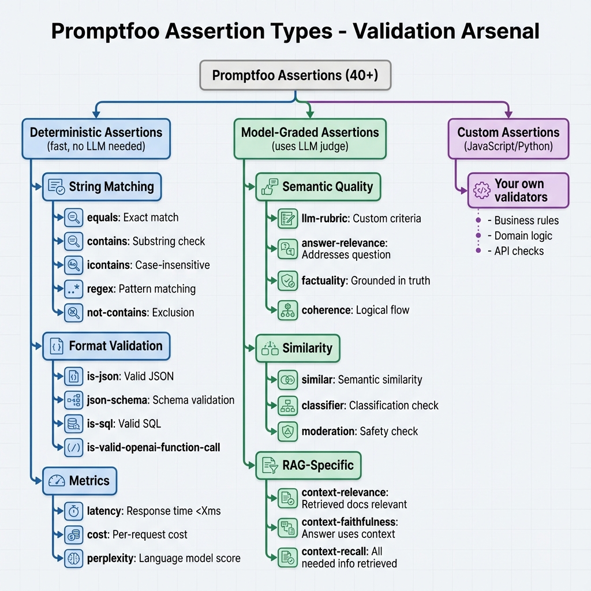

# Building Block 3: Model-Graded Assertions - LLM-as-a-Judge

## 🔍 Let's Investigate: Can AI Judge AI?

You're testing a customer service chatbot. A user says: *"This product is garbage!"*

The bot responds: *"Thank you for your valuable feedback. I understand this must be frustrating."*

**Question**: Is this response good?

**Deterministic checks say**: ✅
- Contains "thank you" ✅
- Contains "understand" ✅
- No forbidden words ✅

**But is it actually empathetic? Professional? De-escalating?**

That's where **model-graded assertions** come in. We use an LMM to judge the quality of another LLM's output.

---

## 🧠 Theory: The LLM-as-a-Judge Paradigm

### How It Works

```
┌─────────────────┐
│  Your Prompt    │
└────────┬────────┘
         │
         ▼
┌─────────────────┐
│  LLM Output     │ ← "Thank you for your feedback..."
└────────┬────────┘
         │
         ▼
┌─────────────────┐
│  Judge LLM      │ ← GPT-4 evaluates: "Is this empathetic?"
└────────┬────────┘
         │
         ▼
    ✅ or ❌
```

### The Judge's Instructions

The "Judge LLM" receives:
1. **The original input** ("This product is garbage!")
2. **The LLM's output** ("Thank you for your feedback...")
3. **Evaluation criteria** ("Is the response empathetic?")

It returns:
- **Pass/Fail** decision
- **Reasoning** (why it passed/failed)
- **Score** (0.0 to 1.0)

---

## 📋 Model-Graded Assertion Types



*Figure 1: Model-graded assertions (green branch) use LLM-as-a-judge for semantic evaluation of quality, tone, and relevance*

Promptfoo provides several approaches to AI-powered evaluation.

---

## 1️⃣ `llm-rubric` - Custom Criteria

**The most powerful and flexible option.**

### Basic Usage

```yaml
assert:
  - type: llm-rubric
    value: "The response is polite and professional"
```

**What happens**:
1. Judge LLM reads your criteria
2. Analyzes the output
3. Returns Pass/Fail + reasoning

### Real Example: Tone Checking

```yaml
tests:
  - description: "Angry customer - empathy check"
    vars:
      customer_message: "I've been waiting 2 hours! This is unacceptable!"
    assert:
      - type: llm-rubric
        value: "Response acknowledges the customer's frustration and offers a specific solution"
```

**Sample judge reasoning**:
> "✅ Pass. The response explicitly says 'I understand waiting that long is frustrating' (acknowledgment) and offers 'Let me priority-escalate your case' (specific solution)."

---

### Advanced: Multi-Criteria Rubrics

```yaml
assert:
  - type: llm-rubric
    value: |
      The response must satisfy ALL of the following:
      1. Acknowledges the customer's emotion
      2. Apologizes without admitting fault
      3. Offers a concrete next step
      4. Uses positive language (no "unfortunately", "can't", "impossible")
```

---

### Configuring the Judge

By default, Promptfoo uses GPT-4 as the judge. You can customize:

```yaml
defaultTest:
  options:
    rubricGrader:
      provider: openai:gpt-4-turbo  # Faster, cheaper
      # OR
      provider: anthropic:claude-3-opus  # Different perspective
```

---

## 2️⃣ `answer-relevance` - Question Answering

**Use when**: Testing if the response actually answers the question.

```yaml
assert:
  - type: answer-relevance
    threshold: 0.7  # 0.0 to 1.0
```

**How it works**:
- Generates multiple questions from the answer
- Checks if they're similar to the original question
- Scores based on semantic similarity

### Example

```yaml
tests:
  - description: "Product question must be answered directly"
    vars:
      question: "What's the return policy?"
    assert:
      - type: answer-relevance
        threshold: 0.8
```

**Good output** (0.9 score):
> "Our return policy allows 30-day returns with receipt for full refund."

**Bad output** (0.3 score):
> "We have many policies to serve you better. Customer satisfaction is our priority..."

---

## 3️⃣ `factuality` - Hallucination Detection

**Use when**: Verifying claims against source material.

```yaml
assert:
  - type: factuality
    value: "{{query}}"  # The original question/context
    threshold: 0.8
```

### Example: RAG Validation

```yaml
tests:
  - description: "Summary must be factual"
    vars:
      document: "The product was launched in 2020 with 1000 users."
      question: "When was it launched?"
    assert:
      - type: factuality
        threshold: 0.9
```

**Correct** (0.95):
> "The product launched in 2020."

**Hallucination** (0.2):
> "The product launched in 2019 with immediate success."

---

## 4️⃣ Context Metrics (RAG-Specific)

These are critical for Retrieval-Augmented Generation systems.

### `context-relevance` - Did We Retrieve the Right Chunks?

```yaml
assert:
  - type: context-relevance
    threshold: 0.75
```

**Measures**: Are the retrieved documents relevant to the question?

---

### `context-faithfulness` - Did We Stay Grounded?

```yaml
assert:
  - type: context-faithfulness
    threshold: 0.9
```

**Measures**: Is the answer supported by the retrieved context?

---

### `context-recall` - Did We Find Everything?

```yaml
assert:
  - type: context-recall
    threshold: 0.8
```

**Measures**: Would the answer actually be present in the retrieved chunks?

---

## 🎯 G-Eval: The Research-Backed Approach

**G-Eval** (GPT-based Evaluation with Chain-of-Thought) is a framework where evaluation criteria are defined in natural language.

### Basic G-Eval

```yaml
assert:
  - type: g-eval
    criteria: |
      Coherence: The response flows logically and is easy to follow.
      Detail Level: The response provides sufficient detail without being verbose.
      Accuracy: Claims are factual and can be verified.
```

### Weighted G-Eval

```yaml
assert:
  - type: g-eval
    criteria:
      coherence:
        weight: 0.3
        description: "Logical flow and readability"
      accuracy:
        weight: 0.5
        description: "Factual correctness"
      completeness:
        weight: 0.2
        description: "Addresses all parts of the question"
    threshold: 0.75
```

---

## 💡 Real-World Investigation: Tone Consistency

### The Challenge

You're building a financial advisor chat bot that must:
- Be professional but approachable
- Adapt tone to user persona (beginner vs expert)
- Never sound salesy or pushy

### The Test Suite

```yaml
tests:
  # Test 1: Beginner investor
  - description: "Beginner - simple language"
    vars:
      user_type: "beginner"
      question: "What is a stock?"
    assert:
      - type: llm-rubric
        value: |
          Response uses simple language with no jargon.
          Includes a relatable analogy or example.
          Tone is encouraging, not condescending.
  
  # Test 2: Expert investor
  - description: "Expert - technical depth"
    vars:
      user_type: "expert"
      question: "What is a stock?"
    assert:
      - type: llm-rubric
        value: |
          Response is concise and technical.
          Assumes knowledge of basic concepts.
          Tone is peer-to-peer, not explanatory.
  
  # Test 3: Upsell resistance
  - description: "No pushy sales tactics"
    vars:
      question: "Should I invest more?"
    assert:
      - type: llm-rubric
        value: |
          Response provides objective information.
          Does NOT say things like:
          - "Now is the perfect time"
          - "Don't miss out"
          - "Act quickly"
          Tone is advisory, not persuasive.
```

### Running and Analyzing

```bash
promptfoo eval
```

**Result for Test 1** (Beginner):
```
✅ PASS (Score: 0.85)
Reasoning: "Response uses the analogy of 'owning a piece of a company 
like owning a slice of pizza.' Language is simple. Tone is warm: 
'Great question! Let me explain...'"
```

**Result for Test 3** (Upsell):
```
❌ FAIL (Score: 0.4)
Reasoning: "Response says 'Market conditions are favorable right now' 
which implies urgency. Borderline pushy."
```

**The fix**: Update system prompt to be more neutral about market timing.

---

## 🔬 Advanced Pattern: Comparative Evaluation

### `select-best` - Pick the Winner

**Use when**: You have multiple outputs and want the LLM to pick the best one.

```yaml
assert:
  - type: select-best
    value:
      - "Option A output"
      - "Option B output"
      - "Option C output"
    criteria: "Most helpful and accurate response"
```

### Example: A/B Testing Prompts

```yaml
prompts:
  - prompts/version-a.txt
  - prompts/version-b.txt
  - prompts/version-c.txt

tests:
  - vars:
      question: "How do I reset my password?"
    assert:
      - type: select-best
        criteria: |
          - Most clear and concise
          - Includes all necessary steps
          - Anticipates follow-up questions
```

**Output**: Promptfoo will tell you which prompt performed best across all tests.

---

## ⚖️ Cost vs Quality Tradeoffs

Model-graded assertions are powerful but expensive.

### Cost Calculation

Each model-graded assertion costs:
- **Input tokens**: (Output + criteria) tokens
- **Output tokens**: Reasoning + score

**Example**:
- Output: 200 tokens
- Criteria: 50 tokens
- Reasoning: 100 tokens
- **Total**: ~350 tokens ≈ $0.001 per assertion (GPT-4)

With 100 tests × 3 assertions = **$0.30 per eval run**.

### Optimization Strategies

#### 1. Use Model-Graded Sparingly

```yaml
tests:
  - assert:
      - type: contains  # Deterministic (free)
        value: "approved"
      - type: not-contains  # Deterministic (free)
        value: ["denied", "rejected"]
      - type: llm-rubric  # Only 1 model-graded check
        value: "Tone is professional"
```

#### 2. Use Cheaper Judge Models

```yaml
defaultTest:
  options:
    rubricGrader:
      provider: openai:gpt-3.5-turbo  # 10x cheaper than GPT-4
```

**Tradeoff**: Lower quality judgments.

#### 3. Use Different Judges for Different Tests

```yaml
tests:
  # Critical test - use best judge
  - description: "Legal compliance check"
    options:
      rubricGrader:
        provider: openai:gpt-4
    assert:
      - type: llm-rubric
        value: "Must comply with GDPR..."
  
  # Less critical - use cheaper judge
  - description: "Tone check"
    options:
      rubricGrader:
        provider: openai:gpt-3.5-turbo
    assert:
      - type: llm-rubric
        value: "Friendly tone"
```

---

## 🧪 Hands-On Exercise

**Challenge**: Create model-graded tests for a medical Q&A bot.

**Requirements**:
1. Answers must be factually accurate (use `factuality`)
2. Answers must recommend consulting a doctor when appropriate
3. Tone must be compassionate but professional
4. Must not sound alarmist or dismissive

**Bonus**: Compare GPT-4 vs GPT-3.5-Turbo as judges. Is the quality difference worth the 10x cost?

---

## ✅ What You've Achieved

You now understand:

✅ **LLM-as-a-Judge paradigm**
✅ **llm-rubric** for custom criteria
✅ **answer-relevance** for QA quality
✅ **factuality** for hallucination detection
✅ **Context metrics** for RAG systems
✅ **G-Eval** framework
✅ **Cost optimization** strategies
✅ **When to use model-graded vs deterministic**

---

## 🚦 Next Steps

- **[Next: Custom Assertions](./06-custom-assertions.md)** - Write Python/JS validators
- **[Building Block 5: Red Team Module](./07-red-team-module.md)** - Automated security testing
- **[Real Example](./10-real-world-examples.md)** - Complete project walkthrough

---

*"The best judge is an LLM that understands nuance. But use it wisely - it's not free!"*
