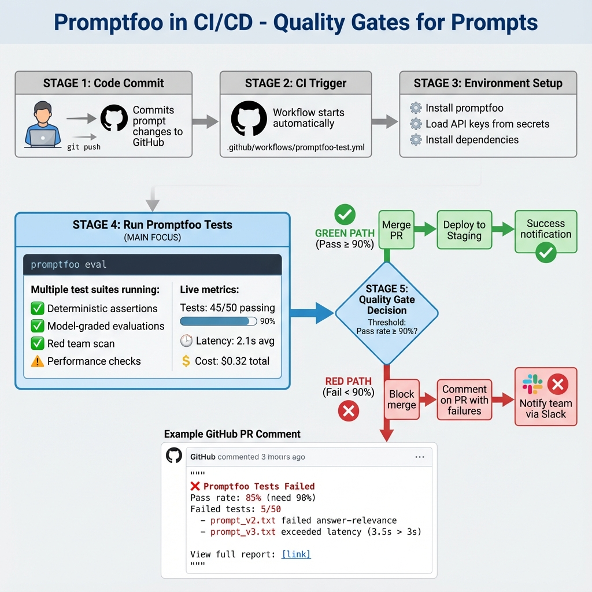

# Building Block 7: CI/CD Integration - Automation & Quality Gates

## 🔍 Let's Investigate: Can Bad Prompts Reach Production?

Scenario: Your teammate just updated the system prompt at 5 PM on Friday. They tested it manually with 3 examples. "Looks good!"said they commit and deploy.

Monday morning: Customer complaints flood in. The new prompt is giving financial advice (regulatory violation). Emergency rollback. Damage control in progress.

**Question**: Could this have been prevented?

**Answer**: Yes. With **CI/CD integration**, bad prompts never make it past automated testing.

---

## 🧠 Theory: Treating Prompts Like Code

### The Paradigm Shift

**Traditional software**:
```
Code Change → Unit Tests → Integration Tests → Deploy
```

**LLM applications** (without CI/CD):
```
Prompt Change → Manual Testing → 🤞 Hope → Deploy
```

**LLM applications** (with Promptfoo CI/CD):
```
Prompt Change → Automated Tests → Quality Gate → Deploy
                      ↓ FAIL
                   Block PR
```

### Why This Matters

- **Regression Prevention**: Ensure new changes don't break existing functionality
- **Security Enforcement**: Block prompts that fail security tests
- **Cost Control**: Prevent expensive prompts from deploying
- **Team Confidence**: Deploy fearlessly, knowing tests have your back

---

## 🎯 Core Concepts

### 1. Quality Gates

A **quality gate** is a pass/fail threshold that blocks deployment.

**Examples**:
```yaml
# Quality Gate: Must pass 95% of tests
min_pass_rate: 0.95

# Quality Gate: No security failures
max_security_failures: 0

# Quality Gate: Cost per request < $0.01
max_cost: 0.01
```

### 2. CI/CD Platforms

Promptfoo integrates with:
- GitHub Actions (most common)
- GitLab CI
- Jenkins
- CircleCI
- Any platform that runs shell commands

### 3. Trigger Events

**When to run tests**:
- **On Pull Request**: Before merging changes
- **On Push to Main**: After merge (regression check)
- **Scheduled**: Nightly, weekly (model drift detection)
- **Manual**: On-demand testing

---

## 🚀 GitHub Actions Integration



*Figure 1: Complete CI/CD pipeline with quality gates - tests run automatically on every PR, blocking bad prompts from reaching production*

### Step 1: Create Workflow File

`.github/workflows/promptfoo-test.yml`:
```yaml
name: LLM Prompt Testing

# When to run
on:
  pull_request:
    paths:
      - 'prompts/**'
      - 'tests/**'
      - 'promptfooconfig.yaml'
  
  push:
    branches:
      - main

# Environment variables
env:
  OPENAI_API_KEY: ${{ secrets.OPENAI_API_KEY }}
  ANTHROPIC_API_KEY: ${{ secrets.ANTHROPIC_API_KEY }}

jobs:
  test-prompts:
    runs-on: ubuntu-latest
    
    steps:
      # 1. Checkout code
      - name: Checkout repository
        uses: actions/checkout@v3
      
      # 2. Setup Node.js
      - name: Setup Node.js
        uses: actions/setup-node@v3
        with:
          node-version: '18'
      
      # 3. Install Promptfoo
      - name: Install Promptfoo
        run: npm install -g promptfoo
      
      # 4. Run evaluation
      - name: Run Promptfoo Tests
        run: |
          promptfoo eval --no-cache
      
      # 5. Check quality gate
      - name: Check Quality Gate
        run: |
          # Parse results and fail if below threshold
          pass_rate=$(promptfoo eval --output json | jq '.stats.passRate')
          echo "Pass rate: $pass_rate"
          
          if (( $(echo "$pass_rate < 0.95" | bc -l) )); then
            echo "❌ Quality gate failed: Pass rate below 95%"
            exit 1
          fi
      
      # 6. Upload results as artifact
      - name: Upload Results
        if: always()
        uses: actions/upload-artifact@v3
        with:
          name: promptfoo-results
          path: promptfoo-results.json
```

### Step 2: Add Secrets

In your GitHub repository:
1. Go to **Settings** → **Secrets and variables** → **Actions**
2. Add:
   - `OPENAI_API_KEY`
   - `ANTHROPIC_API_KEY`
   - Any other secrets

### Step 3: Configure Promptfoo for CI

`promptfooconfig.yaml`:
```yaml
prompts:
  - prompts/**/*.txt

providers:
  - openai:gpt-4-turbo

tests:
  - file://tests/smoke-tests.yaml
  - file://tests/regression-tests.yaml

# CI-specific settings
ci:
  # Fail build if pass rate below threshold
  failureThreshold: 0.95
  
  # Output format for easy parsing
  outputFormat: json
  
  # Don't use cache in CI (ensure fresh results)
  noCache: true
```

---

## 💡 Advanced GitHub Actions Patterns

### Pattern 1: Post Results as PR Comments

```yaml
- name: Comment PR with Results
  if: github.event_name == 'pull_request'
  uses: actions/github-script@v6
  with:
    script: |
      const fs = require('fs');
      const results = JSON.parse(fs.readFileSync('promptfoo-results.json'));
      
      const comment = `
      ## 🤖 Promptfoo Test Results
      
      **Pass Rate**: ${results.stats.passRate * 100}%
      **Tests Passed**: ${results.stats.passed}/${results.stats.total}
      
      ${results.stats.passRate >= 0.95 ? '✅ Quality gate passed!' : '❌ Quality gate failed!'}
      
      [View detailed results](${results.shareableUrl})
      `;
      
      github.rest.issues.createComment({
        issue_number: context.issue.number,
        owner: context.repo.owner,
        repo: context.repo.name,
        body: comment
      });
```

### Pattern 2: Only Test Changed Files

```yaml
- name: Get Changed Prompts
  id: changed-files
  uses: tj-actions/changed-files@v39
  with:
    files: |
      prompts/**
      tests/**

- name: Run Tests on Changed Files Only
  if: steps.changed-files.outputs.any_changed == 'true'
  run: |
    # Test only changed prompts
    for file in ${{ steps.changed-files.outputs.all_changed_files }}; do
      echo "Testing $file"
      promptfoo eval -p "$file"
    done
```

### Pattern 3: Parallel Testing (Speed Optimization)

```yaml
jobs:
  test-prompts:
    strategy:
      matrix:
        test-suite: [smoke, regression, security]
    
    runs-on: ubuntu-latest
    
    steps:
      - uses: actions/checkout@v3
      - name: Run ${{ matrix.test-suite }} tests
        run: promptfoo eval -c configs/${{ matrix.test-suite }}.yaml
```

**Result**: 3 test suites run **in parallel** instead of sequentially!

---

## 🔴 Red Team in CI/CD

### Scheduled Security Scans

`.github/workflows/security-scan.yml`:
```yaml
name: Weekly Security Scan

on:
  schedule:
    # Run every Monday at 2 AM
    - cron: '0 2 * * 1'
  
  # Allow manual trigger
  workflow_dispatch:

jobs:
  red-team:
    runs-on: ubuntu-latest
    
    steps:
      - uses: actions/checkout@v3
      
      - name: Run Red Team Scan
        run: |
          promptfoo redteam run --config security-config.yaml
      
      - name: Check for Vulnerabilities
        run: |
          # Fail if ANY security test fails
          failures=$(cat promptfoo-results.json | jq '.stats.failed')
          
          if [ "$failures" -gt "0" ]; then
            echo "🚨 Security vulnerabilities detected!"
            echo "Failed tests: $failures"
            exit 1
          fi
      
      # Alert on Slack if failures detected
      - name: Notify Team
        if: failure()
        uses: slackapi/slack-github-action@v1
        with:
          payload: |
            {
              "text": "🚨 Security scan detected vulnerabilities in prompts!"
            }
        env:
          SLACK_WEBHOOK_URL: ${{ secrets.SLACK_WEBHOOK }}
```

---

## 🏭 GitLab CI Integration

`.gitlab-ci.yml`:
```yaml
stages:
  - test
  - deploy

variables:
  OPENAI_API_KEY: $OPENAI_API_KEY

test-prompts:
  stage: test
  image: node:18
  
  before_script:
    - npm install -g promptfoo
  
  script:
    - promptfoo eval --no-cache
    - |
      # Check quality gate
      pass_rate=$(promptfoo eval --output json | jq '.stats.passRate')
      if (( $(echo "$pass_rate < 0.95" | bc -l) )); then
        echo "Quality gate failed"
        exit 1
      fi
  
  artifacts:
    reports:
      junit: promptfoo-results.xml
    paths:
      - promptfoo-results.json
  
  only:
    - merge_requests
    - main
```

---

## 🔧 Jenkins Pipeline

`Jenkinsfile`:
```groovy
pipeline {
    agent any
    
    environment {
        OPENAI_API_KEY = credentials('openai-api-key')
    }
    
    stages {
        stage('Install') {
            steps {
                sh 'npm install -g promptfoo'
            }
        }
        
        stage('Test Prompts') {
            steps {
                sh 'promptfoo eval --no-cache'
            }
        }
        
        stage('Quality Gate') {
            steps {
                script {
                    def results = readJSON file: 'promptfoo-results.json'
                    def passRate = results.stats.passRate
                    
                    if (passRate < 0.95) {
                        error("Quality gate failed: ${passRate * 100}% pass rate")
                    }
                }
            }
        }
    }
    
    post {
        always {
            archiveArtifacts artifacts: 'promptfoo-results.json'
        }
        
        failure {
            emailext (
                subject: "Prompt Tests Failed: ${env.JOB_NAME}",
                body: "Check console output at ${env.BUILD_URL}",
                to: "team@company.com"
            )
        }
    }
}
```

---

## 📊 Quality Gate Strategies

### Strategy 1: Strict (Production)

```yaml
ci:
  # Zero tolerance
  failureThreshold: 1.0  # 100% pass rate required
  maxCost: 0.005         # Max half cent per request
  maxLatency: 2000       # Max 2 seconds
```

**Use when**: Production deployments, regulated industries.

---

### Strategy 2: Permissive (Development)

```yaml
ci:
  # Allow some failures
  failureThreshold: 0.80  # 80% pass rate
  warnOnly: true          # Don't block, just warn
```

**Use when**: Development branches, experimental features.

---

### Strategy 3: Progressive (Staged)

```yaml
# Different gates for different environments

# dev.yaml
ci:
  failureThreshold: 0.75

# staging.yaml
ci:
  failureThreshold: 0.90

# prod.yaml
ci:
  failureThreshold: 0.98
```

---

## 💡 Real-World Example: Complete CI/CD Setup

### The Scenario

E-commerce company with:
- 10 prompts
- 500 test cases
- 3 models (GPT-4, Claude, Gemini)
- Regulatory requirements (no financial advice, no medical claims)

### The Solution

**Directory Structure**:
```
.github/
  workflows/
    pr-tests.yml          # Fast smoke tests on PR
    main-tests.yml        # Full regression on merge
    nightly-security.yml  # Red team scans

configs/
  pr-smoke.yaml      # 50 critical tests, GPT-3.5 (fast!)
  main-regression.yaml   # All 500 tests, all models
  security.yaml          # Red team config

prompts/
tests/
```

**PR Workflow** (Fast Feedback):
```yaml
# .github/workflows/pr-tests.yml
name: PR - Smoke Tests

on: pull_request

jobs:
  smoke-test:
    runs-on: ubuntu-latest
    steps:
      - uses: actions/checkout@v3
      - run: npm install -g promptfoo
      - name: Quick Smoke Test (50 tests, ~2 min)
        run: promptfoo eval -c configs/pr-smoke.yaml
```

**Main Workflow** (Comprehensive):
```yaml
# .github/workflows/main-tests.yml
name: Main - Full Regression

on:
  push:
    branches: [main]

jobs:
  full-test:
    runs-on: ubuntu-latest
    steps:
      - uses: actions/checkout@v3
      - run: npm install -g promptfoo
      - name: Full Test Suite (500 tests, ~15 min)
        run: promptfoo eval -c configs/main-regression.yaml
```

**Security Workflow** (Weekly):
```yaml
# .github/workflows/nightly-security.yml
name: Security Scan

on:
  schedule:
    - cron: '0 0 * * 0'  # Sunday midnight

jobs:
  redteam:
    runs-on: ubuntu-latest
    steps:
      - uses: actions/checkout@v3
      - run: promptfoo redteam run -c configs/security.yaml
```

---

## ✅ What You've Achieved

You now master:

✅ **CI/CD integration** across multiple platforms
✅ **Quality gates** to enforce standards
✅ **GitHub Actions** workflows
✅ **Automated security scanning**
✅ **PR commenting** for team visibility
✅ **Parallel testing** for speed
✅ **Multi-environment** strategies

---

## 🚦 Next Steps

- **[Next: Real-World Examples](./10-real-world-examples.md)** - Complete project walkthrough
- **[Summary](./11-summary-achievements.md)** - Reflect on your mastery
- **[Back to Installation](./02-installation.md)** - Review basics

---

*"Automate testing. Block bad changes. Deploy with confidence."*
