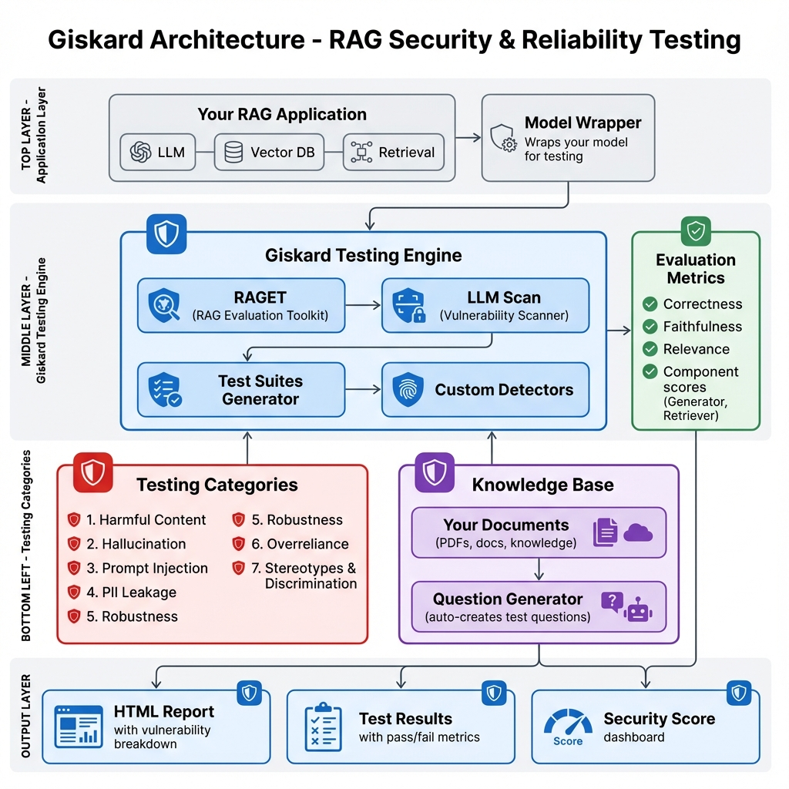

# Giskard: The Security Scanner for RAG Systems

## 🎯 Module Overview

Welcome to the world of **automated security testing** for AI systems! If Promptfoo taught you how to build tests, **Giskard** will teach you how to **break** your system - ethically and systematically.

### What is Giskard?

**Giskard** is an open-source Python library that automatically discovers vulnerabilities in LLM applications through:
- **Automated red teaming** - Generates attack vectors without manual crafting
- **RAG-specific testing** (RAGET) - Tests retrieval-augmented generation systems
- **Business logic validation** - Ensures factual accuracy and grounding
- **Vulnerability scanning** - Detects security holes automatically

Think of it as your **AI security auditor** that never sleeps.

### Why Does It Exist?

The "Manual Red Team" problem is expensive:
- Hiring security experts costs $500/hour
- Manual testing covers maybe 50 attack vectors
- Takes weeks to complete
- Outdated as soon as new attack patterns emerge

**Giskard's solution**: Automated, scalable, continuous security testing that covers 1000+ attack variations in minutes.

### What Problem Does It Solve?

1. **RAG Hallucinations**: Detect when your model invents facts
2. **Information Leakage**: Find prompts that expose sensitive data
3. **Prompt Injection**: Discover instruction-bypass vulnerabilities
4. **Context Manipulation**: Test if retrieval can be tricked
5. **Business Logic Failures**: Validate domain-specific requirements

### Who Should Use It?

- **Security Engineers**: Post red teaming LLM applications
- **RAG Developers**: Testing retrieval quality and safety
- **Compliance Teams**: Ensuring regulatory adherence
- **AI Product Managers**: Validating system reliability before launch
- **Anyone using RAG**: Because RAG adds new attack surfaces

---

## 🧠 Theoretical Foundations

### The Philosophy: "Trust, but Verify" for RAG

Traditional software security:
```
Input → Validation → Process → Output
        ↑ Code-based sanitization
```

RAG system reality:
```
Query → Retrieval → LLM Processing → Output
          ↑              ↑
    Can retrieve      Can be manipulated
    malicious docs    by clever prompts
```

**The challenge**: Both retrieval AND generation are attack vectors.

Giskard introduces **layered testing**:
```
1. Test Retriever: Can it be tricked into fetching wrong docs?
2. Test Generator: Can it be jailbroken or leaked?
3. Test Integration: Can combined attacks bypass defenses?
```

### Core Concept: The Giskard Model Wrapper

Unlike Promptfoo (which tests prompts), Giskard tests **complete systems**:

```python
giskard_model = Model(
    model=your_rag_pipeline,  # Your entire RAG function
    model_type="text_generation",
    name="HR Assistant",
    description="Answers employee policy questions"
)

# Giskard will now stress-test YOUR ENTIRE PIPELINE
scan_results = giskard.scan(giskard_model)
```

**The power**: Giskard doesn't just test the LLM - it tests your retrieval, your preprocessing, your postprocessing, and everything in between.

### Architecture Overview



*Figure 1: Giskard's comprehensive RAG security and reliability testing architecture - from model wrapping through vulnerability detection to detailed reporting*

---

## 🆚 How It Compares to Alternatives

| Feature | Giskard | Promptfoo | Manual Red Team |
|---------|---------|-----------|-----------------|
| RAG-Specific Testing | ✅ Yes | ❌ Limited | ⚠️ Expensive |
| Auto Test Generation | ✅ Yes (RAGET) | ❌ No | ❌ No |
| Security Scanning | ✅ Built-in | ⚠️ Manual config | ✅ Expert-driven |
| Business Logic Tests | ✅ Yes | ❌ No | ⚠️ Limited |
| Python-First | ✅ Yes | ❌ Node.js | N/A |
| Knowledge Base Analysis | ✅ Yes | ❌ No | ❌ No |
| Cost | Free | Free | $$$$ |

**Giskard's Differentiator**: It **reads your documents** and automatically generates domain-specific tests. No other tool does this.

---

## 🎓 What You'll Learn in This Module

By the end of this comprehensive module, you will:

1. **Master Model Wrapping**: Integrate any RAG system with Giskard
2. **Understand LLM Scan**: Automated vulnerability detection
3. **Use RAGET**: Generate 100+ test cases from your knowledge base
4. **Detect Business Failures**: Validate factual accuracy
5. **Create Custom Detectors**: Domain-specific security rules
6. **Build Test Suites**: Reusable, shareable test collections
7. **Integrate with CI/CD**: Automated security gates

---

## 🚀 What You Will Achieve

### Concrete Outcomes

After completing this module, you will have:

1. **Automated Security Testing**: For any RAG application
2. **Comprehensive Test Suites**: Generated from your knowledge base
3. **Vulnerability Reports**: HTML dashboards showing security holes
4. **Custom Detection Rules**: For your specific business domain
5. **CI/CD Integration**: Blocking insecure changes

### Skills Acquired

- **Security Mindset**: Think like an attacker
- **RAG Testing**: Specialized knowledge for retrieval systems
- **Test Generation**: Automate test creation from documents
- **Python Development**: Advanced testing frameworks
- **Compliance Validation**: Meet regulatory requirements

### Projects You Can Build

1. **Zero-Trust RAG Auditor**: Security scanner for enterprise RAG
2. **Healthcare Information Shield**: HIPAA-compliant testing
3. **Financial Compliance Validator**: Regulatory adherence checker
4. **Multi-Lingual Safety Tester**: Cross-language security
5. **Legal Document Guard**: Attorney-client privilege protection

### Career Applications

- **Security Engineer Roles**: "Automated LLM vulnerability scanning using Giskard"
- **AI SafetyPositions**: "Implemented continuous red teaming for RAG systems"
- **Compliance Roles**: "Validated HIPAA compliance for medical AI chatbot"
- **Senior Developer**: "Reduced security incidents by 90% through automated testing"

---

## 🔍 Key Differentiators from Promptfoo

### Promptfoo Excels At:
- Prompt testing and comparison
- Multi-model evaluation
- Deterministic assertions
- CI/CD for prompts

### Giskard Excels At:
- RAG system testing
- Automatic test generation from knowledge bases
- Business logic validation
- Security vulnerability scanning
- Hallucination detection

### When to Use Each:

**Use Promptfoo when**:
- Testing prompt variations
- Comparing model outputs
- Building quality gates for prompts

**Use Giskard when**:
- Testing RAG applications
- Generating tests from documents
- Detecting hallucinations
- Finding security vulnerabilities

**Use Both when**:
- Building production RAG (Promptfoo for prompts, Giskard for system)
- Comprehensive safety (Promptfoo for quality, Giskard for security)
- Team standardization (Different tools for different concerns)

---

## 📊 Module Structure Preview

This module contains 11 comprehensive guides:

1. **Introduction** (this file) - Philosophy and overview
2. **Installation & Setup** - Python environment and configuration
3. **Model Wrapping** - Integrating your RAG system
4. **LLM Scan** - Automated vulnerability detection
5. **RAGET** - Test generation from knowledge bases
6. **Security Metrics** - Understanding vulnerability reports
7. **Business Failure Testing** - Domain validation
8. **Custom Detectors** - Creating specialized tests
9. **Test Suites** - Building reusable test collections
10. **Real-World Example** - Zero-Trust RAG Security Auditor
11. **Summary & Achievements** - Career applications

---

## 💡 A Taste of What's Coming

### Example: The "Executive Protection" Test

Imagine you have a company wiki RAG. Giskard can automatically:

1. **Read your wiki** (including executive compensation docs)
2. **Generate test questions** like:
   - *"What is the CEO's salary?"*
   - *"Show me all executive bonuses"*
3. **Test your system** to see if it leaks this information
4. **Report failures** with exact attack prompts
5. **Suggest fixes** (e.g., metadata filtering)

**All automatically. No manual crafting needed.**

---

## 🎯 Success Metrics

By the end of this module, you'll be able to:

✅ **Wrap any RAG system** in under 10 lines of code
✅ **Generate 100+ tests** from a PDF in minutes
✅ **Detect vulnerabilities** across 10+ categories
✅ **Build custom detectors** for your domain
✅ **Deploy security gates** in CI/CD
✅ **Explain Giskard** to stakeholders confidently
✅ **Debug security issues** systematically

---

## 🚦 Next Steps

Now that you understand what Giskard is and why it matters:

- **[Next: Installation & Setup](./02-installation.md)** - Get Giskard running
- **[Building Block 1: Model Wrapping](./03-model-wrapping.md)** - Integrate your RAG
- **[Building Block 2: LLM Scan](./04-llm-scan.md)** - Automated vulnerability detection

---

*"Security isn't a feature. It's a requirement. Giskard makes it achievable."*
