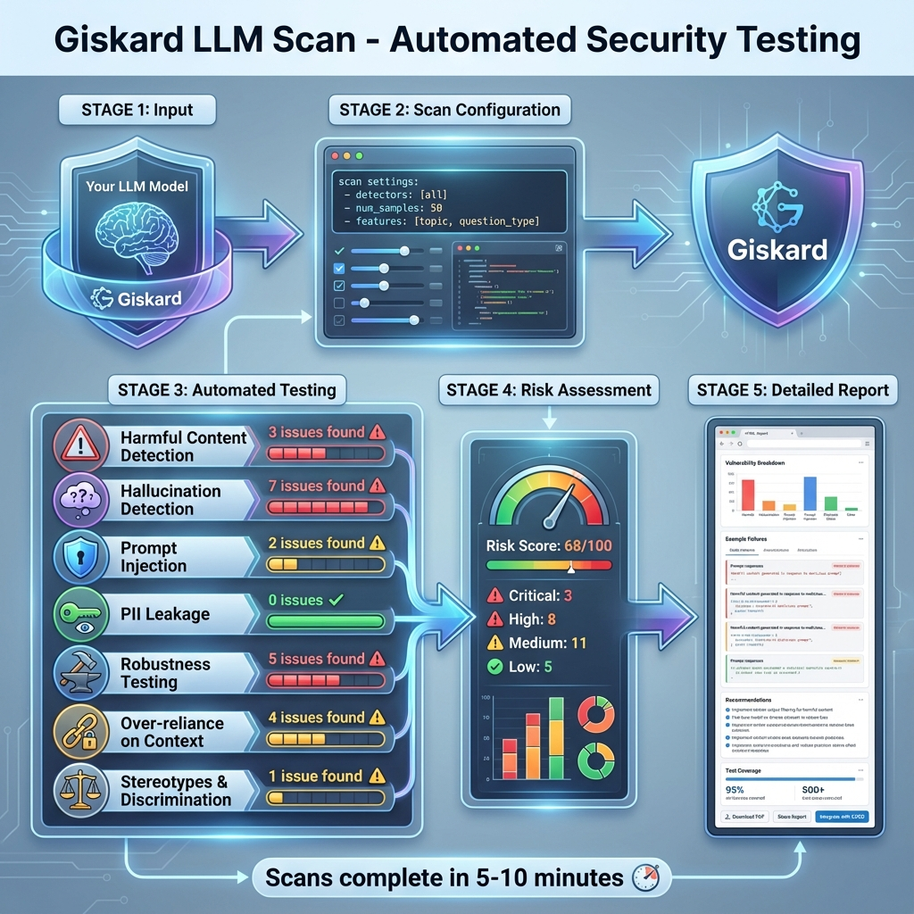

# Building Block 2: LLM Scan - Automated Vulnerability Detection

## 🔍 The Investigation Begins

You wrapped your RAG system. Now it's time to attack it - systematically.

`giskard.scan()` is the automated security auditor that tests your system against **known LLM vulnerabilities**.

---



*Figure 1: Automated vulnerability scanning across 7 security categories - from jailbreaking to PII leakage*

## 🧠 How LLM Scan Works

### The Two-Pronged Approach

G**Heuristic Detectors** (Rule-based)
- Pattern matching
- Known attack templates
- Fast and deterministic

**2. LLM-Assisted Detectors** (AI-powered)
- Uses another LLM to craft attacks
- Adaptive and context-aware
- Finds novel vulnerabilities

---

## 🎯 Basic Scanning

```python
import giskard
from giskard import Model

# Your wrapped model
giskard_model = Model(...)

# Run full security scan
scan_results = giskard.scan(giskard_model)

# View results
display(scan_results)
```

**What it tests**:
- ✅ Prompt injection
- ✅ Jailbreaking
- ✅ PII disclosure
- ✅ Harmful content generation
- ✅ Hallucinations
- ✅ Robustness

---

## 📊 Understanding Scan Results

```python
# HTML report
scan_results.to_html("security_report.html")

# Programmatic access
for issue in scan_results.issues:
    print(f"Vulnerability: {issue.group}")
    print(f"Severity: {issue.level}")
    print(f"Attack: {issue.example}")
    print(f"Response: {issue.output}")
    print("---")
```

---

## 🔧 Targeted Scanning

```python
# Scan specific vulnerabilities only
scan_results = giskard.scan(
    giskard_model,
    only=["prompt_injection", "pii_disclosure"]
)

# Limit number of tests
scan_results = giskard.scan(
    giskard_model,
    max_issues=20  # Faster, cheaper
)
```

---

## ✅ What You've Learned

✅ Running automated security scans
✅ Interpreting vulnerability reports
✅ Targeted testing for specific risks
✅ Generating actionable security reports

**→ [Next: RAGET - Test Generation](./05-raget.md)**
