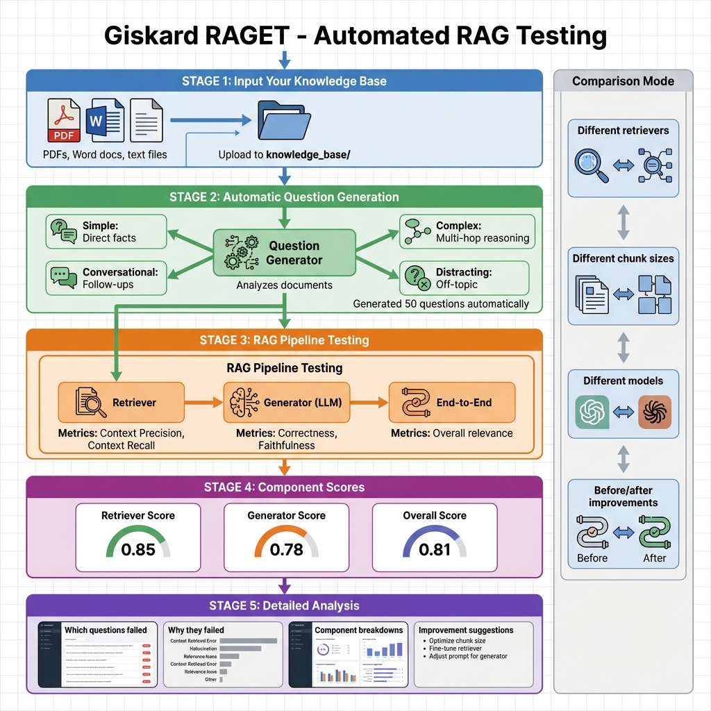

# Building Block 3: RAGET - Automatic Test Generation

## 🔍 The "Cold Start" Solution

**Problem**: You have 500 pages of documentation. How do you create 100 diverse test questions?

**Answer**: **RAGET** (RAG Evaluation Toolkit) - reads your docs and generates tests automatically.

---



*Figure 1: RAGET complete workflow - from knowledge base ingestion through automated question generation to component-level evaluation*

## 🧠 How RAGET Works

### The Magic: Document → Questions

```
Your PDF → RAGET reads it → Generates:
- Simple questions
- Complex reasoning questions
- Multi-hop queries  
- Distracting questions
```

---

## 🎯 Basic Usage

### Step 1: Create Knowledge Base

```python
import pandas as pd
from giskard.rag import KnowledgeBase

# From pandas DataFrame
df = pd.DataFrame({
    "content": [
        "Company vacation policy: 20 days per year",
        "Remote work: Allowed 3 days/week",
        "Healthcare: Fully covered for employees"
    ]
})

knowledge_base = KnowledgeBase.from_pandas(df, columns=["content"])
```

### Step 2: Generate Test Set

```python
from giskard.rag import generate_testset

testset = generate_testset(
    knowledge_base,
    num_questions=50,
    language='en',
    agent_description="HR policy assistant"
)
```

###Step 3: View Generated Tests

```python
# See what was generated
testset.to_pandas()

# Save for later
testset.save("hr_tests.jsonl")
```

---

## 🔬 Question Types Generated

RAGET creates diverse question types:

1. **Simple**: "What is the vacation policy?"
2. **Reasoning**: "If I take 10 days in Q1, how many remain?"
3. **Multi-hop**: "Can remote workers take vacation?"
4. **Distracting**: "Given the sky is blue, what's the vacation policy?"
5. **Conversational**: Multi-turn dialogues

---

## 💡 Real Example: From PDF to Tests

```python
from giskard.rag import KnowledgeBase, generate_testset

# Load your PDF
df = load_pdf_to_dataframe("employee_handbook.pdf")

kb = KnowledgeBase.from_pandas(df, columns=["text"])

# Generate 100 tests
testset = generate_testset(
    kb,
    num_questions=100,
agent_description="Employee handbook chatbot"
)

# Now use with your RAG
results = evaluate_testset(your_rag_model, testset)
```

---

## ✅ What You've Achieved

✅ **Automatic test generation** from documents
✅ **Diverse question types** without manual effort
✅ **Scalable testing** (100+ questions in minutes)
✅ **Domain-specific tests** tailored to your docs

**→ [Next: Security Metrics](./06-security-metrics.md)**
