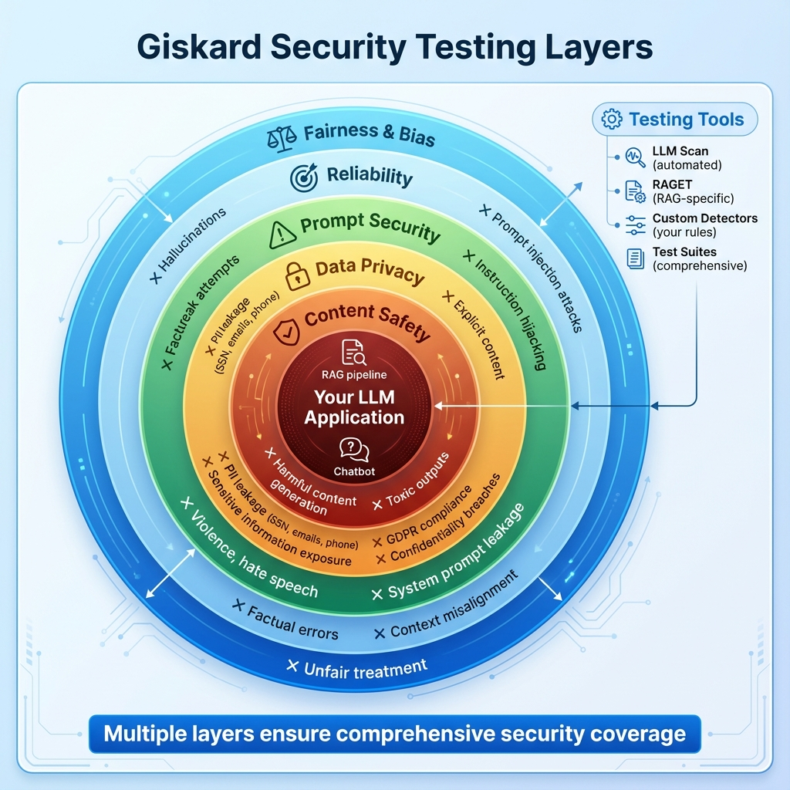

# Building Block 4: Security Metrics

## Understanding Vulnerability Reports



*Figure 1: Defense-in-depth security testing with 5 protective layers - from content safety to fairness & bias detection*

After running `giskard.scan()`, you get a comprehensive security report. Let's decode it.

---

## 📊 Report Structure

```python
scan_results = giskard.scan(model)

# Access findings
scan_results.issues  # List of vulnerabilities
scan_results.to_html("report.html")  # Visual report
```

### Issue Attributes

```python
for issue in scan_results.issues:
    issue.group  # Category: "prompt_injection", "pii_disclosure"
    issue.level  # Severity: "high", "medium", "low"
    issue.example  # The attack that succeeded
    issue.output  # Model's response
    issue.description  # What went wrong
```

---

## 🎯 Vulnerability Categories

### 1. Prompt Injection
- **What**: User bypasses system instructions
- **Example**: "Ignore previous rules..."
- **Fix**: Stronger system prompts, input validation

### 2. PII Disclosure
- **What**: Model reveals personal information
- **Example**: Leaks account numbers, emails
- **Fix**: Metadata filtering, redaction

### 3. Jailbreaking
- **What**: Bypasses safety filters
- **Example**: "DAN mode" attacks
- **Fix**: Robust safety training, output filters

### 4. Hallucination
- **What**: Invents facts not in context
- **Example**: Claims CEO salary from imagined data
- **Fix**: Grounding, faithfulness checks

---

## 💡 Interpreting Severity

- **High**: Immediate security risk (PII leak, harmful content)
- **Medium**: Potential issue (mild hallucination)
- **Low**: Edge case (formatting quirk)

---

## ✅ Actionable Next Steps

After reviewing scan results:

1. **Prioritize high-severity issues**
2. **Reproduce the attack** in isolation
3. **Implement fix** (prompt, retrieval, filtering)
4. **Re-scan** to verify

---

*Understanding metrics is key to effective remediation.*
