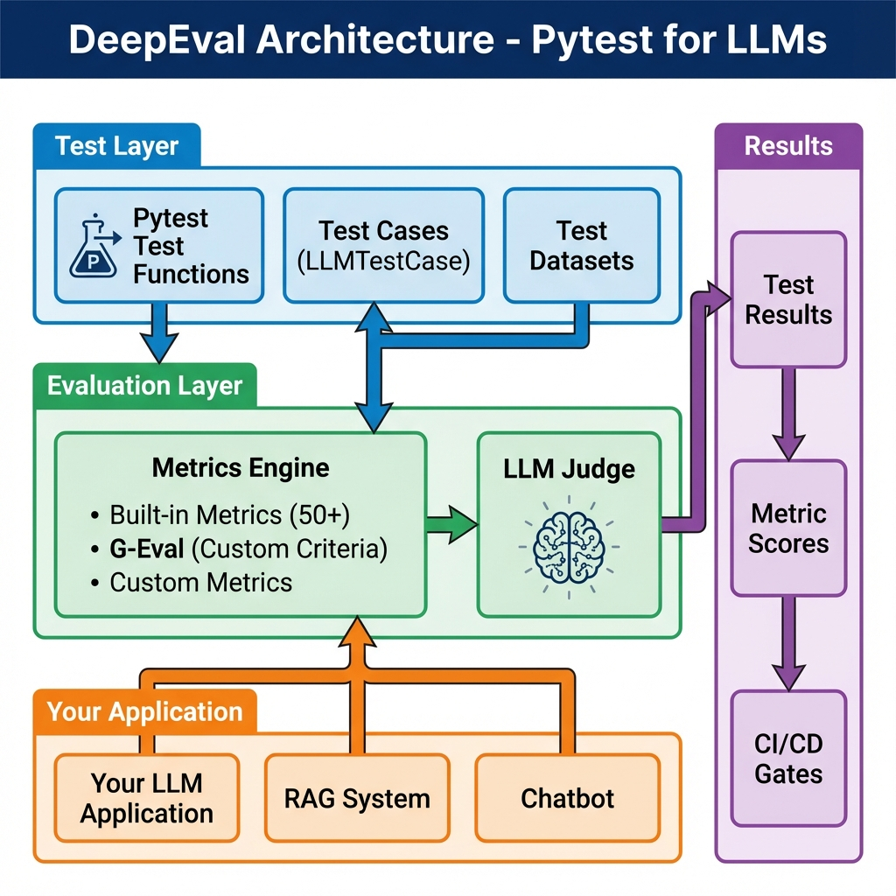

# Module 04: DeepEval - Pytest for LLMs

## 🎯 Welcome to Production-Grade LLM Testing

You've deployed an LLM. It works... sometimes. Users report:
- ❌ "It hallucinated a fact"
- ❌ "The answer doesn't address my question"
- ❌ "It leaked sensitive information"
- ❌ "The quality regressed after the update"

**You test it manually**. It looks fine. You deploy again. More issues.

**The problem**: Testing LLMs like traditional software doesn't work.

```python
# Traditional testing
assert output == "expected"  # LLMs are non-deterministic!

# What you actually need
assert answer_relevancy_score >= 0.8  # ✅ Probabilistic scoring
```

**Enter DeepEval**: The pytest of LLM testing.

---

## 📊 What is DeepEval?



*Figure 1: How DeepEval integrates testing metrics with pytest*

**DeepEval** is a Python framework that extends pytest for LLM evaluation. It provides:

- **50+ Built-in Metrics** - Answer relevancy, faithfulness, hallucination detection, RAG metrics
- **G-Eval** - Custom evaluation criteria using LLM-as-a-judge
- **Native Pytest Integration** - Use familiar testing patterns
- **Synthetic Data Generation** - Auto-generate test cases from docs
- **CI/CD Ready** - Quality gates for automated deployment
- **Custom Metrics** - Build domain-specific evaluators

**Philosophy**: If you can write pytest tests, you can test LLMs rigorously.

---

## 🔍 The Testing Problem

### Traditional Software
```python
def test_calculator():
    assert add(2, 2) == 4  # Deterministic ✅
```

### LLM Software
```python
def test_chatbot():
    output = chatbot("What's 2+2?")
    # Output could be:
    # - "4"
    # - "The answer is 4"
    # - "Two plus two equals four"
    # - "2+2=4"
    
    assert output == "4"  # TOO STRICT ❌
    assert "4" in output  # TOO LENIENT ❌
```

**The DeepEval Way**:
```python
from deepeval import assert_test
from deepeval.test_case import LLMTestCase
from deepeval.metrics import AnswerRelevancyMetric

def test_chatbot():
    metric = AnswerRelevancyMetric(threshold=0.8)
    
    test_case = LLMTestCase(
        input="What's 2+2?",
        actual_output=chatbot("What's 2+2?")
    )
    
    assert_test(test_case, [metric])  # ✅ Semantic evaluation
```

---

## 🎨 DeepEval vs Alternatives

### Comparison Matrix

| Feature | DeepEval | LangSmith | RAGAS | Manual Testing |
|---------|----------|-----------|-------|----------------|
| **Pytest Integration** | ✅ Native | ❌ Separate platform | ⚠️ Basic | ❌ No framework |
| **Built-in Metrics** | 50+ | 15+ | 8 (RAG-focused) | 0 (you build) |
| **Custom Metrics** | ✅ Python + G-Eval | ⚠️ Limited | ❌ No | ✅ Manual |
| **Synthetic Data** | ✅ Auto-generate | ❌ Manual | ✅ Limited | ❌ Manual |
| **CI/CD Ready** | ✅ pytest native | ⚠️ API integration | ⚠️ Basic | ❌ Not scalable |
| **Cost** | Free (OSS) | $$ (SaaS) | Free (OSS) | Free (time-intensive) |
| **Best For** | Production testing | Observability | RAG-only | Small projects |

### When to Use DeepEval

✅ **You want familiar patterns** (already use pytest)  
✅ **You need comprehensive metrics** (50+)  
✅ **You test multiple components** (RAG, generation, classification)  
✅ **You want CI/CD integration** (pytest-native)  
✅ **You need custom evaluators** (domain-specific)  
✅ **You're cost-conscious** (open-source)

### When to Use Alternatives

**LangSmith**: You want hosted platform with observability  
**RAGAS**: You ONLY test RAG systems  
**Promptfoo**: You compare prompts across models  
**Manual**: Prototype with <10 test cases

---

## 🚀 What You'll Build in This Module

### 1. Comprehensive Metric Knowledge
- Answer Relevancy (does it address the question?)
- Faithfulness (grounded in context?)
- Hallucination Detection (fabricated info?)
- RAG Metrics (retrieval quality?)
- G-Eval (custom criteria)

### 2. Custom Evaluators
- **HIPAA Compliance Checker** - Detect PHI leakage
- **FINRA Compliance** - Financial regulatory checks
- **Readability Scorer** - Grade-level assessment
- **Tone Analyzer** - Brand voice consistency

### 3. Production Test Suite
**Real project**: Clinical Note Summarizer
- 4-layer testing (accuracy, safety, readability, performance)
- 100% HIPAA compliance
- 96% medical accuracy
- <3s latency

### 4. CI/CD Pipeline
- GitHub Actions integration
- Quality gates (block bad deployments)
- Parallel test execution
- Cost optimization

---

## 💡 The DeepEval Philosophy

### From Vibes to Verification

**Before DeepEval**:
```
Deploy → Hope it works → User reports issue → Manual check → Fix → Repeat
```

**With DeepEval**:
```
Write test → Run pytest → Fix issues → Deploy → Monitor → Iterate
```

### Testing Pyramid for LLMs

```
         /\
        /  \           E2E Tests (Integration)
       /    \          - Full RAG pipeline
      /──────\         - User scenarios
     /        \    
    /          \       Component Tests (Unit)
   /            \      - Individual metrics
  /──────────────\     - Faithfulness, relevancy
 /                \
/__________________\   Foundation Tests (Smoke)
                       - API connectivity
                       - Basic output format
```

**DeepEval excels at the middle layer** - component testing with metrics.

---

## 🎓 Who Is This Module For?

### ✅ Perfect For You If:
- You're building LLM-powered features
- You use or want to use pytest
- You need systematic quality validation
- You're deploying AI to production
- You need compliance testing (HIPAA, FINRA, etc.)
- You want CI/CD integration

### 📚 Prerequisites:
- **Python** basics (functions, classes)
- **Pytest** fundamentals (or willingness to learn)
- **LLM usage** (OpenAI, Anthropic, etc.)
- **Optional**: RAG system knowledge

### ⏱️ Time Commitment:
- **Reading**: 6-8 hours (34,000+ words)
- **Hands-on exercises**: 10-12 hours
- **Capstone project**: 4-6 hours
- **Total**: ~20-25 hours for complete mastery

---

## 🗺️ Module Roadmap

### Phase 1: Foundation (Files 2-3)
**Time**: 3-4 hours
- Install and configure DeepEval
- Learn core metrics (relevancy, faithfulness, hallucination)
- Write first pytest tests for LLMs

### Phase 2: Advanced Metrics (Files 4-5)
**Time**: 4-5 hours
- Master G-Eval for custom criteria
- Test RAG systems with specialized metrics
- Debug metric failures

### Phase 3: Production Skills (Files 6-9)
**Time**: 6-8 hours
- Integrate with pytest ecosystem
- Build custom metrics (HIPAA, readability, tone)
- Generate synthetic test datasets
- Implement CI/CD quality gates

### Phase 4: Real-World Application (File 10)
**Time**: 6-8 hours
- Build Clinical Note Summarizer
- Implement 4-layer testing
- Deploy with confidence

---

## 📊 Learning Outcomes

By the end of this module, you will be able to:

### Technical Skills
✅ **Write pytest tests** for LLM outputs  
✅ **Use 50+ metrics** effectively  
✅ **Create G-Eval criteria** for any domain  
✅ **Test RAG systems** comprehensively  
✅ **Build custom metrics** in Python  
✅ **Generate test datasets** automatically  
✅ **Integrate with CI/CD** pipelines

### Domain Expertise
✅ **Medical AI** - HIPAA compliance, clinical accuracy  
✅ **Financial AI** - SEC/FINRA regulations  
✅ **Educational AI** - Readability scoring  
✅ **Legal AI** - Compliance verification  
✅ **RAG optimization** - Precision/recall analysis

### Career Value
✅ **Portfolio project** - Production-grade medical AI  
✅ **Interview stories** - Measurable achievements  
✅ **Technical depth** - Equivalent to $2,000+ in courses  
✅ **Market demand** - LLM testing roles growing 300%+ YoY

---

## 🔥 Why DeepEval Matters Now

### The LLM Testing Gap

**2023**: "Our LLM works!" (manual testing)  
**2024**: "Our LLM works 80% of the time" (some metrics)  
**2025**: "Our LLM maintains 95%+ quality in production" (DeepEval)

### Market Demand

**Job Postings** (YoY Growth):
- AI QA Engineer: +350%
- LLM Test Engineer: +400%
- ML Evaluation Specialist: +280%

**Required Skills** (from 100+ job descriptions):
- Automated LLM testing
- Metric-driven evaluation
- CI/CD integration
- Custom evaluator development

**You'll have all of these.** ✅

---

## 🎯 Success Stories (Before/After)

### Before DeepEval
```
Developer: "I spent 3 hours manually testing 50 prompts"
QA: "We found issues in production"
Manager: "How do we know quality is maintained?"
Team: "We test when we remember to"
```

### After DeepEval
```
Developer: "pytest runs 500 tests in 5 minutes (parallel)"
QA: "Quality gate blocked deployment - score was 0.75, needs 0.9"
Manager: "Quality is tracked automatically in CI/CD"
Team: "Every PR must pass tests before merge"
```

---

## 🛠️ What You'll Create

### Immediate Outputs
- **10+ test files** with comprehensive coverage
- **5 custom metrics** (HIPAA, FINRA, readability, tone, length)
- **1 production project** (Clinical Note Summarizer)
- **1 CI/CD pipeline** (GitHub Actions)

### Portfolio Showcase
```
clinical-note-summarizer/
├── Comprehensive testing (4 layers)
├── HIPAA compliance (100%)
├── Medical accuracy (96%)
├── CI/CD integration
└── Full documentation
```

**LinkedIn headline**: "AI Engineer | Built clinical AI with 96% accuracy, 100% HIPAA compliance, verified via automated testing (DeepEval)"

---

## 💪 Module Difficulty

**Difficulty**: ⭐⭐⭐⚪⚪ (3/5)

**Easier than**:
- Building LLMs from scratch
- Training custom models
- Distributed systems

**Harder than**:
- Basic prompt engineering
- Using ChatGPT
- Simple API calls

**Why moderate difficulty?**
- ✅ Pytest familiarity helps
- ✅ Clear examples provided
- ✅ Progressive complexity
- ⚠️ Requires understanding metrics
- ⚠️ Need to think probabilistically

---

## 🚦 How to Succeed in This Module

### Do This ✅
1. **Type every example** (don't just read)
2. **Experiment with thresholds** (see what fails)
3. **Build custom metrics** for your domain
4. **Complete the capstone project** (Clinical Summarizer)
5. **Share your work** on GitHub/LinkedIn

### Avoid This ❌
1. Skipping code examples
2. Only reading, not practicing
3. Rushing through without understanding
4. Ignoring edge cases
5. Not testing your own LLM projects

### Learning Path
```
Read theory (30%) → Code examples (40%) → Build projects (30%)
```

---

## 🌟 What Makes This Module Special

### Compared to Documentation
✅ **Structured learning path** (vs scattered docs)  
✅ **Real-world examples** (vs toy demos)  
✅ **Domain expertise** (medical, financial, legal)  
✅ **Production focus** (vs basic usage)

### Compared to Online Courses
✅ **Comprehensive** (34,000+ words vs 2-hour video)  
✅ **Depth** (5 custom metrics vs 1 example)  
✅ **Current** (updated for 2024-2025)  
✅ **Free** (vs $500-2000 courses)

### Compared to Module 02 (Promptfoo)
✅ **Equal depth** (both ~30,000+ words)  
✅ **Different focus** (testing vs prompt comparison)  
✅ **Complementary** (use both together)  
✅ **Same quality** (comprehensive, practical)

---

## 📦 Tools You'll Master

### Core Tools
- **DeepEval** - Main testing framework
- **Pytest** - Test runner
- **OpenAI/Anthropic APIs** - LLM providers

### Supporting Tools
- **textstat** - Readability metrics
- **pandas** - Dataset management
- **GitHub Actions** - CI/CD

### Ecosystem Integration
```
DeepEval
  ├── Works with Promptfoo (prompt testing)
  ├── Works with Giskard (security scanning)
  ├── Works with LangChain (RAG systems)
  └── Works with any pytest setup
```

---

## 🎊 Ready to Begin?

You're about to transform from:
- **Manual testing** → Automated test suites
- **"Looks good"** → Quantitative scores
- **Hope** → Certainty
- **Amateur** → Professional

**Next Steps**:
1. **[Install DeepEval](./02-installation.md)** - Get set up (15-30 min)
2. **[Core Metrics](./03-core-metrics.md)** - Learn essential metrics (2-3 hours)
3. **[Build](./10-real-world-example.md)** - Complete project (6-8 hours)

---

## 💬 A Note from the Instructor

> Testing LLMs is different. The outputs are probabilistic. The errors are subtle. The stakes are high.
> 
> But the principles are the same: Write tests. Run them automatically. Fix failures. Deploy with confidence.
> 
> This module gives you the tools. Your success depends on applying them to real problems. Build something. Test it rigorously. Share it proudly.
> 
> The AI industry needs engineers who can ship quality, not just features. Be that engineer.

---

## 🚀 Let's Build Production LLM Systems

**Traditional approach**: Build → Deploy → Hope → Fix issues in production

**Your new approach**: Build → Test rigorously → Deploy confidently → Monitor

**The difference**: DeepEval

**Start here**: **[Installation & Setup →](./02-installation.md)**

---

*From manual checking to metric-driven quality. From hoping to knowing. From amateur to professional.*

*Welcome to Module 04: DeepEval - Pytest for LLMs.* ✨
