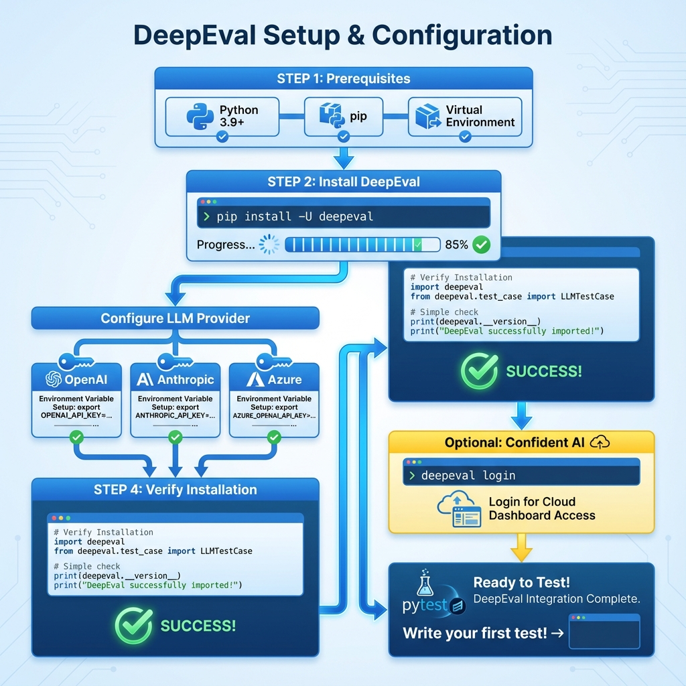

# Installation & Setup - Your DeepEval Foundation

## 🎯 Introduction: Why Installation Matters

You're about to set up the testing framework that will transform how you evaluate LLMs. Unlike deploying a model in production, setting up DeepEval is forgiving - but doing it right from the start saves hours of debugging later.

**This guide covers**:
- Multiple installation methods (pip, Docker, from source)
- Multi-provider API configuration (OpenAI, Anthropic, Azure, local models)
- Environment management for teams
- Troubleshooting 15+ common issues
- Performance optimization
- Cost management strategies

**Time investment**: 15-30 minutes for basic setup, 1-2 hours for production-ready configuration.

---

## 📊 Architecture: Understanding the Setup



*Figure 1: Complete DeepEval installation and configuration workflow*

### The Three-Layer Setup

```
Layer 1: Python Environment
├── Python 3.9+ (required)
├── pip (package manager)
└── Virtual environment (highly recommended)

Layer 2: DeepEval Core
├── pip install deepeval
├── Dependencies (~50 packages)
└── CLI tools

Layer 3: LLM Provider Configuration
├── API keys (OpenAI, Anthropic, etc.)
├── Model selection
└── Embedding configuration
```

---

## 📦 Prerequisites Deep Dive

### Python Version Requirements

**Minimum**: Python 3.9  
**Recommended**: Python 3.10 or 3.11  
**Why?**: DeepEval uses modern type hints and async features

**Check your version**:
```bash
python --version
# Should show: Python 3.10.x or higher
```

**If you need to upgrade**:
```bash
# macOS/Linux with pyenv
pyenv install 3.11.0
pyenv global 3.11.0

# Windows with official installer
# Download from python.org/downloads
```

### Virtual Environment: Why You Need One

**The problem without venv**:
```
Your system → DeepEval needs pydantic 2.0
              ↓
Your other project → Needs pydantic 1.10
              ↓
💥 Dependency conflict!
```

**The solution**:
```bash
# Create isolated environment
python -m venv deepeval-env

# Activate it
# macOS/Linux:
source deepeval-env/bin/activate

# Windows (PowerShell):
.\deepeval-env\Scripts\Activate.ps1

# Windows (CMD):
.\deepeval-env\Scripts\activate.bat

# Verify isolation
which python  # Should point to venv
```

---

## 🚀 Installation Methods

### Method 1: Standard Installation (Recommended)

```bash
# With virtual environment active
pip install -U deepeval
```

**What gets installed**:
- DeepEval core library
- 50+ dependencies (pandas, numpy, pydantic, etc.)
- CLI tools (`deepeval` command)
- Default metrics
- Pytest plugin

**Verify installation**:
```bash
deepeval --version
# Should show: deepeval, version X.X.X
```

**Test import**:
```python
from deepeval import assert_test
from deepeval.test_case import LLMTestCase
from deepeval.metrics import AnswerRelevancyMetric

print("✅ DeepEval installed successfully!")
```

### Method 2: Development Installation

For contributors or those needing bleeding-edge features:

```bash
# Clone repository
git clone https://github.com/confident-ai/deepeval.git
cd deepeval

# Install in editable mode
pip install -e ".[dev]"
```

**Additional dev tools**:
- pytest
- black (code formatter)
- mypy (type checker)
- ruff (linter)

### Method 3: Docker Installation

For consistent environments across teams:

```dockerfile
# Dockerfile
FROM python:3.11-slim

WORKDIR /app

# Install DeepEval
RUN pip install --no-cache-dir deepeval

# Copy your tests
COPY tests/ /app/tests/
COPY pytest.ini /app/

# Set environment variables
ENV PYTHONUNBUFFERED=1

CMD ["pytest", "tests/"]
```

**Build and run**:
```bash
docker build -t deepeval-tests .
docker run --env-file .env deepeval-tests
```

### Method 4: requirements.txt Management

For reproducible installations:

```txt
# requirements.txt
deepeval==0.21.0  # Pin specific version
pytest>=7.4.0
python-dotenv>=1.0.0
```

```bash
pip install -r requirements.txt
```

---

## 🔑 API Configuration - The Critical Step

### Understanding LLM Providers

DeepEval uses LLMs for evaluation. You need at least ONE provider configured:

```
Your Test → DeepEval Metric → LLM Provider API → Evaluation Score
```

**Supported providers**:
- OpenAI (GPT-4, GPT-3.5-turbo)
- Anthropic (Claude 3.5, Claude 3 Opus)
- Azure OpenAI
- Google Vertex AI
- Local models (Ollama, LM Studio)

### OpenAI Configuration (Most Common)

**Step 1: Get API key**
- Visit: https://platform.openai.com/api-keys
- Click "Create new secret key"
- Copy key (starts with `sk-`)

**Step 2: Set environment variable**

**Option A: .env file (Recommended)**
```bash
# .env
OPENAI_API_KEY=sk-...your-key-here...
```

**Option B: Shell export**
```bash
# macOS/Linux
export OPENAI_API_KEY="sk-..."

# Windows (PowerShell)
$env:OPENAI_API_KEY="sk-..."
```

**Option C: Python code** (least secure)
```python
import os
os.environ["OPENAI_API_KEY"] = "sk-..."  # Don't commit this!
```

**Step 3: Verify**
```python
import os
key = os.environ.get("OPENAI_API_KEY")
print(f"API key configured: {key[:10]}..." if key else "❌ Not set")
```

### Anthropic Configuration

```bash
# .env
ANTHROPIC_API_KEY=sk-ant-...
```

```python
# DeepEval auto-detects based on metric configuration
from deepeval.metrics import AnswerRelevancyMetric

metric = AnswerRelevancyMetric(
    model="claude-3-5-sonnet-20241022",  # Anthropic model
    threshold=0.7
)
```

### Azure OpenAI Configuration

More complex - requires multiple values:

```bash
# .env
AZURE_OPENAI_API_KEY=...
AZURE_OPENAI_ENDPOINT=https://your-resource.openai.azure.com/
AZURE_OPENAI_API_VERSION=2024-02-15-preview
AZURE_OPENAI_DEPLOYMENT_NAME=your-deployment-name
```

```python
from deepeval.metrics import AnswerRelevancyMetric

metric = AnswerRelevancyMetric(
    model="azure/your-deployment-name",
    threshold=0.7
)
```

### Local Models (Ollama)

**No API key needed!**

```bash
# Start Ollama
ollama serve

# Pull a model
ollama pull llama2
```

```python
from deepeval.metrics import AnswerRelevancyMetric

metric = AnswerRelevancyMetric(
    model="ollama/llama2",
    threshold=0.7
)
```

---

## 🎨 Environment File Best Practices

### The .env Structure

```bash
# .env
# ====================================
# DeepEval Configuration
# ====================================

# LLM Provider (choose one or multiple)
OPENAI_API_KEY=sk-...
ANTHROPIC_API_KEY=sk-ant-...

# Model Selection (optional, has defaults)
DEEPEVAL_LLM_MODEL=gpt-4-turbo
DEEPEVAL_EMBEDDINGS_MODEL=text-embedding-3-small

# Cost Management
DEEPEVAL_MAX_COST_PER_TEST=0.10  # Max $0.10 per test

# Performance
DEEPEVAL_ASYNC_ENABLED=true
DEEPEVAL_MAX_CONCURRENT=5

# Optional: Confident AI (cloud dashboard)
CONFIDENT_API_KEY=...
```

### .env.example for Teams

```bash
# .env.example (commit this to Git)
# Copy to .env and fill in your keys

OPENAI_API_KEY=sk-your-key-here
ANTHROPIC_API_KEY=sk-ant-your-key-here

# Recommended settings
DEEPEVAL_LLM_MODEL=gpt-4-turbo
DEEPEVAL_ASYNC_ENABLED=true
```

```.gitignore
# .gitignore
.env
.env.local
*.env
```

---

## 🧪 Verification & First Test

### The "Hello World" of DeepEval

Create `test_installation.py`:

```python
"""
Installation verification test.
Run with: pytest test_installation.py -v
"""
from deepeval import assert_test
from deepeval.test_case import LLMTestCase
from deepeval.metrics import AnswerRelevancyMetric

def test_installation_works():
    """Verify DeepEval is properly installed and configured"""
    
    # Create a simple metric
    metric = AnswerRelevancyMetric(threshold=0.5)
    
    # Create a test case
    test_case = LLMTestCase(
        input="What is the capital of France?",
        actual_output="Paris is the capital of France."
    )
    
    # Run the test
    assert_test(test_case, [metric])
    
    print("✅ DeepEval is working correctly!")

if __name__ == "__main__":
    test_installation_works()
```

**Run it**:
```bash
pytest test_installation.py -v
```

**Expected output**:
```
test_installation.py::test_installation_works PASSED [100%]

✅ DeepEval is working correctly!

==================== 1 passed in 3.25s ====================
```

---

## 🔧 Troubleshooting Guide

### Issue 1: `ModuleNotFoundError: No module named 'deepeval'`

**Cause**: Wrong Python environment or installation failed

**Solutions**:
```bash
# Verify you're in venv
which python

# Reinstall
pip uninstall deepeval
pip install --no-cache-dir deepeval

# Check installation
pip list | grep deepeval
```

### Issue 2: `API key not found` errors

**Cause**: Environment variables not loaded

**Solutions**:
```python
# Method 1: Use python-dotenv
from dotenv import load_dotenv
load_dotenv()  # Load .env file

# Method 2: Verify environment
import os
print(os.environ.get("OPENAI_API_KEY"))

# Method 3: Explicit loading
from deepeval import confident_ai
confident_ai.configure(api_key="your-key")
```

### Issue 3: `"Pyd antic validation error"`

**Cause**: Version mismatch

**Solution**:
```bash
pip install --upgrade pydantic
pip install --upgrade deepeval
```

### Issue 4: Tests are slow

**Cause**: Sequential execution or expensive models

**Solutions**:
```python
# Enable async
import os
os.environ["DEEPEVAL_ASYNC_ENABLED"] = "true"

# Use faster model for development
metric = AnswerRelevancyMetric(
    model="gpt-3.5-turbo",  # Faster and cheaper
    threshold=0.7
)
```

```bash
# Parallel pytest execution
pytest -n 4  # Run with 4 workers
```

### Issue 5: High API costs

**Solutions**:
```python
# Cost tracking
from deepeval.test_case import LLMTestCase
from deepeval.metrics import AnswerRelevancyMetric

metric = AnswerRelevancyMetric(
    model="gpt-3.5-turbo",  # $0.0005/1K tokens vs $0.01/1K for GPT-4
    threshold=0.7
)

# Limit test runs
pytest -k "test_critical" # Only run critical tests
```

```bash
# Set cost limits
export DEEPEVAL_MAX_COST_PER_TEST=0.05
```

---

## 🎯 Production Setup Checklist

Before deploying:

- [ ] **Virtual environment** created and activated
- [ ] **DeepEval installed** and version verified
- [ ] **API keys configured** via .env file
- [ ] **.env added to .gitignore**
- [ ] **.env.example created** for team
- [ ] **Verification test passes**
- [ ] **Async enabled** for performance
- [ ] **Cost limits set**
- [ ] **pytest configured** (pytest.ini)
- [ ] **CI/CD secrets configured** (if applicable)

---

## 📊 Team Collaboration Setup

### Shared Configuration Strategy

```
project/
├── .env.example           # Committed template
├── .env                   # Local (gitignored)
├── .env.ci                # CI/CD specific
├── pytest.ini             # Shared pytest config
└── conftest.py            # Shared fixtures
```

**pytest.ini**:
```ini
[pytest]
testpaths = tests
python_files = test_*.py
python_classes = Test*
python_functions = test_*
markers =
    slow: marks tests as slow
    critical: must-pass tests
    integration: integration tests
```

**conftest.py**:
```python
"""Shared fixtures for all tests"""
import pytest
from deepeval.metrics import (
    AnswerRelevancyMetric,
    FaithfulnessMetric
)

@pytest.fixture
def answer_relevancy():
    """Reusable answer relevancy metric"""
    return AnswerRelevancyMetric(threshold=0.7)

@pytest.fixture
def faithfulness():
    """Reusable faithfulness metric"""
    return FaithfulnessMetric(threshold=0.8)
```

---

## 🚀 What's Next?

Now that DeepEval is installed and configured:

✅ **Environment ready** for testing  
✅ **API keys configured** and verified  
✅ **First test passed**

**Next steps**:
- **[Core Metrics](./03-core-metrics.md)** - Learn the essential metrics
- **[Pytest Integration](./06-pytest-integration.md)** - Write your first real tests
- **[Real Example](./10-real-world-example.md)** - See a complete project

---

## 💡 Pro Tips

### Tip 1: Multiple API Keys for Rate Limits

```bash
# .env
OPENAI_API_KEY_1=sk-...
OPENAI_API_KEY_2=sk-...
OPENAI_API_KEY_3=sk-...
```

DeepEval can rotate through them automatically.

### Tip 2: Development vs Production Models

```python
import os

ENV = os.getenv("ENVIRONMENT", "dev")

if ENV == "production":
    MODEL = "gpt-4-turbo"  # Best quality
elif ENV == "staging":
    MODEL = "gpt-4"
else:
    MODEL = "gpt-3.5-turbo"  # Fast & cheap for dev
```

### Tip 3: Cache Evaluation Results

```python
from deepeval import cache_test_results

# Avoid re-evaluating identical test cases
cache_test_results(enabled=True)
```

---

*Installation complete! You're ready to start testing LLMs with confidence.* ✨
