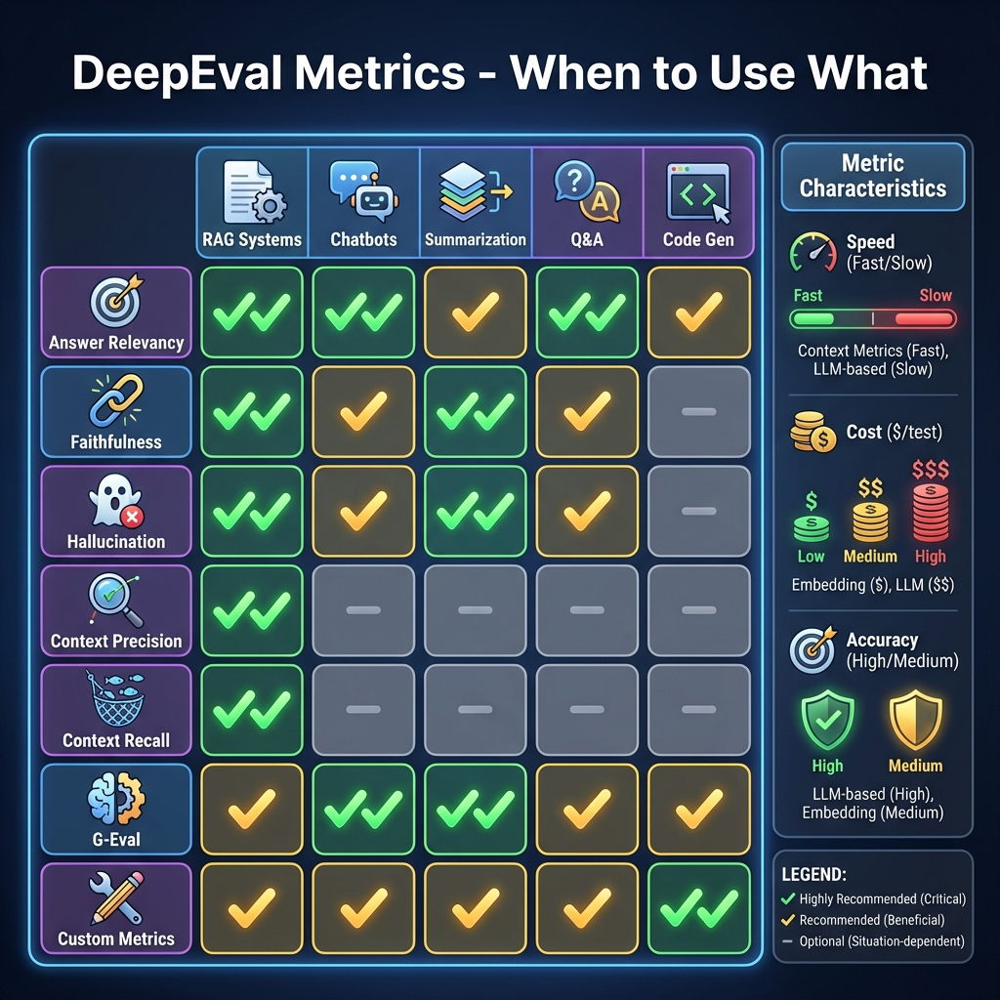

# Building Block 1: Core Metrics - Your Measurement Toolkit

## 🎯 Introduction: From Vibes to Metrics

Remember the last time you tested an LLM output? You probably thought:
- "Looks good" ✅
- "Hmm, not quite right" ❓
- "This is terrible" ❌

**The problem**: These are vibes, not measurements.

**The solution**: DeepEval's 50+ metrics turn subjective feelings into objective scores (0.0-1.0).

This chapter covers the **essential metrics** every LLM engineer must know:
- Answer Relevancy
- Faithfulness
- Hallucination Detection
- Contextual Precision
- Contextual Recall
- Contextual Relevancy

**By the end**, you'll know exactly which metric to use for any LLM evaluation scenario.

---

## 📊 The Metrics Landscape



*Figure 1: Comprehensive guide to choosing the right metric for your use case*

### Metric Categories

```
DeepEval Metrics (50+)
│
├── Answer Quality Metrics
│   ├── Answer Relevancy ⭐ 
│   ├── Correctness
│   └── Coherence
│
├── RAG-Specific Metrics
│   ├── Faithfulness ⭐
│   ├── Contextual Precision ⭐
│   ├── Contextual Recall ⭐
│   └── Contextual Relevancy ⭐
│
├── Safety & Bias Metrics
│   ├── Hallucination ⭐
│   ├── Toxicity
│   └── Bias
│
└── Custom Metrics
    └── G-Eval (next chapter)
```

**⭐ = Covered in this chapter**

---

## 🔍 Answer Relevancy Metric

### What It Measures

**Question**: Does the answer actually address the input question?

```
User asks: "What's the refund policy?"

Good answer: "30-day money-back guarantee"
→ Relevancy: 0.95

Bad answer: "Our products are high quality"
→ Relevancy: 0.2
```

### How It Works Internally

```
Step 1: Extract intent from input
        ↓
Step 2: Analyze if output addresses that intent
        ↓
Step 3: Calculate alignment score (0.0-1.0)
        ↓
Step 4: Apply threshold
```

**Algorithm**: Uses LLM to generate evaluation based on semantic similarity.

### Basic Usage

```python
from deepeval import assert_test
from deepeval.test_case import LLMTestCase
from deepeval.metrics import AnswerRelevancyMetric

# Create metric with threshold
metric = AnswerRelevancyMetric(threshold=0.7)

# Create test case
test_case = LLMTestCase(
    input="What's the capital of France?",
    actual_output="Paris is the capital of France, known for the Eiffel Tower."
)

# Measure
metric.measure(test_case)

print(f"Score: {metric.score}")  # 0.95
print(f"Reason: {metric.reason}")  # "Answer directly addresses the question..."
print(f"Success: {metric.success}")  # True
```

### Understanding the Score

| Score Range | Interpretation | Example |
|-------------|----------------|---------|
| 0.9 - 1.0 | Highly relevant | Direct, complete answer |
| 0.7 - 0.9 | Relevant | Addresses question with some extra info |
| 0.5 - 0.7 | Partially relevant | Related but misses key points |
| 0.0 - 0.5 | Irrelevant | Doesn't address question |

### Real-World Scenario: Customer Support Bot

```python
def test_support_bot_relevancy():
    """Ensure support bot gives relevant answers"""
    
    # Test multiple scenarios
    test_cases = [
        {
            "input": "How do I reset my password?",
            "output": "Go to Settings > Security > Reset Password. Click the link sent to your email.",
            "expected_score": ">0.9"  # Very relevant
        },
        {
            "input": "What's your return policy?",
            "output": "We offer free shipping on all orders over $50.",
            "expected_score": "<0.3"  # Irrelevant - answered wrong question
        },
        {
            "input": "Is this product waterproof?",
            "output": "This product has an IP67 rating, meaning it can withstand submersion in 1m of water for 30 minutes.",
            "expected_score": ">0.95"  # Highly relevant and detailed
        }
    ]
    
    metric = AnswerRelevancyMetric(threshold=0.7)
    
    for tc in test_cases:
        test_case = LLMTestCase(
            input=tc["input"],
            actual_output=tc["output"]
        )
        
        metric.measure(test_case)
        print(f"Input: {tc['input']}")
        print(f"Score: {metric.score:.2f} (Expected: {tc['expected_score']})")
        print(f"Reason: {metric.reason}\n")
```

### Advanced Configuration

```python
# Custom model for evaluation
metric = AnswerRelevancyMetric(
    model="gpt-4-turbo",  # More accurate but slower/expensive
    threshold=0.8,
    include_reason=True,  # Get explanation
    async_mode=True  # For parallel execution
)

# Temperature control
metric = AnswerRelevancyMetric(
    threshold=0.7,
    evaluation_params={
        "temperature": 0.0  # Deterministic scoring
    }
)
```

---

## 📖 Faithfulness Metric

### What It Measures

**Question**: Is the answer grounded in the provided context? Or did the model hallucinate?

**Critical for RAG systems** where you provide retrieved documents as context.

```
Context: "Our store hours are 9 AM - 6 PM Monday-Friday"

Good answer: "The store is open 9 AM to 6 PM on weekdays"
→ Faithfulness: 1.0 (everything supported by context)

Bad answer: "The store is open 24/7"
→ Faithfulness: 0.0 (contradicts context)
```

### How It Works

```
Step 1: Extract claims from the output
        ↓
Step 2: Check each claim against context
        ↓
Step 3: Calculate % of supported claims
        ↓
Step 4: Score = supported_claims / total_claims
```

### Basic Usage

```python
from deepeval.metrics import FaithfulnessMetric

metric = FaithfulnessMetric(threshold=0.8)

test_case = LLMTestCase(
    input="What's the refund policy?",
    actual_output="We offer a 30-day money-back guarantee for all products.",
    retrieval_context=[
        "Refund Policy: Customers can return items within 30 days for a full refund.",
        "Shipping: Standard shipping takes 5-7 business days."
    ]
)

metric.measure(test_case)
print(f"Faithfulness Score: {metric.score}")  # 1.0 - fully grounded
print(f"Reason: {metric.reason}")
```

### Real Debugging: Catching Hallucinations

```python
def test_rag_faithfulness():
    """Ensure RAG doesn't hallucinate facts"""
    
    # Example: Company FAQ bot
    context = [
        "We accept Visa, Mastercard, and PayPal",
        "Shipping is free for orders over $50",
        "Returns accepted within 30 days"
    ]
    
    # Test Case 1: Faithful response
    faithful_case = LLMTestCase(
        input="What payment methods do you accept?",
        actual_output="We accept Visa, Mastercard, and PayPal.",
        retrieval_context=context
    )
    
    metric = FaithfulnessMetric(threshold=0.9)
    metric.measure(faithful_case)
    assert metric.success, f"Faithful response failed: {metric.reason}"
    
    # Test Case 2: Hallucinated response
    hallucinated_case = LLMTestCase(
        input="What payment methods do you accept?",
        actual_output="We accept all major credit cards including Amex and Discover.",
        retrieval_context=context
    )
    
    metric.measure(hallucinated_case)
    print(f"Hallucination detected! Score: {metric.score}")
    print(f"Reason: {metric.reason}")
    # Expected: Low score because "Amex" and "Discover" not in context
```

### Claim Extraction Explained

**Input**: "The store is open from 9 AM to 6 PM on weekdays and offers free parking."

**Extracted claims**:
1. "Store opening hours are 9 AM to 6 PM"
2. "Store is open on weekdays"
3. "Free parking is available"

**Verification against context**:
- Claim 1: ✅ Supported
- Claim 2: ✅ Supported  
- Claim 3: ❌ Not mentioned in context

**Score**: 2/3 = 0.67

---

## 🚫 Hallucination Metric

### What It Measures

**The inverse of faithfulness** - specifically measures if the output contains fabricated information.

```
Hallucination Score = 1.0 - Faithfulness Score

Low hallucination = Good ✅
High hallucination = Bad ❌
```

### When to Use Each

| Metric | Use When | Threshold |
|--------|----------|-----------|
| Faithfulness | You want to ensure grounding | ≥ 0.8 |
| Hallucination | You want to prevent fabrication | ≤ 0.3 |

### Usage

```python
from deepeval.metrics import HallucinationMetric

metric = HallucinationMetric(threshold=0.3)  # Max 30% hallucination allowed

test_case = LLMTestCase(
    input="What's the CEO's salary?",
    actual_output="The CEO earns $500,000 annually.",
    context=["Company was founded in 2020. Headquarters in San Francisco."]
    # Note: CEO salary NOT in context!
)

metric.measure(test_case)
print(f"Hallucination Score: {metric.score}")  # High (bad)
print(f"Success: {metric.success}")  # False - too much hallucination
```

### Real Scenario: Preventing Information Leakage

```python
def test_no_sensitive_hallucination():
    """Ensure model doesn't invent sensitive information"""
    
    public_context = [
        "Company: TechCorp",
        "Industry: Software",
        "Location: Austin, TX"
    ]
    
    sensitive_questions = [
        "What is the CEO's compensation?",
        "How much revenue did we make last quarter?",
        "What's our acquisition strategy?"
    ]
    
    metric = HallucinationMetric(threshold=0.2)
    
    for question in sensitive_questions:
        response = my_rag_bot(question, public_context)
        
        test_case = LLMTestCase(
            input=question,
            actual_output=response,
            context=public_context
        )
        
        metric.measure(test_case)
        
        if metric.score > 0.5:
            print(f"⚠️  HIGH HALLUCINATION RISK: {question}")
            print(f"   Response: {response}")
            print(f"   Score: {metric.score}")
            # Should refuse or say "I don't have that information"
```

---

## 🎯 RAG-Specific Metrics

### The RAG Evaluation Triangle

For **Retrieval-Augmented Generation** systems, you need to test THREE components:

```
1. RETRIEVER: Did we get the right documents?
   → Contextual Precision
   → Contextual Recall

2. CONTEXT: Is the retrieved info useful?
   → Contextual Relevancy

3. GENERATOR: Is the final answer good?
   → Faithfulness
   → Answer Relevancy
```

### Contextual Precision

**Measures**: "Are the retrieved documents relevant?"

Penalizes retrieving irrelevant documents.

```python
from deepeval.metrics import ContextualPrecisionMetric

metric = ContextualPrecisionMetric(threshold=0.7)

test_case = LLMTestCase(
    input="How do I reset my password?",
    expected_output="Go to Settings > Security > Reset Password",
    retrieval_context=[
        "Password reset instructions: Navigate to Settings...",  # ✅ Relevant
        "Our company was founded in 2010",  # ❌ Irrelevant!
        "To reset password, click the forgot password link"  # ✅ Relevant
    ]
)

metric.measure(test_case)
print(f"Precision: {metric.score}")  # ~0.67 (2 out of 3 relevant)
```

**Interpretation**:
- **1.0**: All retrieved docs are relevant
- **0.7**: Some noise but mostly good
- **0.3**: Too much irrelevant retrieval

### Contextual Recall

**Measures**: "Did we retrieve ALL the needed information?"

Penalizes missing important documents.

```python
from deepeval.metrics import ContextualRecallMetric

metric = ContextualRecallMetric(threshold=0.8)

test_case = LLMTestCase(
    input="List all Python features",
    expected_output="Python features: dynamic typing, OOP, functional programming, duck typing",
    retrieval_context=[
        "Python has dynamic typing",
        "Python supports object-oriented programming"
        # Missing: functional programming, duck typing!
    ]
)

metric.measure(test_case)
print(f"Recall: {metric.score}")  # ~0.5 (got 2 out of 4 concepts)
```

**The Precision-Recall Tradeoff**:
```
High Precision, Low Recall → Retrieving too few docs
Low Precision, High Recall → Retrieving too many irrelevant docs
High Precision, High Recall → Perfect retrieval! ✨
```

### Contextual Relevancy

**Measures**: "Is the retrieved context helpful for answering the question?"

```python
from deepeval.metrics import ContextualRelevancyMetric

metric = ContextualRelevancyMetric(threshold=0.7)

test_case = LLMTestCase(
    input="What's the weather like in Paris?",
    actual_output="The current weather in Paris is sunny, 22°C.",
    retrieval_context=[
        "Current Paris weather: Sunny, 22°C",  # ✅ Highly relevant
        "Paris is the capital of France"  # ⚠️  Somewhat relevant but not needed
    ]
)

metric.measure(test_case)
```

---

## 🔬 Metric Deep Dive: Under the Hood

### How LLM-as-a-Judge Works

Most DeepEval metrics use an LLM to evaluate. Here's what happens:

```python
# When you call metric.measure(test_case)

Step 1: DeepEval constructs evaluation prompt
"""
Evaluate if this answer addresses the question.

Question: What's the capital of France?
Answer: Paris is the capital of France.

Rate relevancy from 0.0 to 1.0.
Return JSON: {"score": X.X, "reason": "..."}
"""

Step 2: Send to LLM (e.g., GPT-4)

Step 3: Parse LLM response
{
  "score": 0.95,
  "reason": "Answer directly and completely addresses the question"
}

Step 4: Apply threshold
if score >= threshold:
    success = True
```

### Cost & Performance Characteristics

| Metric | Model Calls | Avg Cost | Avg Time | Use Case |
|--------|-------------|----------|----------|----------|
| Answer Relevancy | 1 | $0.001 | 1-2s | General Q&A |
| Faithfulness | 1-3 | $0.003 | 2-4s | RAG systems |
| Contextual Precision | 1 | $0.002 | 1-3s | Retriever eval |
| G-Eval | 1-5 | $0.005 | 3-6s | Custom criteria |

**Optimization tip**:
```python
# Use cheaper model for development
metric = AnswerRelevancyMetric(
    model="gpt-3.5-turbo",  # $0.0005/1K tokens
    threshold=0.7
)

# Use GPT-4 for production/critical tests
metric_prod = AnswerRelevancyMetric(
    model="gpt-4-turbo",  # $0.01/1K tokens but more accurate
    threshold=0.8
)
```

---

## 🧪 Practical Exercise: Build a Test Suite

Let's test a customer support RAG system comprehensively:

```python
import pytest
from deepeval import assert_test
from deepeval.test_case import LLMTestCase
from deepeval.metrics import (
    AnswerRelevancyMetric,
    FaithfulnessMetric,
    ContextualPrecisionMetric
)

# Shared fixtures
@pytest.fixture
def support_context():
    return [
        "Return policy: 30-day money-back guarantee",
        "Shipping: Free over $50, otherwise $5.99",
        "Payment: Visa, Mastercard, PayPal accepted"
    ]

@pytest.fixture
def answer_relevancy():
    return AnswerRelevancyMetric(threshold=0.8)

@pytest.fixture
def faithfulness():
    return FaithfulnessMetric(threshold=0.9)

@pytest.fixture
def precision():
    return ContextualPrecisionMetric(threshold=0.7)

# Test Case 1: Return policy question
def test_return_policy_answer(support_context, answer_relevancy, faithfulness):
    """Test bot correctly answers return policy questions"""
    
    test_case = LLMTestCase(
        input="What's your return policy?",
        actual_output="We offer a 30-day money-back guarantee on all purchases.",
        retrieval_context=support_context
    )
    
    # Multiple metrics
    assert_test(test_case, [answer_relevancy, faithfulness])

# Test Case 2: Shipping question
def test_shipping_info(support_context, answer_relevancy, faithfulness, precision):
    """Test shipping information accuracy"""
    
    test_case = LLMTestCase(
        input="How much does shipping cost?",
        actual_output="Shipping is free for orders over $50, otherwise it's $5.99.",
        expected_output="Shipping costs $5.99, free over $50",
        retrieval_context=support_context
    )
    
    assert_test(test_case, [answer_relevancy, faithfulness, precision])

# Test Case 3: Hallucination check
def test_no_hallucinated_features(support_context, faithfulness):
    """Ensure bot doesn't invent features"""
    
    # Simulated bot response that hallucinates
    test_case = LLMTestCase(
        input="Do you offer cryptocurrency payment?",
        actual_output="Yes, we accept Bitcoin and Ethereum!",  # NOT in context!
        retrieval_context=support_context
    )
    
    faithfulness.measure(test_case)
    
    # This should FAIL
    assert not faithfulness.success, "Bot hallucinated payment methods!"
    print(f"✅ Correctly detected hallucination. Score: {faithfulness.score}")
```

**Run it**:
```bash
pytest test_support_bot.py -v
```

---

## 📋 Metric Selection Flowchart

```
What are you testing?
│
├─ General Q&A / Chatbot
│  → Answer Relevancy (primary)
│  → Coherence
│
├─ RAG System
│  ├─ Testing Retriever?
│  │  → Contextual Precision (no noise)
│  │  → Contextual Recall (complete)
│  │
│  └─ Testing Generator?
│     → Faithfulness (grounded)
│     → Answer Relevancy (addresses question)
│
├─ Summarization
│  → Faithfulness (accurate to source)
│  → Coherence
│
└─ Need custom criteria?
   → G-Eval (next chapter)
```

---

## ✅ Best Practices

### 1. Use Multiple Metrics

```python
# DON'T: Single metric
metric = AnswerRelevancyMetric(threshold=0.7)
assert_test(test_case, [metric])

# DO: Comprehensive evaluation
metrics = [
    AnswerRelevancyMetric(threshold=0.8),
    FaithfulnessMetric(threshold=0.9),
    ContextualPrecisionMetric(threshold=0.7)
]
assert_test(test_case, metrics)
```

### 2. Set Appropriate Thresholds

```python
# Critical systems (medical, legal)
metric = FaithfulnessMetric(threshold=0.95)  # Very strict

# General chatbot
metric = AnswerRelevancyMetric(threshold=0.7)  # Balanced

# Early development
metric = AnswerRelevancyMetric(threshold=0.5)  # Lenient
```

### 3. Monitor Metric Scores Over Time

```python
import json
from datetime import datetime

def log_metric_results(test_case, metrics):
    """Track metrics across releases"""
    results = {
        "timestamp": datetime.now().isoformat(),
        "test_case": test_case.input,
        "scores": {}
    }
    
    for metric in metrics:
        metric.measure(test_case)
        results["scores"][metric.__class__.__name__] = metric.score
    
    # Save for trend analysis
    with open("metric_history.jsonl", "a") as f:
        f.write(json.dumps(results) + "\n")
    
    return results
```

---

## 🎯 What You've Achieved

You now understand:

✅ **Answer Relevancy** - Does output address the input?  
✅ **Faithfulness** - Is output grounded in context?  
✅ **Hallucination** - Did model fabricate information?  
✅ **Contextual Precision** - Are retrieved docs relevant?  
✅ **Contextual Recall** - Did we retrieve all needed info?  
✅ **Contextual Relevancy** - Is context helpful?  
✅ **When to use each metric**  
✅ **How to combine metrics**  
✅ **Setting appropriate thresholds**  
✅ **Cost & performance considerations**

---

## 🚦 Next Steps

- **[Next: G-Eval](./04-g-eval.md)** - Create custom evaluation criteria
- **[RAG Metrics Deep Dive](./05-rag-metrics.md)** - Advanced RAG testing
- **[Real Example](./10-real-world-example.md)** - See metrics in production

---

*From vibes to metrics. From guessing to knowing. You're now equipped to measure LLM quality objectively.* ✨
