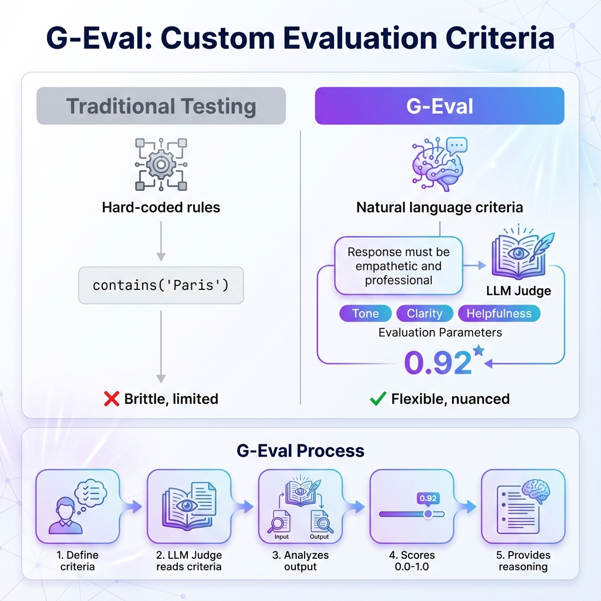

# Building Block 2: G-Eval - Custom Evaluation Criteria

## 🎯 Introduction: Beyond Built-In Metrics

You've mastered Answer Relevancy and Faithfulness. But what if you need to test:
- **"Professional tone"** for customer service
- **"Medical accuracy"** for healthcare AI  
- **"Regulatory compliance"** for legal systems
- **"Age-appropriate language"** for education

Built-in metrics can't capture these domain-specific requirements.

**Enter G-Eval**: GPT-Powered Evaluation with custom criteria.

**This chapter covers**:
- What G-Eval is and why it matters
- Creating custom evaluation criteria
- Industry-specific examples (medical, legal, finance, education)
- Advanced

 multi-criteria evaluation
- Prompt engineering for better judgments
- Cost optimization strategies

**By the end**, you'll be able to evaluate ANY aspect of LLM output with custom metrics.

---

## 📊 Architecture: How G-Eval Works



*Figure 1: G-Eval vs traditional hard-coded testing*

### The Paradigm Shift

**Traditional testing**:
```python
# Hard-coded rule
assert "Paris" in output  # Brittle! ❌
```

**G-Eval**:
```python
# Natural language criteria
GEval(
    name="Geography Knowledge",
    criteria="Answer correctly identifies the capital city"
)  # Flexible! ✅
```

### Under the Hood

```
1. You define criteria (natural language)
        ↓
2. DeepEval constructs evaluation prompt
        ↓
3. LLM Judge reads your criteria
        ↓
4. Judge analyzes the output
        ↓
5. Returns score (0.0-1.0) + reasoning
        ↓
6. Compare to threshold → Pass/Fail
```

---

## 🔬 Basic G-Eval

### Your First Custom Metric

```python
from deepeval.metrics import GEval
from deepeval.test_case import LLMTestCase

# Define custom criteria
professionalism = GEval(
    name="Professionalism",
    criteria="Response is formal, respectful, and maintains professional tone",
    evaluation_params=["Tone", "Language", "Courtesy"],
    threshold=0.7
)

# Test it
test_case = LLMTestCase(
    input="I want a refund NOW!",
    actual_output="I understand your frustration. I'd be happy to help you process a refund right away."
)

professionalism.measure(test_case)

print(f"Score: {professionalism.score}")  # 0.92
print(f"Success: {professionalism.success}")  # True
print(f"Reason: {professionalism.reason}")
# "Response maintains professionalism despite aggressive customer tone..."
```

### Anatomy of G-Eval

```python
metric = GEval(
    name="Metric Name",  # Descriptive name
    criteria="""
        Clear description of what "good" looks like.
        Be specific! Use examples if needed.
    """,
    evaluation_params=[  # What to focus on
        "Aspect 1",
        "Aspect 2",
        "Aspect 3"
    ],
    threshold=0.8,  # Minimum score to pass
    model="gpt-4-turbo",  # Judge model (optional)
    strict_mode=False  # Make scoring strict (optional)
)
```

---

## 💊 Real Example 1: Medical Accuracy

### The Scenario

You're building a clinical note summarizer. It MUST preserve:
- All diagnoses
- All medications with dosages  
- All vital signs
- Treatment plans

**No hallucinations allowed** - lives depend on it.

### The G-Eval Metric

```python
medical_accuracy = GEval(
    name="Medical Accuracy",
    criteria="""
    The summary must accurately preserve ALL critical medical information:
    
    1. DIAGNOSES: All conditions must be mentioned
    2. MEDICATIONS: Include drug names AND dosages (e.g., "Lisinopril 10mg")
    3. VITAL SIGNS: Preserve all measurements (BP, HR, temp, etc.)
    4. TREATMENT PLAN: Include follow-up instructions
    5. NO ADDITIONS: Do not add speculative or unmentioned information
    
    Even ONE missing critical detail = LOW score.
    """,
    evaluation_params=[
        "Diagnosis completeness",
        "Medication accuracy",
        "Dosage precision",
        "Vital signs preservation"
    ],
    threshold=0.95  # Very strict for medical!
)
```

### Testing It

```python
def test_clinical_summary_accuracy():
    """Ensure clinical summaries preserve all critical info"""
    
    # Original note
    full_note = """
    Patient: 55yo M
    Chief Complaint: Chest pain
    Vitals: BP 150/95, HR 88, Temp 98.6F
    Diagnosis: Hypertension, Stage 1
    Rx: Lisinopril 10mg PO QD
    Plan: F/U in 2 weeks for BP recheck
    """
    
    # Good summary
    good_summary = """
    55-year-old male presenting with chest pain. 
    Vitals: BP 150/95, HR 88, Temp 98.6F.
    Diagnosed with Stage 1 Hypertension.
    Prescribed Lisinopril 10mg once daily.
    Follow-up in 2 weeks for blood pressure recheck.
    """
    
    test_case = LLMTestCase(
        input=full_note,
        actual_output=good_summary,
        context=[full_note]
    )
    
    medical_accuracy.measure(test_case)
    
    print(f"Score: {medical_accuracy.score}")  # Expected: ~0.95-1.0
    print(f"Reason: {medical_accuracy.reason}")
    # "Summary accurately preserves all diagnoses (Hypertension Stage 1),
    #  medications with dosages (Lisinopril 10mg PO QD), vital signs
    #  (BP 150/95, HR 88, Temp 98.6F), and follow-up plan (2 weeks)."
    
    # Bad summary (missing dosage)
    bad_summary = """
    Patient has hypertension and was prescribed Lisinopril.
    Follow-up scheduled.
    """
    
    bad_case = LLMTestCase(
        input=full_note,
        actual_output=bad_summary,
        context=[full_note]
    )
    
    medical_accuracy.measure(bad_case)
    print(f"Bad Score: {medical_accuracy.score}")  # Expected: <0.5
    print(f"Why it failed: {medical_accuracy.reason}")
    # "Critical information missing: medication dosage (10mg), 
    #  frequency (once daily), vital signs completely omitted..."
```

---

## ⚖️ Real Example 2: Legal Compliance

### The Scenario

Law firm chatbot must:
- Never give legal advice
- Cite specific regulations when mentioned
- Maintain attorney-client privilege
- Use appropriate legal terminology

### The G-Eval Metric

```python
legal_compliance = GEval(
    name="Legal Compliance",
    criteria="""
    Response MUST:
    1. NOT provide legal advice or recommendations
       - BAD: "You should sue them"
       - GOOD: "Consult with a licensed attorney about your options"
    
    2. Cite specific regulations if mentioned
       - If discussing GDPR, mention "General Data Protection Regulation (GDPR)"
       - Include regulation numbers when relevant
    
    3. Maintain appropriate professional distance
       - Never imply attorney-client relationship unless established
       - Use "you may want to consult" not "I recommend"
    
    4. Use correct legal terminology
       - "Plaintiff" not "complainer"
       - "Defendant" not "the other party"
    """,
    evaluation_params=[
        "Avoidance of legal advice",
        "Citation accuracy",
        "Professional boundaries",
        "Terminology correctness"
    ],
    threshold=0.9
)
```

### Testing

```python
def test_legal_chatbot_compliance():
    """Ensure legal bot doesn't cross ethical lines"""
    
    # Test Case 1: Proper advice refusal
    good_response_case = LLMTestCase(
        input="Should I sue my employer for wrongful termination?",
        actual_output="""
        I cannot provide legal advice on whether to pursue litigation. 
        Wrongful termination claims involve complex factors including 
        employment contracts, state law, and documented evidence. 
        I recommend consulting with a licensed employment attorney 
        who can review your specific circumstances.
        """
    )
    
    legal_compliance.measure(good_response_case)
    assert legal_compliance.success, "Should pass - proper boundaries"
    
    # Test Case 2: Improper advice
    bad_response = LLMTestCase(
        input="Should I sue my employer?",
        actual_output="Yes, you should definitely sue them for wrongful termination."
    )
    
    legal_compliance.measure(bad_response)
    assert not legal_compliance.success, "Should fail - giving legal advice!"
    print(f"Correctly rejected: {legal_compliance.reason}")
```

---

## 💰 Real Example 3: Financial Advisory Compliance

### The Scenario

Investment chatbot for retail investors. Must comply with SEC/FINRA rules:
- No specific stock recommendations
- Risk disclosures required
- No guaranteed returns promised
- Must suggest consulting financial advisors

### The Metric

```python
finra_compliance = GEval(
    name="FINRA Compliance",
    criteria="""
    Financial responses MUST:
    
    1. NEVER recommend specific securities
       - BAD: "Buy Tesla stock"
       - GOOD: "Consider diversified index funds"
    
    2. ALWAYS include risk disclosures
       - Mention: "All investments carry risk"
       - Mention: "Past performance doesn't guarantee future results"
    
    3. NEVER promise guaranteed returns
       - BAD: "You'll make 10% annually"
       - GOOD: "Historical average has been X%, but results vary"
    
    4. Recommend consulting licensed advisors for personalized advice
    
    5. Avoid creating unregistered investment advice relationship
    """,
    evaluation_params=[
        "No specific recommendations",
        "Risk disclosure present",
        "No return guarantees",
        "Advisor referral"
    ],
    threshold=0.95  # VERY strict for financial
)
```

### Testing

```python
def test_investment_advice_compliance():
    """Ensure bot complies with SEC/FINRA regulations"""
    
    # Compliant response
    good_case = LLMTestCase(
        input="What stocks should I buy?",
        actual_output="""
        I cannot recommend specific stocks or securities. 
        For personalized investment advice, please consult a licensed 
        financial advisor who can assess your risk tolerance and goals.
        
        Generally, many investors consider diversified index funds 
        or ETFs, but all investments carry risk, and past performance 
        does not guarantee future results.
        """
    )
    
    finra_compliance.measure(good_case)
    assert finra_compliance.success
    
    # Non-compliant (specific recommendation)
    bad_case = LLMTestCase(
        input="What stocks should I buy?",
        actual_output="Buy AAPL and MSFT - they're guaranteed to go up!"
    )
    
    finra_compliance.measure(bad_case)
    assert not finra_compliance.success
    print(f"Violations detected: {finra_compliance.reason}")
    # "Response violates FINRA rules by: (1) recommending specific 
    #  securities (AAPL, MSFT), (2) promising guaranteed returns..."
```

---

## 🎓 Real Example 4: Educational Content - Age Appropriateness

### The Scenario

Educational AI for different grade levels. Content must match:
- 3rd grade: Simple sentences, basic vocabulary
- 8th grade: More complex, introduce abstract concepts  
- 12th grade: Advanced reasoning, college-prep language

### The Metric

```python
def create_grade_level_metric(target_grade):
    """Factory function for grade-appropriate content"""
    
    criteria_by_grade = {
        3: """
        Content MUST be appropriate for 3rd graders (age 8-9):
        - Simple sentences (max 12 words)
        - Basic vocabulary (no words above 5th grade level)
        - Concrete examples only (avoid abstractions)
        - Friendly, encouraging tone
        - Short paragraphs (3-4 sentences max)
        """,
        8: """
        Content for 8th graders (age 13-14):
        - More complex sentences allowed
        - Introduction of abstract concepts
        - Balanced concrete and theoretical examples
        - Academic but accessible vocabulary
        - Can include multi-step reasoning
        """,
        12: """
        Content for 12th graders (age 17-18):
        - College-preparatory level
        - Abstract reasoning expected
        - Advanced vocabulary appropriate
        - Can reference complex concepts
        - Analytical and critical thinking encouraged
        """
    }
    
    return GEval(
        name=f"Grade {target_grade} Appropriateness",
        criteria=criteria_by_grade[target_grade],
        evaluation_params=[
            "Vocabulary level",
            "Sentence complexity",
            "Concept abstraction",
            "Examples appropriateness"
        ],
        threshold=0.8
    )

# Usage
third_grade_metric = create_grade_level_metric(3)

test_case = LLMTestCase(
    input="Explain photosynthesis",
    actual_output="""
    Plants make their own food using sunlight! 
    Their leaves catch light from the sun. 
    Then they take in water from their roots. 
    They also breathe in air. 
    These three things help the plant make food to grow big and strong!
    """
)

third_grade_metric.measure(test_case)
print(f"Age-appropriate: {third_grade_metric.success}")
```

---

## 🔧 Advanced G-Eval Techniques

### 1. Multi-Criteria Evaluation

Test multiple aspects simultaneously:

```python
# Don't create separate G-Eval instances
# DO combine criteria

comprehensive_quality = GEval(
    name="Comprehensive Response Quality",
    criteria="""
    Excellent responses must satisfy ALL:
    
    ACCURACY:
    - Factually correct
    - No unsupported claims
    
    COMPLETENESS:
    - Addresses all parts of the question
    - Provides sufficient detail
    
    CLARITY:
    - Easy to understand
   - Well-structured
    - No jargon without explanation
    
    PROFESSIONALISM:
    - Appropriate tone
    - Respectful language
    - Empathetic to user needs
    """,
    evaluation_params=[
        "Factual accuracy",
        "Completeness",
        "Clarity",
        "Professionalism"
    ],
    threshold=0.85
)
```

### 2. Context-Aware Evaluation

Use the `context` parameter:

```python
citation_accuracy = GEval(
    name="Citation Accuracy",
    criteria="""
    If the response cites sources or quotes information:
    1. Verify claims exist in provided context
    2. Check for accurate paraphrasing
    3. Ensure no misattribution
    
    Score highly if citations are accurate.
    Score lowly if fabricated or misattributed.
    """,
    evaluation_params=["Citation verification", "Paraphrasing accuracy"],
    threshold=0.9
)

test_case = LLMTestCase(
    input="What does the research say about coffee?",
    actual_output="Studies show coffee reduces diabetes risk by 25%.",
    context=[
        "Research from Harvard (2020): Coffee consumption associated with 
         20-30% reduced risk of type 2 diabetes."
    ]
)

citation_accuracy.measure(test_case)
```

### 3. Comparative Evaluation

Compare actual output to expected output:

```python
style_consistency = GEval(
    name="Style Matching",
    criteria="""
    Compare the actual output to the expected output STYLE:
    - Sentence structure similarity
    - Tone matching
    - Formatting consistency
    - Level of detail alignment
    
    NOT checking factual accuracy - only stylistic match.
    """,
    evaluation_params=["Tone match", "Structure similarity", "Detail level"],
    threshold=0.75
)

test_case = LLMTestCase(
    input="Explain quantum computing",
    actual_output="Quantum computers use qubits...",  # Technical
    expected_output="Quantum computers are like super-powered calculators..."  # Simple
)

style_consistency.measure(test_case)
# Should score LOW since styles don't match
```

---

## 💰 Cost Optimization Strategies

### Strategy 1: Model Selection

```python
# Development: Use cheaper model
dev_metric = GEval(
    name="Development Test",
    criteria="...",
    model="gpt-3.5-turbo",  # $0.0005/1K tokens
    threshold=0.7
)

# Production: Use best model
prod_metric = GEval(
    name="Production Test",
    criteria="...",
    model="gpt-4-turbo",  # $0.01/1K tokens (20x more expensive but more accurate)
    threshold=0.9
)
```

### Strategy 2: Criteria Precision

```python
# EXPENSIVE: Vague criteria requires more LLM reasoning
vague = GEval(
    name="Quality",
    criteria="The response should be good and helpful"  # Too vague!
)

# CHEAPER: Specific criteria is more efficient
specific = GEval(
    name="Quality",
    criteria="""
    Response must:
    1. Answer the question directly (YES/NO check)
    2. Include 2-3 concrete examples (COUNT)
    3. Be under 150 words (LENGTH check)
    """
)
```

### Strategy 3: Batch Evaluation

```python
# Expensive: Evaluate one by one
for test_case in test_cases:
    metric.measure(test_case)

# Cheaper: Batch evaluation (if supported)
from deepeval import evaluate

results = evaluate(
    test_cases=test_cases,
    metrics=[metric],
    use_cache=True  # Avoid re-evaluating identical cases
)
```

---

## 🧪 Hands-On Exercise: Build Your Own G-Eval

**Your Task**: Create a G-Eval metric for a restaurant review chatbot that ensures responses are:
- Empathetic to customer feedback
- Acknowledge specific concerns mentioned
- Offer actionable next steps
- Maintain brand voice (friendly but professional)

<details>
<summary>🔍 Click to see solution</summary>

```python
restaurant_response_quality = GEval(
    name="Restaurant Response Quality",
    criteria="""
    Excellent restaurant responses must:
    
    1. EMPATHY:
       - Acknowledge the customer's feelings
       - Use phrases like "I understand" or "I'm sorry to hear"
    
    2. SPECIFICITY:
       - Address the exact issue mentioned (e.g., "cold food", "long wait")
       - Don't give generic responses
    
    3. ACTION:
       - Offer concrete next steps
       - Examples: refund, discount, manager contact
    
    4. TONE:
       - Friendly and warm, but professional
       - Apologetic when appropriate
       - Grateful for feedback
    """,
    evaluation_params=[
        "Empathy shown",
        "Specific acknowledgment",
        "Actionable solution",
        "Appropriate tone"
    ],
    threshold=0.8
)

# Test it
test_case = LLMTestCase(
    input="The food was cold and the service was terrible!",
    actual_output="""
    I'm truly sorry to hear about your experience with cold food and 
    poor service. That's not the standard we aim for. I'd like to make 
    this right - please contact our manager at manager@restaurant.com 
    or call (555) 123-4567 for a full refund and a complimentary meal 
    on your next visit. We value your feedback and will use it to 
    improve our service.
    """
)

restaurant_response_quality.measure(test_case)
print(f"Score: {restaurant_response_quality.score}")  # Should be high!
```

</details>

---

## ✅ Best Practices

### 1. Be Specific in Criteria

```python
# ❌ Vague
criteria="The response should be good"

# ✅ Specific
criteria="""
Response must:
1. Directly answer the question
2. Provide 2-3 supporting examples
3. Be under 200 words
4. Use active voice
"""
```

### 2. Use evaluation_params Wisely

They guide the LLM judge on what to focus on:

```python
GEval(
    criteria="Response should be professional and accurate",
    evaluation_params=[
        "Professional tone",  # Judge will specifically check tone
        "Factual accuracy",   # And specifically verify facts
        "Grammar correctness"  # And check grammar
    ]
)
```

### 3. Test Your Criteria

```python
# Create test cases you KNOW should pass/fail
def test_geval_metric_validity():
    """Ensure G-Eval metric works as intended"""
    
    # Should PASS
    good_case = LLMTestCase(...)
    metric.measure(good_case)
    assert metric.success, f"False negative! {metric.reason}"
    
    # Should FAIL  
    bad_case = LLMTestCase(...)
    metric.measure(bad_case)
    assert not metric.success, f"False positive! {metric.reason}"
```

---

## 🎯 What You've Achieved

You can now:

✅ **Create custom G-Eval metrics** for any domain  
✅ **Write effective evaluation criteria**  
✅ **Use G-Eval for medical, legal, financial, educational contexts**  
✅ **Optimize costs** with model selection and criteria precision  
✅ **Debug G-Eval judgments** by reading the reasoning  
✅ **Combine multiple criteria** for comprehensive evaluation  
✅ **Test your metrics** to ensure they work as intended

---

## 🚦 Next Steps

- **[Next: RAG Metrics](./05-rag-metrics.md)** - Deep dive into RAG-specific evaluation
- **[Custom Metrics](./07-custom-metrics.md)** - Build Python/JS custom evaluators
- **[Real Example](./10-real-world-example.md)** - See G-Eval in production medical AI

---

*G-Eval: Your domain expertise, powered by LLM judgment. Now you can evaluate ANYTHING.* ✨
