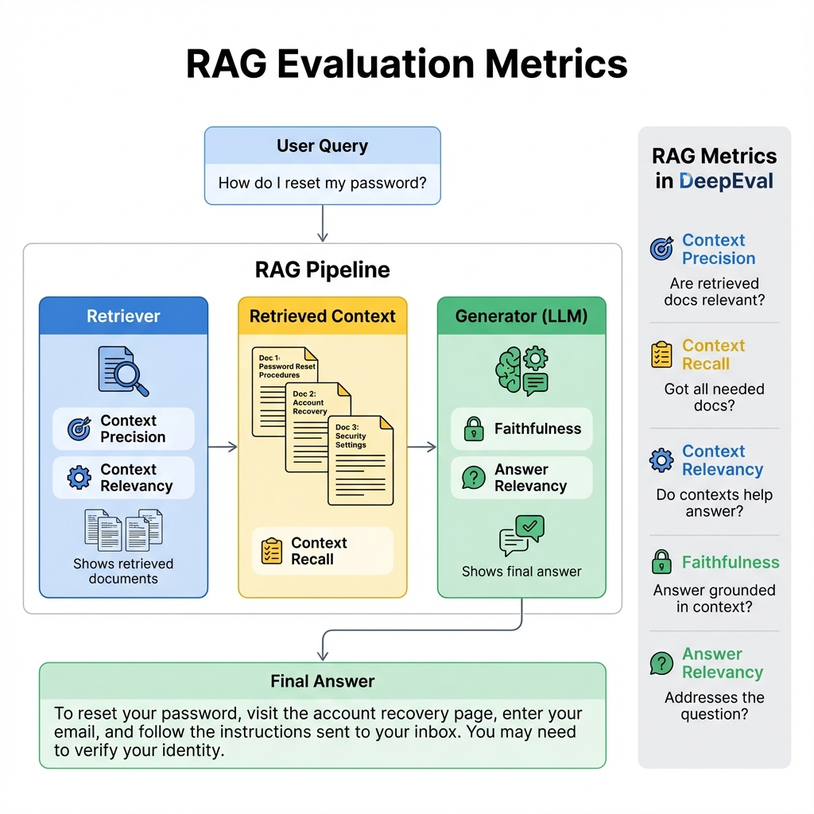

# Building Block 3: RAG Metrics - Testing Retrieval Systems

## 🎯 Introduction: The RAG Testing Challenge

You built a RAG system. It retrieves documents and generates answers. But how do you know it's working **well**?

**The problem**: RAG has TWO failure modes:
1. **Bad retrieval** → Model gets wrong documents → Garbage in, garbage out
2. **Bad generation** → Model ignores good documents → Wasted retrieval

**Traditional metrics** only test the final answer. They miss retrieval quality.

**RAG-specific metrics** test EVERY component:
- ✅ Retriever: Did we get the right docs?
- ✅ Context: Is retrieved info useful?
- ✅ Generator: Is the answer faithful and relevant?

**This chapter covers**:
- The three RAG evaluation dimensions
- Context Precision (retrieval quality)
- Context Recall (retrieval completeness)
- Context Relevancy (context usefulness)
- End-to-end RAG testing strategies
- Debugging retrieval failures
- Optimizing RAG systems with metrics

**By the end**, you'll be able to systematically improve RAG performance from 60% to 90%+.

---

## 📊 Architecture: The RAG Pipeline



*Figure 1: RAG pipeline components and their corresponding metrics*

### The Three-Stage RAG Pipeline

```
User Query: "How do I reset my password?"
        ↓
┌─────────────────────────────────────┐
│ STAGE 1: RETRIEVAL                  │
│ ┌─────────────────────────────────┐ │
│ │ Vector DB / Search Engine       │ │
│ │ Retrieves top-k documents       │ │
│ └─────────────────────────────────┘ │
│                                     │
│ Metrics:                            │
│ • Contextual Precision              │
│ • Contextual Recall                 │
└─────────────────────────────────────┘
        ↓
┌─────────────────────────────────────┐
│ STAGE 2: CONTEXT ASSEMBLY           │
│ ┌─────────────────────────────────┐ │
│ │ Retrieved Documents:            │ │
│ │ 1. "Password reset in Settings" │ │
│ │ 2. "Security features overview" │ │
│ │ 3. "Company history"            │ │
│ └─────────────────────────────────┘ │
│                                     │
│ Metrics:                            │
│ • Contextual Relevancy              │
└─────────────────────────────────────┘
        ↓
┌─────────────────────────────────────┐
│ STAGE 3: GENERATION                 │
│ ┌─────────────────────────────────┐ │
│ │ LLM generates answer from       │ │
│ │ query + retrieved context       │ │
│ └─────────────────────────────────┘ │
│                                     │
│ Metrics:                            │
│ • Faithfulness                      │
│ • Answer Relevancy                  │
└─────────────────────────────────────┘
        ↓
Final Answer: "Go to Settings > Security > Reset Password"
```

---

## 🎯 Contextual Precision: Retrieval Quality

### What It Measures

**Question**: Are the retrieved documents relevant to answering the query?

**Analogy**: Imagine asking a librarian for books about Python programming. They give you:
- ✅ "Python Programming 101"
- ✅ "Advanced Python Techniques"  
- ❌ "The Python: A Snake Species Guide"
- ❌ "Monty Python's Greatest Hits"

**Precision**: 2/4 = 0.5 → Too much noise!

### The Formula

```
Contextual Precision = (Relevant Retrieved Docs) / (Total Retrieved Docs)
```

### How DeepEval Calculates It

```python
from deepeval.metrics import ContextualPrecisionMetric

metric = ContextualPrecisionMetric(threshold=0.7)

test_case = LLMTestCase(
    input="How do I reset my password?",
    expected_output="Go to Settings > Security > Reset Password",
    retrieval_context=[
        "Password Reset: Navigate to Settings > Security...",  # ✅ Relevant
        "Two-factor authentication can be enabled in Security",  # ⚠️ Related but not needed
        "Company was founded in 2020"  # ❌ Completely irrelevant
    ]
)

metric.measure(test_case)
print(f"Precision: {metric.score}")  # ~0.33-0.67 depending on LLM judge
print(f"Reason: {metric.reason}")
```

**Internal Process**:
1. LLM analyzes each document against the `expected_output`
2. Determines if each doc is relevant
3. Calculates ratio of relevant docs

### Precision Scores Interpretation

| Score | Quality | Action Needed |
|-------|---------|---------------|
| 0.9-1.0 | Excellent | Retriever is well-tuned ✅ |
| 0.7-0.9 | Good | Minor noise, acceptable |
| 0.5-0.7 | Mediocre | Too many irrelevant docs, tune retriever |
| 0.0-0.5 | Poor | Retriever is broken, major tuning needed ❌ |

### Real Debugging: Low Precision

```python
def debug_low_precision():
    """When precision is low, inspect retrieved docs"""
    
    test_case = LLMTestCase(
        input="What's the refund policy?",
        expected_output="30-day money-back guarantee",
        retrieval_context=[
            "Refund policy: 30 days for full refund",  # ✅
            "Shipping takes 5-7 business days",  # ❌
            "Founded in 2020 by...",  # ❌
            "We use SSL encryption",  # ❌
            "Return instructions: contact support"  # ✅
        ]
    )
    
    metric = ContextualPrecisionMetric(threshold=0.7)
    metric.measure(test_case)
    
    print(f"❌ Precision Score: {metric.score}")  # 0.4 (2/5)
    
    # Diagnosis
    print("\n🔍 Retrieved Documents Analysis:")
    for i, doc in enumerate(test_case.retrieval_context, 1):
        print(f"{i}. {doc[:50]}...")
        # Manually check relevance
    
    print("\n💡 Fix: Improve retriever to filter out irrelevant docs")
    print("   - Adjust similarity threshold")
    print("   - Use metadata filtering")
    print("   - Re-embed with better model")
```

---

## 📊 Contextual Recall: Retrieval Completeness

### What It Measures

**Question**: Did we retrieve ALL the documents needed to answer the query?

**Analogy**: You ask for books about Python. Librarian gives you:
- ✅ "Python Programming 101"
- ❌ Missing: "Python Data Science" (needed!)
- ❌ Missing: "Python Web Development" (needed!)

**Recall**: 1/3 = 0.33 → Incomplete!

### The Formula

```
Contextual Recall = (Retrieved Relevant Docs) / (All Relevant Docs Needed)
```

### Implementation

```python
from deepeval.metrics import ContextualRecallMetric

metric = ContextualRecallMetric(threshold=0.8)

test_case = LLMTestCase(
    input="List all Python frameworks",
    expected_output="Python frameworks include Django, Flask, FastAPI, and Pyramid",
    retrieval_context=[
        "Django is a full-stack web framework",
        "Flask is a micro web framework"
        # Missing: FastAPI, Pyramid!
    ]
)

metric.measure(test_case)
print(f"Recall: {metric.score}")  # ~0.5 (got 2 out of 4)
print(f"Reason: {metric.reason}")
# "Retrieved docs cover Django and Flask but missing FastAPI and Pyramid..."
```

**How it works**:
1. LLM extracts key facts from `expected_output`
2. Checks if each fact is supported by `retrieval_context`
3. Calculates coverage ratio

### Recall Scores Interpretation

| Score | Completeness | Action Needed |
|-------|--------------|---------------|
| 0.9-1.0 | Complete | Retrieved all needed info ✅ |
| 0.7-0.9 | Mostly complete | Minor gaps, acceptable |
| 0.5-0.7 | Incomplete | Missing key information |
| 0.0-0.5 | Severely incomplete | Retriever misses most relevant docs ❌ |

### Real Debugging: Low Recall

```python
def debug_low_recall():
    """When recall is low, identify what's missing"""
    
    # Expected answer has 4 key facts
    test_case = LLMTestCase(
        input="What are Python's key features?",
        expected_output="""
        Python's key features include:
        1. Dynamic typing
        2. Object-oriented programming
        3. Functional programming support
        4. Extensive standard library
        """,
        retrieval_context=[
            "Python uses dynamic typing",
            "Python supports OOP"
            # Missing: functional programming, standard library
        ]
    )
    
    metric = ContextualRecallMetric(threshold=0.8)
    metric.measure(test_case)
    
    print(f"❌ Recall Score: {metric.score}")  # 0.5
    print(f"Reason: {metric.reason}")
    # "Retrieved context covers dynamic typing and OOP but lacks information
    #  about functional programming and standard library"
    
    print("\n💡 Fixes:")
    print("   - Increase k (retrieve more docs)")
    print("   - Use hybrid search (keyword + vector)")
    print("   - Improve document chunking strategy")
```

---

## ⚖️ The Precision-Recall Tradeoff

### Understanding the Balance

```
High Precision, Low Recall:
├─ Retrieved: Only 2 docs, both perfect
└─ Problem: Missing 3 other important docs
   → Answer will be incomplete

High Recall, Low Precision:
├─ Retrieved: 10 docs, 5 relevant, 5 noise
└─ Problem: Irrelevant docs confuse the LLM
   → Answer may hallucinate from noise

Sweet Spot:
├─ Retrieved: 5 docs, all relevant, nothing missed
└─ Result: Complete and accurate answer ✨
```

### Measuring Both Together

```python
def test_rag_retrieval_quality():
    """Test both precision and recall"""
    
    precision_metric = ContextualPrecisionMetric(threshold=0.7)
    recall_metric = ContextualRecallMetric(threshold=0.8)
    
    test_case = LLMTestCase(
        input="Explain Python's data types",
        expected_output="Python has int, float, str, bool, list, tuple, dict, set",
        retrieval_context=[
            "Python integers (int) are whole numbers",
            "Python floats for decimals",  
            "Strings (str) for text",
            "Boolean (bool) for True/False",
            "Lists are mutable sequences",
            "Tuples are immutable sequences",
            "Dictionaries (dict) for key-value pairs",
            # Missing: set
            "Python was created by Guido van Rossum"  # Irrelevant
        ]
    )
    
    precision_metric.measure(test_case)
    recall_metric.measure(test_case)
    
    print(f"Precision: {precision_metric.score:.2f}")  # ~0.88 (7/8 relevant)
    print(f"Recall: {recall_metric.score:.2f}")  # ~0.88 (7/8 concepts covered)
    
    # F1 Score (harmonic mean)
    f1 = 2 * (precision_metric.score * recall_metric.score) / \
         (precision_metric.score + recall_metric.score)
    print(f"F1 Score: {f1:.2f}")  # Balanced measure
```

### Optimization Strategies

| Problem | Precision | Recall | Fix |
|---------|-----------|--------|-----|
| Too much noise | Low ⬇️ | High ⬆️ | Increase similarity threshold |
| Missing docs | High ⬆️ | Low ⬇️ | Increase k, use hybrid search |
| Both low | Low ⬇️ | Low ⬇️ | Re-embed with better model, improve chunking |
| Both high | High ⬆️ | High ⬆️ | System is well-tuned! ✅ |

---

## 🎯 Contextual Relevancy: Context Usefulness

### What It Measures

**Question**: Even if retrieved docs are relevant, are they actually USEFUL for answering?

**Different from Precision**: A doc can be topically relevant but not actionable.

```
Query: "How do I fix error 404?"

Retrieved:
✅ "Error 404 means page not found. Check URL for typos."
   → Relevant AND useful

⚠️  "Error 404 is a common HTTP status code."
   → Relevant but NOT useful (doesn't help fix it)
```

### Implementation

```python
from deepeval.metrics import ContextualRelevancyMetric

metric = ContextualRelevancyMetric(threshold=0.7)

test_case = LLMTestCase(
    input="How to fix Python import error?",
    actual_output="Check your PYTHONPATH and ensure the module is installed",
    retrieval_context=[
        "Import errors occur when Python can't find a module. 
         Check PYTHONPATH environment variable.",  # ✅ Highly useful
        
        "Python is a programming language created in 1991."  # ⚠️ Relevant topic, not useful
    ]
)

metric.measure(test_case)
print(f"Relevancy Score: {metric.score}")
```

### Real Scenario: Customer Support RAG

```python
def test_support_rag_relevancy():
    """Ensure retrieved context is actionable"""
    
    query = "My account is locked, how do I unlock it?"
    
    # Good context (actionable)
    good_case = LLMTestCase(
        input=query,
        actual_output="To unlock your account, reset your password at account.example.com/reset",
        retrieval_context=[
            "Account unlock: Visit account.example.com/reset and follow instructions",
            "Multiple failed login attempts lock accounts for security",
            "Contact support@example.com if reset doesn't work"
        ]
    )
    
    metric = ContextualRelevancyMetric(threshold=0.8)
    metric.measure(good_case)
    print(f"✅ Good Context Relevancy: {metric.score}")  # High
    
    # Bad context (not actionable)
    bad_case = LLMTestCase(
        input=query,
        actual_output="Account locks are a security feature...",  # Vague!
        retrieval_context=[
            "We take account security seriously",  # Not helpful
            "Account locks protect user data",  # Not helpful
            "Many users experience account issues"  # Not helpful
        ]
    )
    
    metric.measure(bad_case)
    print(f"❌ Bad Context Relevancy: {metric.score}")  # Low
    print(f"Why: {metric.reason}")
```

---

## 🔬 End-to-End RAG Testing Strategy

### The Complete RAG Test Suite

```python
import pytest
from deepeval import assert_test
from deepeval.test_case import LLMTestCase
from deepeval.metrics import (
    ContextualPrecisionMetric,
    ContextualRecallMetric,
    ContextualRelevancyMetric,
    FaithfulnessMetric,
    AnswerRelevancyMetric
)

class TestRAGPipeline:
    """Comprehensive RAG system testing"""
    
    @pytest.fixture
    def rag_metrics(self):
        """All RAG-specific metrics"""
        return [
            # Retrieval quality
            ContextualPrecisionMetric(threshold=0.7),
            ContextualRecallMetric(threshold=0.8),
            ContextualRelevancyMetric(threshold=0.7),
            
            # Generation quality
            FaithfulnessMetric(threshold=0.9),
            AnswerRelevancyMetric(threshold=0.8)
        ]
    
    def test_product_faq_rag(self, rag_metrics):
        """Test RAG on product FAQ"""
        
        # Simulate RAG pipeline
        query = "What's the warranty period?"
        retrieved_docs = rag_retriever.retrieve(query)
        generated_answer = rag_generator.generate(query, retrieved_docs)
        
        test_case = LLMTestCase(
            input=query,
            actual_output=generated_answer,
            expected_output="2-year limited warranty on all products",
            retrieval_context=retrieved_docs
        )
        
        # Test all metrics
        assert_test(test_case, rag_metrics)
    
    def test_edge_case_no_relevant_docs(self):
        """Test behavior when no relevant docs exist"""
        
        test_case = LLMTestCase(
            input="What's the CEO's favorite color?",  # Not in knowledge base!
            actual_output="I don't have information about that",
            retrieval_context=[
                "CEO bio: John Smith founded company in 2020",
                "Company headquarters in Austin, TX"
            ]
        )
        
        # Should maintain high precision (no irrelevant doc usage)
        precision = ContextualPrecisionMetric(threshold=0.5)
        faithfulness = FaithfulnessMetric(threshold=0.9)
        
        precision.measure(test_case)
        faithfulness.measure(test_case)
        
        assert faithfulness.success, "Should not hallucinate when no info available"
```

---

## 📈 Real Case Study: Optimizing RAG from 0.6 to 0.9

### Initial State (Poor Performance)

```python
# Baseline metrics
initial_test = LLMTestCase(
    input="How do I return a product?",
    actual_output="You can return products within some timeframe",  # Vague
    expected_output="30-day return window with receipt",
    retrieval_context=[
        "Return policy overview document (3000 words)",  # Too long
        "Shipping information",  # Irrelevant
        "Company history",  # Irrelevant
        "Return form instructions"  # Relevant
    ]
)

metrics = {
    "precision": 0.5,  # 2/4 docs relevant
    "recall": 0.6,     # Missing key details (timeframe, receipt requirement)
    "relevancy": 0.4,  # Retrieved docs not actionable
    "faithfulness": 0.7,  # Answer too vague
    "answer_relevancy": 0.6  # Doesn't fully address question
}
```

### Optimization Step 1: Improve Chunking

```python
# Problem: 3000-word document is too big
# Solution: Chunk into smaller, focused sections

# Before: One huge chunk
"Return Policy: [3000 words of everything]"

# After: Multiple focused chunks
chunks = [
    "Return timeline: 30 days from purchase date",
    "Return requirements: Original receipt and packaging",
    "Return process: Contact support@example.com or visit store",
    "Refund timeline: 5-7 business days after receipt"
]

# New metrics after chunking
metrics after chunking:
- Precision: 0.5 → 0.75 ✅ (more focused chunks)
- Recall: 0.6 → 0.8 ✅ (specific info easier to find)
```

### Optimization Step 2: Add Metadata Filtering

```python
# Add metadata to chunks
chunks_with_metadata = [
    {
        "text": "Return timeline: 30 days...",
        "metadata": {"category": "returns", "topic": "timeline"}
    },
    {
        "text": "Shipping takes 5-7 days...",
        "metadata": {"category": "shipping", "topic": "timeline"}
    }
]

# Filter at query time
query_metadata = {"category": "returns"}  # Only retrieve return-related docs

# New metrics:
- Precision: 0.75 → 0.9 ✅ (no more shipping docs for return queries)
```

### Optimization Step 3: Hybrid Search

```python
# Combine vector search + keyword search
from langchain.retrievers import EnsembleRetriever

retriever = EnsembleRetriever(
    retrievers=[vector_retriever, keyword_retriever],
    weights=[0.7, 0.3]  # 70% vector, 30% keyword
)

# New metrics:
- Recall: 0.8 → 0.95 ✅ (catches more exact matches)
```

### Final Result

```python
optimized_test = LLMTestCase(
    input="How do I return a product?",
    actual_output="You can return products within 30 days with original receipt and packaging. Contact support@example.com or visit any store location.",
    expected_output="30-day return window with receipt",
    retrieval_context=[
        "Return timeline: 30 days from purchase date",
        "Return requirements: Original receipt and packaging",
        "Return process: Contact support@example.com or visit store"
    ]
)

final_metrics = {
    "precision": 1.0,  # All retrieved docs relevant ✅
    "recall": 0.95,    # Almost all key info captured ✅
    "relevancy": 0.9,  # Very actionable context ✅
    "faithfulness": 0.95,  # Answer grounded in context ✅
    "answer_relevancy": 0.9  # Fully addresses question ✅
}

# Overall improvement: 0.6 → 0.95 🎉
```

---

## ✅ RAG Testing Checklist

Before deploying your RAG system:

### Retrieval Quality
- [ ] **Precision ≥ 0.7** - Minimal irrelevant docs
- [ ] **Recall ≥ 0.8** - Captures all needed info
- [ ] **Relevancy ≥ 0.7** - Retrieved docs are actionable

### Generation Quality
- [ ] **Faithfulness ≥ 0.9** - No hallucinations
- [ ] **Answer Relevancy ≥ 0.8** - Addresses question

### Edge Cases
- [ ] **No relevant docs**: System says "I don't know"
- [ ] **Contradictory docs**: System handles conflicting info
- [ ] **Outdated docs**: System prioritizes recent information

### Performance
- [ ] **Latency < 3s** - Retrieval + generation combined
- [ ] **Cost < $0.01** - Per query

---

## 🎯 What You've Achieved

You can now:

✅ **Measure RAG retrieval quality** (Precision/Recall/Relevancy)  
✅ **Debug retrieval failures** systematically  
✅ **Optimize RAG systems** with data  
✅ **Test end-to-end** RAG pipelines  
✅ **Handle edge cases** (no docs, conflicts)  
✅ **Improve from 60% to 90%+** performance  
✅ **Deploy RAG with confidence**

---

## 🚦 Next Steps  

- **[Next: Pytest Integration](./06-pytest-integration.md)** - Write RAG tests with pytest
- **[Custom Metrics](./07-custom-metrics.md)** - Build domain-specific RAG metrics
- **[Real Example](./10-real-world-example.md)** - Production RAG testing

---

*RAG systems are complex. RAG metrics make them testable. Now you can build reliable retrieval.* ✨
