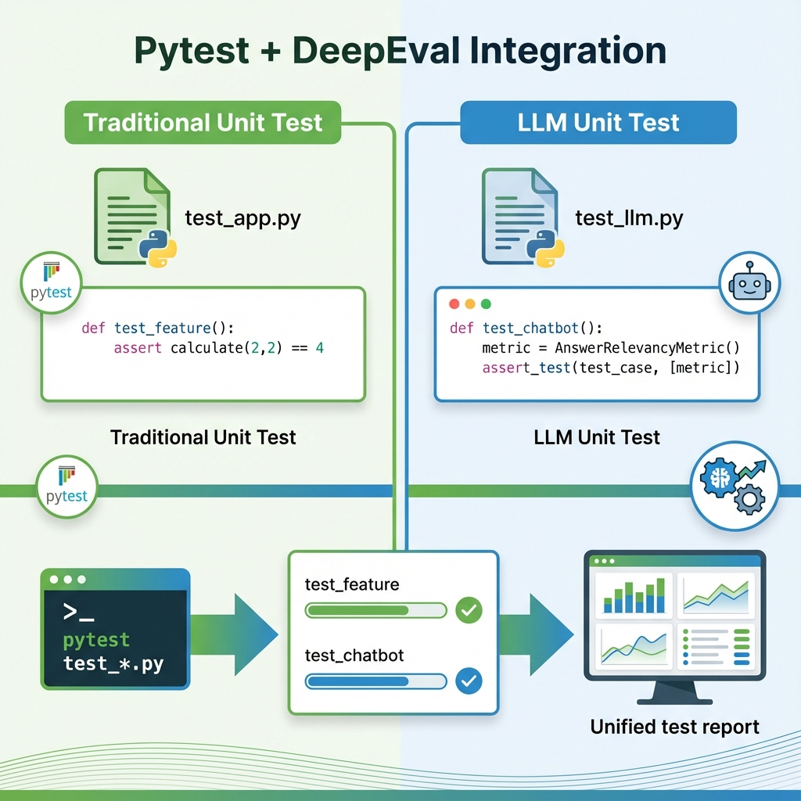

# Building Block 4: Pytest Integration - Testing LLMs Like Code

## 🎯 Introduction: Familiar Patterns for New Problems

You know pytest. You've written thousands of tests:
```python
def test_calculator():
    assert add(2, 2) == 4
```

Now you need to test LLMs. The output is non-deterministic. How do you write tests?

**DeepEval's answer**: Same pytest patterns, adapted for AI.

```python
def test_chatbot():
    metric = AnswerRelevancyMetric(threshold=0.7)
    test_case = LLMTestCase(input="Hello", actual_output=bot_response)
    assert_test(test_case, [metric])
```

**This chapter covers**:
- Native pytest integration
- Test organization strategies
- Fixtures for metrics and test cases
- Parametrized testing for LLMs
- Parallel test execution
- CI/CD integration with pytest
- Debugging failed tests
- Custom pytest plugins

**By the end**, you'll write LLM tests as naturally as you write unit tests.

---

## 📊 Architecture: DeepEval + Pytest



*Figure 1: How DeepEval integrates seamlessly with pytest*

### The Integration Model

```
Traditional Pytest:
test_my_code.py → pytest → assert statements → Pass/Fail

DeepEval + Pytest:
test_my_llm.py → pytest → assert_test(metrics) → Pass/Fail
                    ↓
            Same commands, same workflow!
```

### Key Insight

DeepEval doesn't replace pytest - it **extends** it:

```python
# Still works: Traditional asserts
def test_traditional():
    assert 2 + 2 == 4

# Also works: LLM evaluation
def test_llm():
    metric = AnswerRelevancyMetric(threshold=0.7)
    assert_test(test_case, [metric])

# Works together in same file!
```

---

## 🚀 Basic Pytest Tests

### Your First LLM Test

Create `test_chatbot.py`:

```python
"""
LLM tests using pytest + DeepEval
Run with: pytest test_chatbot.py -v
"""
from deepeval import assert_test
from deepeval.test_case import LLMTestCase
from deepeval.metrics import AnswerRelevancyMetric

def test_chatbot_answers_greeting():
    """Test that chatbot responds relevantly to greetings"""
    
    # Setup
    metric = AnswerRelevancyMetric(threshold=0.7)
    
    # Simulate chatbot response
    user_input = "Hello, how are you?"
    bot_response = "Hi! I'm doing great. How can I help you today?"
    
    # Create test case
    test_case = LLMTestCase(
        input=user_input,
        actual_output=bot_response
    )
    
    # Assert
    assert_test(test_case, [metric])
```

**Run it**:
```bash
pytest test_chatbot.py -v
```

**Output**:
```
test_chatbot.py::test_chatbot_answers_greeting PASSED [100%]

==================== 1 passed in 2.31s ====================
```

### Multiple Test Functions

```python
def test_product_question():
    """Test product information queries"""
    metric = AnswerRelevancyMetric(threshold=0.8)
    
    test_case = LLMTestCase(
        input="What's the price of product X?",
        actual_output="Product X costs $99.99"
    )
    
    assert_test(test_case, [metric])

def test_shipping_question():
    """Test shipping information queries"""
    metric = AnswerRelevancyMetric(threshold=0.8)
    
    test_case = LLMTestCase(
        input="How long is shipping?",
        actual_output="Standard shipping takes 5-7 business days"
    )
    
    assert_test(test_case, [metric])

def test_returns_question():
    """Test return policy queries"""
    faithfulness = FaithfulnessMetric(threshold=0.9)
    relevancy = AnswerRelevancyMetric(threshold=0.8)
    
    test_case = LLMTestCase(
        input="What's your return policy?",
        actual_output="We offer 30-day returns with receipt",
        retrieval_context=["Return policy: 30 days with receipt"]
    )
    
    assert_test(test_case, [faithfulness, relevancy])
```

**Run specific tests**:
```bash
# Run all
pytest test_chatbot.py

# Run one test
pytest test_chatbot.py::test_product_question

# Run tests matching pattern
pytest -k "shipping"
```

---

## 🔧 Fixtures: Reusable Components

### Metric Fixtures

Stop repeating metric creation:

```python
import pytest
from deepeval.metrics import (
    AnswerRelevancyMetric,
    FaithfulnessMetric,
    ContextualPrecisionMetric
)

@pytest.fixture
def answer_relevancy():
    """Reusable answer relevancy metric"""
    return AnswerRelevancyMetric(threshold=0.8)

@pytest.fixture
def faithfulness():
    """Reusable faithfulness metric"""
    return FaithfulnessMetric(threshold=0.9)

@pytest.fixture
def precision():
    """Reusable contextual precision metric"""
    return ContextualPrecisionMetric(threshold=0.7)

# Usage
def test_with_fixtures(answer_relevancy, faithfulness):
    """Tests automatically get metrics"""
    test_case = LLMTestCase(...)
    assert_test(test_case, [answer_relevancy, faithfulness])
```

### RAG System Fixture

```python
@pytest.fixture
def rag_system():
    """Mock or real RAG system for testing"""
    from my_app import RAGSystem
    
    # Setup
    rag = RAGSystem(
        vector_db="test_db",
        llm_model="gpt-3.5-turbo"  # Cheaper for tests
    )
    
    yield rag
    
    # Teardown
    rag.cleanup()

def test_rag_retrieval(rag_system, precision):
    """Test RAG retrieval quality"""
    query = "What's the refund policy?"
    docs = rag_system.retrieve(query)
    answer = rag_system.generate(query, docs)
    
    test_case = LLMTestCase(
        input=query,
        actual_output=answer,
        retrieval_context=docs,
        expected_output="30-day refund"
    )
    
    assert_test(test_case, [precision])
```

### Fixture Scope

```python
# Function scope (default): New instance per test
@pytest.fixture
def metric():
    return AnswerRelevancyMetric(threshold=0.7)

# Module scope: One instance for all tests in file
@pytest.fixture(scope="module")
def expensive_metric():
    # Setup takes time
    return ComplexMetric(...)

# Session scope: One instance for entire pytest session
@pytest.fixture(scope="session")
def llm_client():
    # Expensive to create
    client = OpenAI(api_key=...)
    yield client
    client.close()
```

---

## 🔄 Parametrized Tests

### Testing Multiple Inputs

```python
import pytest

@pytest.mark.parametrize("question,expected_topic", [
    ("What's your return policy?", "returns"),
    ("How much is shipping?", "shipping"),
    ("Do you have a warranty?", "warranty"),
    ("What payment methods?", "payment")
])
def test_topic_detection(question, expected_topic):
    """Test chatbot correctly identifies query topics"""
    
    response = my_chatbot(question)
    
    # Simple assertion
    assert expected_topic.lower() in response.lower()
```

### Parametrized with Metrics

```python
@pytest.mark.parametrize("query,context,min_score", [
    (
        "What's the capital of France?",
        ["France's capital is Paris"],
        0.9  # Should score very high
    ),
    (
        "Tell me about Paris",
        ["Paris is the capital of France"],
        0.7  # Relevant but broader
    ),
    (
        "Weather in Paris?",
        ["Paris is the capital of France"],
        0.4  # Somewhat related
    )
])
def test_varying_relevancy(query, context, min_score):
    """Test relevancy varies appropriately"""
    
    answer = my_rag(query, context)
    
    test_case = LLMTestCase(
        input=query,
        actual_output=answer,
        retrieval_context=context
    )
    
    metric = AnswerRelevancyMetric(threshold=min_score)
    assert_test(test_case, [metric])
```

### Test Data from CSV

```python
import pytest
import pandas as pd

# Load test data
test_data = pd.read_csv("test_cases.csv")

@pytest.mark.parametrize("row", test_data.to_dict('records'))
def test_from_csv(row):
    """Test all cases from CSV file"""
    
    test_case = LLMTestCase(
        input=row['input'],
        actual_output=my_model(row['input']),
        expected_output=row['expected_output']
    )
    
    metric = AnswerRelevancyMetric(threshold=row['min_score'])
    assert_test(test_case, [metric])
```

**test_cases.csv**:
```csv
input,expected_output,min_score
"What's 2+2?","4",0.9
"Capital of France?","Paris",0.9
"Python best practices?","PEP 8, testing, documentation",0.7
```

---

## 📁 Test Organization

### Recommended Structure

```
project/
├── src/
│   ├── chatbot.py
│   ├── rag_system.py
│   └── models.py
├── tests/
│   ├── conftest.py          # Shared fixtures
│   ├── test_chatbot.py      # Chatbot tests
│   ├── test_rag.py          # RAG tests
│   ├── test_metrics.py      # Custom metrics tests
│   └── data/
│       ├── test_cases.csv
│       └── mock_responses.json
└── pytest.ini               # Pytest configuration
```

### conftest.py (Shared Fixtures)

```python
"""
Shared fixtures for all tests
Automatically discovered by pytest
"""
import pytest
from deepeval.metrics import (
    AnswerRelevancyMetric,
    FaithfulnessMetric,
    ContextualPrecisionMetric
)
from src.chatbot import Chatbot

# Metrics
@pytest.fixture
def answer_relevancy():
    return AnswerRelevancyMetric(threshold=0.7)

@pytest.fixture
def faithfulness():
    return FaithfulnessMetric(threshold=0.9)

@pytest.fixture
def precision():
    return ContextualPrecisionMetric(threshold=0.7)

# System under test
@pytest.fixture(scope="module")
def chatbot():
    """Initialize chatbot once per module"""
    bot = Chatbot(model="gpt-3.5-turbo")
    yield bot
    bot.cleanup()

# Test data
@pytest.fixture
def sample_context():
    return [
        "Product price: $99.99",
        "Shipping: Free over $50",
        "Returns: 30-day policy"
    ]
```

### pytest.ini Configuration

```ini
[pytest]
# Test discovery
testpaths = tests
python_files = test_*.py
python_classes = Test*
python_functions = test_*

# Markers
markers =
    slow: marks tests as slow (deselect with '-m "not slow"')
    critical: must-pass tests for deployment
    rag: RAG-specific tests
    unit: unit-level tests
    integration: integration tests

# Output
addopts =
    -v                    # Verbose
    --strict-markers      # Error on unknown markers
    --tb=short           # Shorter tracebacks
    -ra                   # Show all test summary

# Coverage
[coverage:run]
source = src
```

**Using markers**:
```python
@pytest.mark.critical
def test_must_pass():
    """This test MUST pass for deployment"""
    pass

@pytest.mark.slow
def test_expensive_operation():
    """Takes a long time"""
    pass

@pytest.mark.rag
def test_rag_component():
    """RAG-specific test"""
    pass
```

**Run by marker**:
```bash
# Run only critical tests
pytest -m critical

# Exclude slow tests
pytest -m "not slow"

# Run RAG tests only
pytest -m rag
```

---

## ⚡ Parallel Test Execution

### Why Parallelize?

LLM tests call APIs - they're I/O bound and slow.

```
Sequential (default):
Test 1 (3s) → Test 2 (3s) → Test 3 (3s) = 9s total

Parallel (4 workers):
Test 1 (3s) ┐
Test 2 (3s) ├─ Running simultaneously = 3s total
Test 3 (3s) ┘
```

### Setup: pytest-xdist

```bash
pip install pytest-xdist
```

### Usage

```bash
# Auto-detect CPU count
pytest -n auto

# Specific number of workers
pytest -n 4

# Distribute by file
pytest --dist loadfile
```

### Example with Timing

```python
# test_parallel.py
import time

def test_slow_1():
    """Simulates slow API call"""
    time.sleep(2)
    assert True

def test_slow_2():
    time.sleep(2)
    assert True

def test_slow_3():
    time.sleep(2)
    assert True

def test_slow_4():
    time.sleep(2)
    assert True
```

**Sequential**:
```bash
pytest test_parallel.py
# Takes: ~8 seconds
```

**Parallel**:
```bash
pytest test_parallel.py -n 4
# Takes: ~2 seconds (4x faster!)
```

### Caution: Shared State

```python
# ❌ BAD: Shared global state causes race conditions
counter = 0

def test_increment_1():
    global counter
    counter += 1
    assert counter == 1  # Fails in parallel!

# ✅ GOOD: Each test is independent
def test_increment_2():
    local_counter = 0
    local_counter += 1
    assert local_counter == 1
```

---

## 🐛 Debugging Failed Tests

### Verbose Output

```bash
# Show full output
pytest -vv

# Show print statements
pytest -s

# Stop on first failure
pytest -x

# Show local variables on failure
pytest -l

# Combine
pytest -vvs -l --tb=long
```

### Inspecting Metric Failures

```python
def test_chatbot_with_debugging():
    """Debug why a test fails"""
    
    metric = AnswerRelevancyMetric(threshold=0.8)
    
    test_case = LLMTestCase(
        input="What's the weather?",
        actual_output="It's sunny outside!"
    )
    
    # Measure first
    metric.measure(test_case)
    
    # Debug output
    print(f"\nScore: {metric.score}")
    print(f"Success: {metric.success}")
    print(f"Reason: {metric.reason}")
    print(f"Threshold: {metric.threshold}")
    
    # Then assert
    assert_test(test_case, [metric])
```

**Run with print output**:
```bash
pytest test_chatbot.py::test_chatbot_with_debugging -s
```

### pytest --pdb (Debugger)

```bash
# Drop into debugger on failure
pytest --pdb

# Drop into debugger immediately
pytest --trace
```

```python
def test_with_breakpoint():
    """Set breakpoint for inspection"""
    
    test_case = LLMTestCase(...)
    
    breakpoint()  # Python 3.7+
    # Or: import pdb; pdb.set_trace()
    
    assert_test(test_case, [metric])
```

---

## 📊 Test Reports

### HTML Reports

```bash
pip install pytest-html
```

```bash
pytest --html=report.html --self-contained-html
```

Opens beautiful HTML report with:
- Pass/fail summary
- Individual test details
- Timing information
- Failure screenshots

### JUnit XML (for CI/CD)

```bash
pytest --junit-xml=results.xml
```

Compatible with:
- GitHub Actions
- GitLab CI
- Jenkins
- CircleCI

### Custom Reporting

```python
# conftest.py
import json

def pytest_terminal_summary(terminalreporter, exitstatus, config):
    """Custom test summary"""
    
    results = {
        "passed": len(terminalreporter.stats.get('passed', [])),
        "failed": len(terminalreporter.stats.get('failed', [])),
        "duration": terminalreporter._sessionstarttime
    }
    
    with open("test_summary.json", "w") as f:
        json.dump(results, f, indent=2)
```

---

## 🎯 Real-World Example: Complete Test Suite

```python
# tests/test_customer_support_bot.py
"""
Comprehensive test suite for customer support chatbot
"""
import pytest
from deepeval import assert_test
from deepeval.test_case import LLMTestCase
from deepeval.metrics import (
    AnswerRelevancyMetric,
    FaithfulnessMetric,
    ContextualPrecisionMetric,
    GEval
)
from src.support_bot import SupportBot

# Fixtures
@pytest.fixture(scope="module")
def support_bot():
    """Initialize support bot once for all tests"""
    bot = SupportBot(knowledge_base="faq_db")
    yield bot
    bot.cleanup()

@pytest.fixture
def answer_relevancy():
    return AnswerRelevancyMetric(threshold=0.8)

@pytest.fixture
def faithfulness():
    return FaithfulnessMetric(threshold=0.9)

@pytest.fixture
def professionalism():
    return GEval(
        name="Professionalism",
        criteria="Response is courteous, helpful, and professional",
        threshold=0.8
    )

# Test Class: Organization
class TestProductQuestions:
    """Tests for product-related queries"""
    
    def test_product_price(self, support_bot, answer_relevancy, faithfulness):
        """Test price inquiries"""
        query = "How much does product X cost?"
        context, answer = support_bot.answer(query)
        
        test_case = LLMTestCase(
            input=query,
            actual_output=answer,
            retrieval_context=context
        )
        
        assert_test(test_case, [answer_relevancy, faithfulness])
    
    def test_product_availability(self, support_bot, answer_relevancy):
        """Test stock inquiries"""
        query = "Is product Y in stock?"
        context, answer = support_bot.answer(query)
        
        test_case = LLMTestCase(
            input=query,
            actual_output=answer
        )
        
        assert_test(test_case, [answer_relevancy])

class TestPolicyQuestions:
    """Tests for policy-related queries"""
    
    @pytest.mark.parametrize("policy_type,keyword", [
        ("return", "30"),
        ("shipping", "free"),
        ("warranty", "year")
    ])
    def test_various_policies(self, support_bot, policy_type, keyword):
        """Test different policy questions"""
        query = f"What's your {policy_type} policy?"
        context, answer = support_bot.answer(query)
        
        # Simple keyword check
        assert keyword in answer.lower()
    
    @pytest.mark.critical
    def test_refund_policy_accuracy(self, support_bot, faithfulness):
        """CRITICAL: Refund policy must be accurate"""
        query = "What's your refund policy?"
        context, answer = support_bot.answer(query)
        
        test_case = LLMTestCase(
            input=query,
            actual_output=answer,
            expected_output="30-day money-back guarantee",
            retrieval_context=context
        )
        
        assert_test(test_case, [faithfulness])

class TestToneAndProfessionalism:
    """Tests ensuring appropriate tone"""
    
    def test_angry_customer_response(self, support_bot, professionalism):
        """Test empathetic response to angry customer"""
        query = "This is TERRIBLE service! I want a refund NOW!"
        context, answer = support_bot.answer(query)
        
        test_case = LLMTestCase(
            input=query,
            actual_output=answer
        )
        
        assert_test(test_case, [professionalism])
        
        # Additional check
        assert "sorry" in answer.lower() or "apologize" in answer.lower()

# Edge Cases
class TestEdgeCases:
    """Tests for unusual inputs"""
    
    def test_no_relevant_info(self, support_bot):
        """Test graceful handling when no info available"""
        query = "What's the CEO's favorite color?"
        context, answer = support_bot.answer(query)
        
        # Should admit not knowing
        assert any(phrase in answer.lower() for phrase in [
            "don't have",
            "not sure",
            "unable to",
            "don't know"
        ])
    
    @pytest.mark.slow
    def test_very_long_query(self, support_bot, answer_relevancy):
        """Test handling of extremely long queries"""
        query = "What is " * 100 + "your return policy?"
        context, answer = support_bot.answer(query)
        
        test_case = LLMTestCase(input=query, actual_output=answer)
        assert_test(test_case, [answer_relevancy])
```

**Run the suite**:
```bash
# All tests
pytest tests/test_customer_support_bot.py -v

# Only critical tests
pytest -m critical

# Parallel execution
pytest -n 4

# With HTML report
pytest --html=report.html -v
```

---

## ✅ Best Practices

### 1. One Assertion Per Test

```python
# ❌ Multiple asserts (hard to debug)
def test_everything():
    assert_test(case1, [metric1])
    assert_test(case2, [metric2])
    assert_test(case3, [metric3])

# ✅ Separate tests (clear failures)
def test_case_1():
    assert_test(case1, [metric1])

def test_case_2():
    assert_test(case2, [metric2])
```

### 2. Clear Test Names

```python
# ❌ Vague
def test_bot():
    pass

# ✅ Descriptive
def test_chatbot_answers_product_price_questions():
    pass
```

### 3. Use Fixtures

```python
# ❌ Repeating setup in every test
def test_1():
    metric = AnswerRelevancyMetric(threshold=0.8)
    ...

def test_2():
    metric = AnswerRelevancyMetric(threshold=0.8)  # Repeated!
    ...

# ✅ Fixture
@pytest.fixture
def metric():
    return AnswerRelevancyMetric(threshold=0.8)

def test_1(metric):
    ...

def test_2(metric):
    ...
```

### 4. Mark Expensive Tests

```python
@pytest.mark.slow
def test_full_rag_pipeline():
    """Takes 10+ seconds"""
    pass
```

```bash
# Skip slow tests during development
pytest -m "not slow"

# Run slow tests in CI only
pytest -m slow
```

---

## 🎯 What You've Achieved

You can now:

✅ **Write pytest tests for LLMs** using DeepEval  
✅ **Organize tests** with fixtures and classes  
✅ **Parametrize tests** for multiple scenarios  
✅ **Run tests in parallel** for speed  
✅ **Debug failures** with verbose output  
✅ **Generate reports** (HTML, JUnit XML)  
✅ **Integrate with CI/CD** workflows  
✅ **Follow best practices** for LLM testing

---

## 🚦 Next Steps

- **[Next: Custom Metrics](./07-custom-metrics.md)** - Build domain-specific evaluators
- **[CI/CD Integration](./09-ci-cd.md)** - Automate testing in pipelines
- **[Real Example](./10-real-world-example.md)** - Complete pytest test suite

---

*Pytest for code. DeepEval for AI. Same workflow, new domain. You're now fluent in both.* ✨
