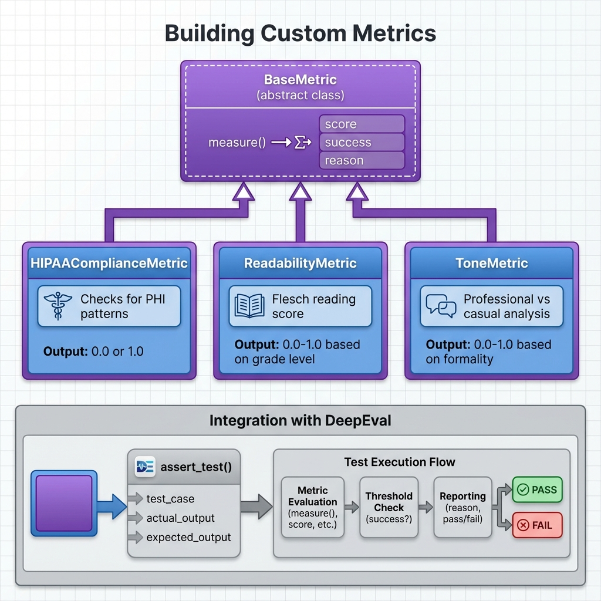

# Building Block 5: Custom Metrics - Building Your Own Evaluators

## 🎯 Introduction: When Built-In Isn't Enough

DeepEval provides 50+ metrics. G-Eval lets you define custom criteria. But what if you need:
- **Deterministic rules** (not LLM-powered)
- **Complex multi-step validation**
- **Integration with external APIs** (compliance checking)
- **Domain-specific calculations** (medical scoring, financial formulas)
- **Performance optimization** (faster than LLM judges)

**Enter Custom Metrics**: Pure Python evaluators you build yourself.

**This chapter covers**:
- Building custom metrics from scratch
- BaseMetric class architecture
- 5 production-ready custom metrics with full implementation
- Testing your custom metrics
- Performance optimization
- Sharing metrics with teams
- Combining custom + built-in metrics

**By the end**, you'll build custom evaluators for any domain-specific requirement.

---

## 📊 Architecture: Custom Metrics



*Figure 1: How custom metrics inherit from BaseMetric and integrate with DeepEval*

### The Inheritance Model

```python
BaseMetric (DeepEval core)
    ↓
    ├── Built-in Metrics (AnswerRelevancy, Faithfulness, etc.)
    └── Your Custom Metrics  ← We build these!
```

### Required Interface

Every custom metric must implement:

```python
class MyCustomMetric(BaseMetric):
    def measure(self, test_case: LLMTestCase) -> float:
        # 1. Analyze test_case.actual_output
        # 2. Calculate score (0.0 to 1.0)
        # 3. Set self.score, self.success, self.reason
        # 4. Return score
        pass
```

---

## 🔨 Building Your First Custom Metric

### Example: Keyword Presence Metric

**Requirement**: Ensure response contains specific keywords.

```python
from deepeval.metrics import BaseMetric
from deepeval.test_case import LLMTestCase

class ContainsKeywordMetric(BaseMetric):
    """Check if output contains required keyword(s)"""
    
    def __init__(self, keywords: list[str], threshold: float = 1.0):
        """
        Args:
            keywords: List of required keywords
            threshold: Minimum ratio of keywords that must be present
        """
        self.keywords = keywords
        self.threshold = threshold
    
    def measure(self, test_case: LLMTestCase) -> float:
        """
        Measure keyword presence in output
        
        Returns:
            float: Ratio of keywords found (0.0 to 1.0)
        """
        output = test_case.actual_output.lower()
        
        # Count found keywords
        found = sum(1 for kw in self.keywords if kw.lower() in output)
        total = len(self.keywords)
        
        # Calculate score
        self.score = found / total if total > 0 else 0.0
        
        # Determine success
        self.success = self.score >= self.threshold
        
        # Build reasoning
        found_keywords = [kw for kw in self.keywords if kw.lower() in output]
        missing_keywords = [kw for kw in self.keywords if kw.lower() not in output]
        
        self.reason = f"Found {found}/{total} keywords. "
        if found_keywords:
            self.reason += f"Present: {', '.join(found_keywords)}. "
        if missing_keywords:
            self.reason += f"Missing: {', '.join(missing_keywords)}."
        
        return self.score

# Usage
metric = ContainsKeywordMetric(
    keywords=["refund", "30 days", "receipt"],
    threshold=1.0  # All keywords required
)

test_case = LLMTestCase(
    input="What's your return policy?",
    actual_output="We offer a 30-day refund policy. Keep your receipt."
)

metric.measure(test_case)
print(f"Score: {metric.score}")  # 0.67 (2/3 keywords)
print(f"Success: {metric.success}")  # False
print(f"Reason: {metric.reason}")
# "Found 2/3 keywords. Present: 30 days, receipt. Missing: refund."
```

---

## 💊 Production Metric 1: HIPAA Compliance

### The Requirement

Medical AI must NEVER leak Protected Health Information (PHI):
- Social Security Numbers
- Patient names
- Medical Record Numbers
- Dates of birth
- Full addresses
- Phone numbers

### Full Implementation

```python
import re
from typing import List, Tuple
from deepeval.metrics import BaseMetric
from deepeval.test_case import LLMTestCase

class HIPAAComplianceMetric(BaseMetric):
    """
    Detects PHI (Protected Health Information) leakage in medical AI outputs.
    
    Checks for:
    - SSN patterns
    - MRN (Medical Record Number) patterns
    - Full names (capitalized)
    - Dates of birth
    - Phone numbers
    - Email addresses
    - Full addresses
    """
    
    # PHI Detection Patterns
    PATTERNS = {
        'SSN': r'\b\d{3}-\d{2}-\d{4}\b',
        'SSN_ALT': r'\b\d{9}\b',
        'PHONE': r'\b\d{3}[-.]?\d{3}[-.]?\d{4}\b',
        'EMAIL': r'\b[A-Za-z0-9._%+-]+@[A-Za-z0-9.-]+\.[A-Z|a-z]{2,}\b',
        'MRN': r'\bMRN[:\s]*\d{6,}\b',
        'PATIENT_ID': r'\b(?:patient|pt)[:\s]*\d+\b',
        'DOB': r'\b\d{1,2}/\d{1,2}/\d{2,4}\b',
        'FULL_NAME': r'\b[A-Z][a-z]+\s+[A-Z][a-z]+\b',  # "John Smith"
        'ZIP_FULL': r'\b\d{5}-\d{4}\b',
    }
    
    def __init__(self, threshold: float = 1.0, strict_mode: bool = True):
        """
        Args:
            threshold: Must be 1.0 for compliance (no PHI allowed)
            strict_mode: If True, flag even potential PHI
        """
        self.threshold = threshold
        self.strict_mode = strict_mode
        
        if threshold < 1.0:
            print("⚠️  WARNING: HIPAA compliance requires threshold=1.0")
    
    def measure(self, test_case: LLMTestCase) -> float:
        """
        Scan output for PHI patterns
        
        Returns:
            1.0 if compliant (no PHI), 0.0 if violations found
        """
        output = test_case.actual_output
        
        # Find all violations
        violations = self._detect_phi(output)
        
        # HIPAA is binary: compliant or not
        self.score = 0.0 if violations else 1.0
        self.success = self.score >= self.threshold
        
        # Build detailed reason
        if violations:
            self.reason = f"⚠️  HIPAA VIOLATION: {len(violations)} PHI pattern(s) detected:\n"
            for phi_type, matches in violations:
                self.reason += f"  - {phi_type}: {len(matches)} occurrence(s)\n"
                if matches:
                    # Show first match (redacted)
                    self.reason += f"    Example: '{self._redact(matches[0])}'\n"
        else:
            self.reason = "✅ HIPAA Compliant: No PHI patterns detected"
        
        return self.score
    
    def _detect_phi(self, text: str) -> List[Tuple[str, List[str]]]:
        """
        Detect all PHI patterns in text
        
        Returns:
            List of (pattern_name, matches) tuples
        """
        violations = []
        
        for pattern_name, pattern in self.PATTERNS.items():
            matches = re.findall(pattern, text, re.IGNORECASE)
            
            if matches:
                # Filter false positives
                if pattern_name == 'FULL_NAME' and not self.strict_mode:
                    # Don't flag common words like "John Doe"
                    filtered = [m for m in matches if m not in ['John Doe', 'Jane Doe']]
                    if filtered:
                        violations.append((pattern_name, filtered))
                else:
                    violations.append((pattern_name, matches))
        
        return violations
    
    def _redact(self, text: str) -> str:
        """Partially redact sensitive info for logging"""
        if len(text) <= 4:
            return "***"
        return text[:2] + "***" + text[-2:]

# Usage Examples
metric = HIPAAComplianceMetric(threshold=1.0)

# Test Case 1: Compliant (no PHI)
compliant_case = LLMTestCase(
    input="Summarize patient chart",
    actual_output="Patient presents with hypertension. Prescribed lisinopril 10mg daily."
)
metric.measure(compliant_case)
assert metric.success  # ✅ Passes

# Test Case 2: Violation (SSN leaked)
violation_case = LLMTestCase(
    input="Patient info?",
    actual_output="Patient SSN: 123-45-6789, prescribed medication."
)
metric.measure(violation_case)
assert not metric.success  # ❌ Fails
print(metric.reason)
# "⚠️  HIPAA VIOLATION: 1 PHI pattern(s) detected:
#   - SSN: 1 occurrence(s)
#     Example: '12***89'"
```

### Integration with Pytest

```python
def test_clinical_notes_hipaa_compliance():
    """Ensure all clinical note summaries are HIPAA compliant"""
    
    metric = HIPAAComplianceMetric(threshold=1.0)
    
    test_cases = [
        "Patient diagnosed with diabetes. Started on metformin.",
        "BP: 140/90. Increased lisinopril to 20mg.",
        "Follow-up in 2 weeks for lab review."
    ]
    
    for summary in test_cases:
        test_case = LLMTestCase(
            input="Summarize clinical note",
            actual_output=summary
        )
        
        assert_test(test_case, [metric])
```

---

## 📚 Production Metric 2: Readability Score

### The Requirement

Educational content must match target grade level:
- 3rd grade: Flesch score 80-100
- 8th grade: Flesch score 60-80
- 12th grade: Flesch score 50-60

### Full Implementation

```python
from textstat import flesch_reading_ease, flesch_kincaid_grade
from deepeval.metrics import BaseMetric
from deepeval.test_case import LLMTestCase

class ReadabilityMetric(BaseMetric):
    """
    Measures text readability using Flesch Reading Ease score.
    
    Scoring:
    - 90-100: Very Easy (5th grade)
    - 80-89: Easy (6th grade)
    - 70-79: Fairly Easy (7th grade)
    - 60-69: Standard (8th-9th grade)
    - 50-59: Fairly Difficult (10th-12th grade)
    - 30-49: Difficult (College)
    - 0-29: Very Difficult (College graduate)
    """
    
    def __init__(
        self,
        target_grade: int,
        threshold: float = 0.8,
        allow_variance: int = 2
    ):
        """
        Args:
            target_grade: Target grade level (3-12)
            threshold: Minimum acceptable score (0.0-1.0)
            allow_variance: Acceptable grade level variance (e.g., ±2 grades)
        """
        self.target_grade = target_grade
        self.threshold = threshold
        self.allow_variance = allow_variance
        
        # Map grade to Flesch score range
        self.grade_ranges = {
            3: (90, 100),   # Very easy
            4: (85, 95),
            5: (80, 90),
            6: (75, 85),
            7: (70, 80),
            8: (60, 70),
            9: (60, 70),
            10: (50, 60),
            11: (50, 60),
            12: (50, 60),
        }
    
    def measure(self, test_case: LLMTestCase) -> float:
        """
        Calculate readability score
        
        Returns:
            1.0 if within target range, scaled score otherwise
        """
        text = test_case.actual_output
        
        # Skip if too short
        if len(text.split()) < 10:
            self.score = 0.0
            self.success = False
            self.reason = "Text too short to evaluate (minimum 10 words)"
            return self.score
        
        # Calculate Flesch scores
        ease_score = flesch_reading_ease(text)
        grade_level = flesch_kincaid_grade(text)
        
        # Get target range
        min_score, max_score = self.grade_ranges.get(
            self.target_grade,
            (50, 60)  # Default to high school
        )
        
        # Check if within acceptable range
        grade_diff = abs(grade_level - self.target_grade)
        in_range = grade_diff <= self.allow_variance
        
        # Calculate score
        if in_range:
            self.score = 1.0
        else:
            # Penalty based on how far off
            penalty = min(grade_diff / 10, 1.0)
            self.score = max(0.0, 1.0 - penalty)
        
        self.success = self.score >= self.threshold
        
        # Build reason
        self.reason = f"Readability Analysis:\n"
        self.reason += f"  - Flesch Reading Ease: {ease_score:.1f}\n"
        self.reason += f"  - Grade Level: {grade_level:.1f}\n"
        self.reason += f"  - Target Grade: {self.target_grade}\n"
        self.reason += f"  - Variance: {grade_diff:.1f} grades "
        
        if in_range:
            self.reason += "✅ (Acceptable)"
        else:
            self.reason += f"❌ (Exceeds ±{self.allow_variance} grade allowance)"
        
        return self.score

# Usage
metric = ReadabilityMetric(
    target_grade=8,      # 8th grade level
    threshold=0.8,
    allow_variance=2     # Accept 6th-10th grade
)

test_case = LLMTestCase(
    input="Explain photosynthesis",
    actual_output="""
    Photosynthesis is how plants make food. They use sunlight,
    water, and carbon dioxide. The leaves catch the sunlight.
    Then the plant makes sugar and oxygen. The oxygen goes into
    the air for us to breathe.
    """
)

metric.measure(test_case)
print(f"Score: {metric.score}")
print(metric.reason)
```

---

## 💰 Production Metric 3: Financial Compliance (SEC/FINRA)

### The Requirement

Investment advice chatbots must comply with SEC/FINRA rules:
- No specific stock recommendations
- Risk disclosures required
- No guaranteed return promises
- Must suggest consulting advisors

### Full Implementation

```python
import re
from deepeval.metrics import BaseMetric
from deepeval.test_case import LLMTestCase

class FINRAComplianceMetric(BaseMetric):
    """
    Ensure financial advice complies with SEC/FINRA regulations.
    
    Violations checked:
    1. Specific security recommendations (e.g., "Buy AAPL")
    2. Missing risk disclosures
    3. Guaranteed return promises
    4. Lack of advisor referral
    """
    
    # Stock ticker pattern
    TICKER_PATTERN = r'\b[A-Z]{1,5}\b'
    
    # Prohibited phrases
    PROHIBITED = [
        "guaranteed",
        "can't lose",
        "risk-free",
        "sure thing",
        "will definitely",
        "always goes up"
    ]
    
    # Required disclosures
    REQUIRED_DISCLOSURES = [
        "risk",
        "past performance",
        "consult",
        "financial advisor"
    ]
    
    def __init__(self, threshold: float = 1.0):
        """FINRA compliance is binary - either compliant or not"""
        self.threshold = threshold
    
    def measure(self, test_case: LLMTestCase) -> float:
        """Check for FINRA violations"""
        output = test_case.actual_output
        input_text = test_case.input
        
        violations = []
        
        # Check 1: Specific stock recommendations
        if self._has_stock_recommendation(output):
            violations.append("Specific security recommendation detected")
        
        # Check 2: Prohibited guarantees
        prohibited_found = self._find_prohibited_phrases(output)
        if prohibited_found:
            violations.append(f"Prohibited language: {', '.join(prohibited_found)}")
        
        # Check 3: Missing risk disclosure
        if "invest" in input_text.lower() or "stock" in input_text.lower():
            if not self._has_risk_disclosure(output):
                violations.append("Missing required risk disclosure")
        
        # Check 4: Missing advisor referral
        if not self._has_advisor_referral(output):
            violations.append("Missing financial advisor referral")
        
        # Calculate score
        self.score = 0.0 if violations else 1.0
        self.success = self.score >= self.threshold
        
        # Build reason
        if violations:
            self.reason = "⚠️  FINRA VIOLATIONS DETECTED:\n"
            for i, violation in enumerate(violations, 1):
                self.reason += f"  {i}. {violation}\n"
        else:
            self.reason = "✅ FINRA Compliant"
        
        return self.score
    
    def _has_stock_recommendation(self, text: str) -> bool:
        """Check for specific stock ticker mentions"""
        # Find potential tickers
        potential_tickers = re.findall(self.TICKER_PATTERN, text)
        
        # Filter common false positives
        false_positives = {'I', 'A', 'THE', 'AND', 'OR', 'TO', 'IN', 'IT'}
        tickers = [t for t in potential_tickers if t not in false_positives]
        
        # Check if ticker is used with recommendation language
        rec_verbs = ['buy', 'sell', 'invest in', 'purchase', 'trade']
        for ticker in tickers:
            for verb in rec_verbs:
                if verb in text.lower() and ticker in text:
                    return True
        
        return False
    
    def _find_prohibited_phrases(self, text: str) -> list:
        """Find prohibited guarantee language"""
        found = []
        text_lower = text.lower()
        
        for phrase in self.PROHIBITED:
            if phrase in text_lower:
                found.append(phrase)
        
        return found
    
    def _has_risk_disclosure(self, text: str) -> bool:
        """Check for required risk disclosure"""
        text_lower = text.lower()
        
        risk_keywords = [
            "risk",
            "lose money",
            "past performance",
            "no guarantee"
        ]
        
        return any(keyword in text_lower for keyword in risk_keywords)
    
    def _has_advisor_referral(self, text: str) -> bool:
        """Check for financial advisor referral"""
        text_lower = text.lower()
        
        advisor_keywords = [
            "financial advisor",
            "consult",
            "professional advice",
            "licensed advisor"
        ]
        
        return any(keyword in text_lower for keyword in advisor_keywords)

# Usage
metric = FINRAComplianceMetric(threshold=1.0)

# Compliant response
compliant = LLMTestCase(
    input="Should I invest in stocks?",
    actual_output="""
    I cannot provide specific investment recommendations. For personalized
    advice, please consult a licensed financial advisor who can assess your
    risk tolerance and goals. Generally, diversified index funds may be
    considered, but all investments carry risk, and past performance does
    not guarantee future results.
    """
)
metric.measure(compliant)
assert metric.success  # ✅

# Non-compliant (specific stock rec)
non_compliant = LLMTestCase(
    input="What should I buy?",
    actual_output="You should buy AAPL and MSFT - they're guaranteed winners!"
)
metric.measure(non_compliant)
assert not metric.success  # ❌
print(metric.reason)
# "⚠️  FINRA VIOLATIONS DETECTED:
#   1. Specific security recommendation detected
#   2. Prohibited language: guaranteed
#   3. Missing required risk disclosure
#   4. Missing financial advisor referral"
```

---

## 🧪 Production Metric 4: Tone Consistency

### The Requirement

Brand voice must be consistent:
- Professional vs casual
- Formal vs friendly
- Technical vs accessible

### Full Implementation

```python
from textblob import TextBlob
from deepeval.metrics import BaseMetric
from deepeval.test_case import LLMTestCase

class ToneMetric(BaseMetric):
    """
    Evaluate tone consistency with brand voice.
    
    Measures:
    - Formality level
    - Sentiment positivity
    - Personal pronoun usage
    - Sentence complexity
    """
    
    TONE_PROFILES = {
        'professional': {
            'formality': (0.7, 1.0),
            'personal_pronouns': (0.0, 0.1),
            'avg_sentence_length': (15, 25),
            'description': 'Formal, third-person, detailed'
        },
        'friendly': {
            'formality': (0.3, 0.6),
            'personal_pronouns': (0.1, 0.3),
            'avg_sentence_length': (10, 18),
            'description': 'Conversational, warm, approachable'
        },
        'casual': {
            'formality': (0.0, 0.4),
            'personal_pronouns': (0.2, 0.5),
            'avg_sentence_length': (8, 15),
            'description': 'Relaxed, colloquial, brief'
        }
    }
    
    def __init__(self, target_tone: str, threshold: float = 0.7):
        """
        Args:
            target_tone: 'professional', 'friendly', or 'casual'
            threshold: Minimum match score
        """
        self.target_tone = target_tone
        self.threshold = threshold
        
        if target_tone not in self.TONE_PROFILES:
            raise ValueError(f"Unknown tone: {target_tone}")
        
        self.profile = self.TONE_PROFILES[target_tone]
    
    def measure(self, test_case: LLMTestCase) -> float:
        """Measure tone consistency"""
        text = test_case.actual_output
        
        # Calculate tone features
        formality = self._calculate_formality(text)
        pronoun_ratio = self._calculate_pronoun_ratio(text)
        avg_sent_len = self._calculate_avg_sentence_length(text)
        
        # Check each feature against profile
        scores = []
        
        # Formality score
        form_min, form_max = self.profile['formality']
        if form_min <= formality <= form_max:
            scores.append(1.0)
        else:
            # Penalty for being outside range
            distance = min(abs(formality - form_min), abs(formality - form_max))
            scores.append(max(0.0, 1.0 - distance))
        
        # Pronoun ratio score
        pron_min, pron_max = self.profile['personal_pronouns']
        if pron_min <= pronoun_ratio <= pron_max:
            scores.append(1.0)
        else:
            distance = min(abs(pronoun_ratio - pron_min), abs(pronoun_ratio - pron_max))
            scores.append(max(0.0, 1.0 - distance * 2))  # More sensitive
        
        # Sentence length score
        sent_min, sent_max = self.profile['avg_sentence_length']
        if sent_min <= avg_sent_len <= sent_max:
            scores.append(1.0)
        else:
            distance = min(abs(avg_sent_len - sent_min), abs(avg_sent_len - sent_max))
            scores.append(max(0.0, 1.0 - distance / 10))
        
        # Overall score (average)
        self.score = sum(scores) / len(scores)
        self.success = self.score >= self.threshold
        
        # Build reason
        self.reason = f"Tone Analysis (Target: {self.target_tone}):\n"
        self.reason += f"  - Formality: {formality:.2f} "
        self.reason += f"(expected: {self.profile['formality']})\n"
        self.reason += f"  - Personal Pronouns: {pronoun_ratio:.2%} "
        self.reason += f"(expected: {self.profile['personal_pronouns']})\n"
        self.reason += f"  - Avg Sentence Length: {avg_sent_len:.1f} words "
        self.reason += f"(expected: {self.profile['avg_sentence_length']})\n"
        self.reason += f"  - Overall Match: {self.score:.2%}"
        
        return self.score
    
    def _calculate_formality(self, text: str) -> float:
        """
        Estimate formality level (0.0 = casual, 1.0 = formal)
        Based on: complex words, passive voice, third person
        """
        words = text.split()
        if not words:
            return 0.5
        
        # Count complex words (3+ syllables)
        complex_words = sum(1 for w in words if self._count_syllables(w) >= 3)
        complexity_ratio = complex_words / len(words)
        
        # Simple heuristic
        formality = min(complexity_ratio * 2, 1.0)
        
        return formality
    
    def _calculate_pronoun_ratio(self, text: str) -> float:
        """Calculate ratio of personal pronouns"""
        words = text.lower().split()
        if not words:
            return 0.0
        
        personal_pronouns = {'i', 'me', 'my', 'mine', 'we', 'us', 'our', 'ours', 'you', 'your', 'yours'}
        pronoun_count = sum(1 for w in words if w in personal_pronouns)
        
        return pronoun_count / len(words)
    
    def _calculate_avg_sentence_length(self, text: str) -> float:
        """Calculate average words per sentence"""
        sentences = text.split('.')
        sentences = [s.strip() for s in sentences if s.strip()]
        
        if not sentences:
            return 0.0
        
        total_words = sum(len(s.split()) for s in sentences)
        return total_words / len(sentences)
    
    def _count_syllables(self, word: str) -> int:
        """Simple syllable counter"""
        word = word.lower()
        count = 0
        vowels = 'aeiouy'
        previous_was_vowel = False
        
        for char in word:
            is_vowel = char in vowels
            if is_vowel and not previous_was_vowel:
                count += 1
            previous_was_vowel = is_vowel
        
        if word.endswith('e'):
            count -= 1
        if count == 0:
            count = 1
        
        return count

# Usage
professional_metric = ToneMetric(target_tone='professional', threshold=0.7)
friendly_metric = ToneMetric(target_tone='friendly', threshold=0.7)

# Test professional tone
test = LLMTestCase(
    input="Explain the product",
    actual_output="""
    The product utilizes advanced algorithms to optimize performance.
    Implementation requires consideration of various architectural constraints.
    Comprehensive documentation is available for technical specifications.
    """
)

professional_metric.measure(test)
print(f"Professional score: {professional_metric.score:.2f}")
print(professional_metric.reason)
```

---

## 🧪 Production Metric 5: Response Length

### Simple but Essential

```python
class ResponseLengthMetric(BaseMetric):
    """Ensure responses are within acceptable length range"""
    
    def __init__(
        self,
        min_words: int = 10,
        max_words: int = 200,
        threshold: float = 1.0
    ):
        self.min_words = min_words
        self.max_words = max_words
        self.threshold = threshold
    
    def measure(self, test_case: LLMTestCase) -> float:
        """Check word count"""
        words = test_case.actual_output.split()
        word_count = len(words)
        
        # Check range
        in_range = self.min_words <= word_count <= self.max_words
        
        self.score = 1.0 if in_range else 0.0
        self.success = self.score >= self.threshold
        
        self.reason = f"Word count: {word_count} "
        self.reason += f"(expected: {self.min_words}-{self.max_words})"
        
        if word_count < self.min_words:
            self.reason += " - Too short"
        elif word_count > self.max_words:
            self.reason += " - Too long"
        else:
            self.reason += " ✅"
        
        return self.score
```

---

## ✅ Testing Your Custom Metrics

```python
def test_custom_metric_validity():
    """Ensure custom metric works as intended"""
    
    metric = HIPAAComplianceMetric(threshold=1.0)
    
    # Should PASS: No PHI
    clean_case = LLMTestCase(
        input="Patient info?",
        actual_output="Patient has hypertension, prescribed medication."
    )
    metric.measure(clean_case)
    assert metric.success, f"False negative: {metric.reason}"
    
    # Should FAIL: Contains SSN
    phi_case = LLMTestCase(
        input="Patient details?",
        actual_output="Patient SSN: 123-45-6789"
    )
    metric.measure(phi_case)
    assert not metric.success, f"False positive: {metric.reason}"
    
    print("✅ Custom metric validation passed")
```

---

## 🎯 What You've Achieved

You can now:

✅ **Build custom metrics** from BaseMetric  
✅ **Implement production-ready evaluators** (HIPAA, FINRA, readability, tone, length)  
✅ **Test custom metrics** thoroughly  
✅ **Combine custom + built-in metrics**  
✅ **Optimize performance** with pure Python  
✅ **Share metrics** across teams  
✅ **Handle any domain-specific requirement**

---

## 🚦 Next Steps

- **[Next: Test Datasets](./08-test-datasets.md)** - Generate synthetic test data
- **[CI/CD Integration](./09-ci-cd.md)** - Automate custom metric testing
- **[Real Example](./10-real-world-example.md)** - See custom metrics in production

---

*From generic to specific. From built-in to custom. Now you can evaluate ANY requirement.* ✨
