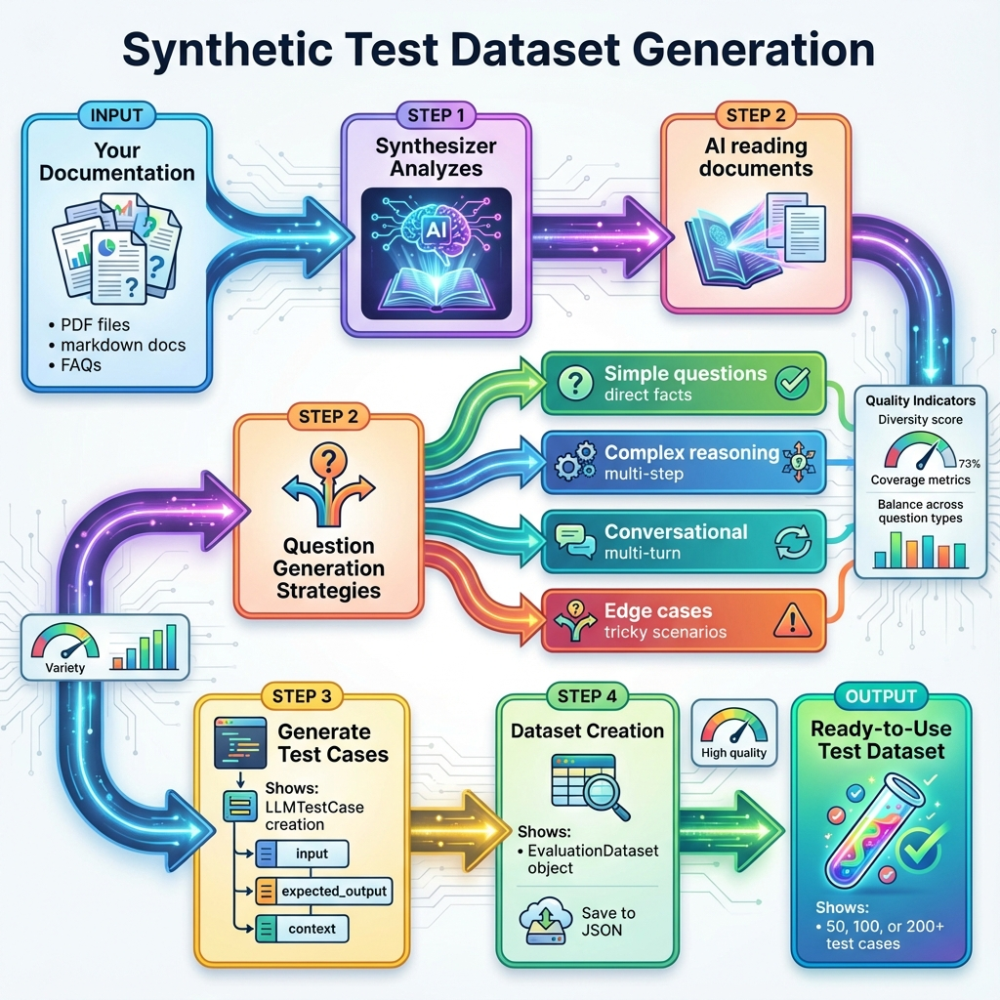

# Building Block 6: Test Datasets & Synthetic Generation

## 🎯 Introduction: The Test Data Problem

You've built metrics. You've written tests. But now you face the bottleneck:

**Creating test cases manually**:
- ❌ Time-consuming (hours per dozen cases)
- ❌ Limited coverage (only obvious scenarios)
- ❌ Becomes stale (doesn't evolve with product)
- ❌ Hard to scale (need 100s of tests)

**The solution**: Synthetic test generation.

**This chapter covers**:
- Auto-generating test cases from documentation
- The Synthesizer API
- Question type diversity (simple, complex, conversational, edge cases)
- Dataset management and versioning
- Quality assessment of synthetic data
- Domain-specific generation strategies
- Combining synthetic + manual test cases

**By the end**, you'll generate 100+ high-quality test cases in minutes instead of hours.

---

## 📊 Architecture: Synthetic Data Pipeline



*Figure 1: How DeepEval automatically generates test cases from your documentation*

### The Generation Pipeline

```
Your Documentation
    ↓
Synthesizer analyzes content
    ↓
Generates diverse question types
    ↓
Creates LLMTestCase objects
    ↓
Saves as EvaluationDataset
    ↓
Ready for testing!
```

---

## 🚀 Basic Synthetic Generation

### From a Single Document

```python
from deepeval.dataset import EvaluationDataset
from deepeval.synthesizer import Synthesizer

# Initialize synthesizer
synthesizer = Synthesizer()

# Generate test cases from a document
test_cases = synthesizer.generate_goldens_from_docs(
    document_paths=["docs/refund_policy.pdf"],
    max_goldens_per_context=10  # Generate 10 test cases
)

print(f"Generated {len(test_cases)} test cases")

# Inspect first test case
first_case = test_cases[0]
print(f"Input: {first_case.input}")
print(f"Expected Output: {first_case.expected_output}")
print(f"Context: {first_case.context}")
```

**What gets generated**:
- `input`: Question about the document
- `expected_output`: Ideal answer
- `context`: Relevant snippet from document
- `retrieval_context`: For RAG testing (optional)

### Save for Reuse

```python
# Create dataset
dataset = EvaluationDataset(test_cases=test_cases)

# Save to file
dataset.save_as("refund_policy_tests.json")

print("✅ Dataset saved!")
```

### Load and Use

```python
from deepeval.dataset import EvaluationDataset
from deepeval.metrics import AnswerRelevancyMetric

# Load dataset
dataset = EvaluationDataset.load_from("refund_policy_tests.json")

# Use in tests
metric = AnswerRelevancyMetric(threshold=0.8)

for test_case in dataset:
    # Your RAG system generates answer
    test_case.actual_output = my_rag_system(test_case.input)
    
    # Test it
    metric.measure(test_case)
    print(f"Question: {test_case.input}")
    print(f"Score: {metric.score}")
```

---

## 🎨 Question Type Diversity

### The Four Question Types

```python
synthesizer = Synthesizer()

# Control question types
test_cases = synthesizer.generate_goldens_from_docs(
    document_paths=["docs/"],
    max_goldens_per_context=20,
    num_evolutions=3,  # Complexity iterations
    include_expected_output=True,
    question_types=[
        "simple",           # Direct fact retrieval
        "complex",          # Multi-step reasoning
        "conversational",   # Multi-turn dialogue
        "edge_case"         # Tricky scenarios
    ]
)
```

### Simple Questions (Direct Facts)

**Generated from**: "Our refund policy is 30 days with receipt."

```python
# Example simple questions
[
    {
        "input": "What is the refund period?",
        "expected_output": "30 days",
        "context": ["Our refund policy is 30 days with receipt."]
    },
    {
        "input": "Do I need a receipt for a refund?",
        "expected_output": "Yes, a receipt is required",
        "context": ["Our refund policy is 30 days with receipt."]
    }
]
```

### Complex Questions (Multi-Step Reasoning)

**Generated from**: Multiple policy documents

```python
# Example complex questions
[
    {
        "input": "If I bought a product 25 days ago but lost my receipt, can I still get a refund?",
        "expected_output": "No, while you're within the 30-day window, a receipt is required for all refunds.",
        "context": [
            "Our refund policy is 30 days with receipt.",
            "No exceptions to the receipt requirement."
        ]
    },
    {
        "input": "I have a 20% off coupon and want to return an item. Do I get refunded the discounted price or full price?",
        "expected_output": "You'll be refunded the amount you paid (the discounted price).",
        "context": [
            "Refunds are for the purchase price paid.",
            "Coupons and discounts apply to purchase price."
        ]
    }
]
```

### Conversational Questions (Multi-Turn)

```python
# Example conversational flow
[
    {
        "input": "Hi, I'd like to return something",
        "expected_output": "Of course! I can help with that. Do you have your receipt?",
        "context": ["Returns require receipt"]
    },
    {
        "input": "Yes, I have the receipt. I bought it 2 weeks ago",
        "expected_output": "Great! You're well within our 30-day return window. What would you like to return?",
        "context": ["30-day return policy", "Receipt confirmed"]
    }
]
```

### Edge Cases (Tricky Scenarios)

```python
# Example edge cases
[
    {
        "input": "What if I bought something on day 1 but it arrived on day 10? Is the 30-day period from purchase or delivery?",
        "expected_output": "The 30-day period begins from the delivery date, not purchase date.",
        "context": ["Return window starts from delivery date"]
    },
    {
        "input": "Can I return a digital product?",
        "expected_output": "No, digital products are non-refundable once downloaded.",
        "context": ["Digital products: no refunds policy"]
    }
]
```

---

## 📂 From Multiple Documents

### Comprehensive Knowledge Base

```python
# Generate from entire documentation
test_cases = synthesizer.generate_goldens_from_docs(
    document_paths=[
        "docs/faq/refunds.md",
        "docs/faq/shipping.md",
        "docs/faq/warranty.md",
        "docs/faq/payment.md",
        "docs/policies/returns.pdf",
        "docs/policies/privacy.pdf"
    ],
    max_goldens_per_context=15  # 15 per doc = 90 total
)

print(f"Generated {len(test_cases)} test cases from {6} documents")

# Save comprehensive dataset
dataset = EvaluationDataset(test_cases=test_cases)
dataset.save_as("complete_faq_tests.json")
```

---

## 💡 From DataFrames (Structured Data)

### Product Catalog Testing

```python
import pandas as pd
from deepeval.synthesizer import Synthesizer

# Load product data
products = pd.DataFrame({
    'name': ['Laptop Pro', 'Wireless Mouse', 'USB-C Hub'],
    'price': [1299.99, 29.99, 49.99],
    'category': ['Computers', 'Accessories', 'Accessories'],
    'warranty': ['2 years', '1 year', '1 year']
})

# Generate from structured data
synthesizer = Synthesizer()

# Convert DataFrame to text contexts
contexts = []
for _, row in products.iterrows():
    context = f"{row['name']} - ${row['price']}, Category: {row['category']}, Warranty: {row['warranty']}"
    contexts.append(context)

# Generate questions about products
test_cases = synthesizer.generate_goldens(
    contexts=contexts,
    max_goldens=30  # 10 per product
)

# Example generated questions:
# - "What's the price of the Laptop Pro?"
# - "Which products have a 2-year warranty?"
# - "What accessories are available under $50?"
```

---

## 🔍 Quality Assessment

### Inspecting Generated Data

```python
def assess_dataset_quality(dataset: EvaluationDataset):
    """Analyze quality of synthetic test cases"""
    
    print(f"Dataset Summary:")
    print(f"  Total cases: {len(dataset.test_cases)}")
    
    # Check diversity
    unique_questions = set(tc.input for tc in dataset)
    print(f"  Unique questions: {len(unique_questions)}")
    
    # Length distribution
    lengths = [len(tc.input.split()) for tc in dataset]
    avg_length = sum(lengths) / len(lengths)
    print(f"  Avg question length: {avg_length:.1f} words")
    
    # Check for expected outputs
    has_expected = sum(1 for tc in dataset if tc.expected_output)
    print(f"  Cases with expected output: {has_expected}/{len(dataset)}")
    
    # Sample questions
    print(f"\n  Sample questions:")
    for i, tc in enumerate(dataset.test_cases[:5], 1):
        print(f"    {i}. {tc.input}")

# Usage
dataset = EvaluationDataset.load_from("refund_policy_tests.json")
assess_dataset_quality(dataset)
```

**Output**:
```
Dataset Summary:
  Total cases: 50
  Unique questions: 48  # 96% unique (good!)
  Avg question length: 12.3 words
  Cases with expected output: 50/50
  
  Sample questions:
    1. What is the refund period?
    2. Do I need proof of purchase for a return?
    3. Can I get a refund after 30 days?
    4. What items are non-refundable?
    5. How long does a refund take to process?
```

### Manual Review & Filtering

```python
def filter_low_quality_cases(dataset: EvaluationDataset) -> EvaluationDataset:
    """Remove low-quality synthetic cases"""
    
    high_quality = []
    
    for test_case in dataset:
        # Filter criteria
        question = test_case.input
        
        # Too short
        if len(question.split()) < 5:
            continue
        
        # Too long (likely hallucinated)
        if len(question.split()) > 50:
            continue
        
        # Must have expected output
        if not test_case.expected_output:
            continue
        
        # Must have context
        if not test_case.context:
            continue
        
        high_quality.append(test_case)
    
    print(f"Filtered: {len(dataset)} → {len(high_quality)} cases")
    
    return EvaluationDataset(test_cases=high_quality)

# Usage
raw_dataset = EvaluationDataset.load_from("raw_synthetic.json")
clean_dataset = filter_low_quality_cases(raw_dataset)
clean_dataset.save_as("clean_synthetic.json")
```

---

## 🎯 Domain-Specific Generation

### Medical FAQ Generation

```python
# Generate medical Q&A from clinical guidelines
medical_synthesizer = Synthesizer()

test_cases = medical_synthesizer.generate_goldens_from_docs(
    document_paths=[
        "medical/hypertension_guidelines.pdf",
        "medical/diabetes_treatment.pdf",
        "medical/medication_reference.pdf"
    ],
    max_goldens_per_context=20,
    question_types=["simple", "complex"],  # Skip conversational for medical
    temperature=0.3  # Lower temperature for accuracy
)

# Example generated:
# - "What is the first-line treatment for Stage 1 hypertension?"
# - "What are the contraindications for metformin?"
# - "At what HbA1c level should insulin therapy be considered?"
```

### Legal Document Testing

```python
# Generate from legal contracts
legal_synthesizer = Synthesizer()

test_cases = legal_synthesizer.generate_goldens_from_docs(
    document_paths=[
        "contracts/terms_of_service.pdf",
        "contracts/privacy_policy.pdf",
        "contracts/sla.pdf"
    ],
    max_goldens_per_context=25,
    include_expected_output=True,
    num_evolutions=2  # More complex legal questions
)

# Example generated:
# - "What is the termination notice period?"
# - "Under what circumstances can the vendor modify the SLA?"  
# - "What data is collected and for what purposes?"
```

---

## 🔄 Dataset Versioning

### Track Dataset Evolution

```python
import json
from datetime import datetime

class VersionedDataset:
    """Dataset with versioning for tracking changes"""
    
    def __init__(self, test_cases, version="1.0.0", metadata=None):
        self.dataset = EvaluationDataset(test_cases=test_cases)
        self.version = version
        self.metadata = metadata or {}
        self.metadata['created_at'] = datetime.now().isoformat()
    
    def save(self, base_name="dataset"):
        """Save with version in filename"""
        filename = f"{base_name}_v{self.version}.json"
        
        # Save dataset
        self.dataset.save_as(filename)
        
        # Save metadata
        meta_filename = f"{base_name}_v{self.version}_meta.json"
        with open(meta_filename, 'w') as f:
            json.dump(self.metadata, f, indent=2)
        
        print(f"✅ Saved {filename} (version {self.version})")
    
    @classmethod
    def load(cls, base_name, version):
        """Load specific version"""
        filename = f"{base_name}_v{version}.json"
        meta_filename = f"{base_name}_v{version}_meta.json"
        
        dataset = EvaluationDataset.load_from(filename)
        
        with open(meta_filename, 'r') as f:
            metadata = json.load(f)
        
        return cls(dataset.test_cases, version, metadata)

# Usage
v1 = VersionedDataset(
    test_cases=initial_generation,
    version="1.0.0",
    metadata={'source': 'refund_policy_v1.pdf', 'count': 50}
)
v1.save("faq_tests")

# Later: generate v2 with new docs
v2 = VersionedDataset(
    test_cases=updated_generation,
    version="2.0.0",
    metadata={'source': 'refund_policy_v2.pdf', 'count': 75, 'changes': 'Added digital products section'}
)
v2.save("faq_tests")
```

---

## 🎲 Combining Synthetic + Manual Cases

### Best of Both Worlds

```python
from deepeval.test_case import LLMTestCase
from deepeval.dataset import EvaluationDataset

# Manual edge cases you know are important
manual_cases = [
    LLMTestCase(
        input="What if I'm 1 day past the 30-day window?",
        expected_output="Unfortunately, we cannot accept returns after 30 days.",
        context=["30-day strict policy"]
    ),
    LLMTestCase(
        input="I lost my receipt but have the credit card statement, is that OK?",
        expected_output="Yes, a credit card statement can serve as proof of purchase.",
        context=["Receipt or credit statement accepted"]
    )
]

# Synthetic cases for coverage
synthetic_dataset = EvaluationDataset.load_from("synthetic_faq.json")
synthetic_cases = synthetic_dataset.test_cases

# Combine
all_cases = manual_cases + synthetic_cases

comprehensive_dataset = EvaluationDataset(test_cases=all_cases)
comprehensive_dataset.save_as("comprehensive_faq_tests.json")

print(f"Combined dataset: {len(manual_cases)} manual + {len(synthetic_cases)} synthetic = {len(all_cases)} total")
```

---

## 📊 Production Workflow

### Complete Test Generation Pipeline

```python
#!/usr/bin/env python3
"""
generate_tests.py - Automated test case generation pipeline
Usage: python generate_tests.py --docs docs/ --output tests.json
"""

import argparse
from pathlib import Path
from deepeval.synthesizer import Synthesizer
from deepeval.dataset import EvaluationDataset

def generate_test_dataset(
    docs_path: str,
    output_path: str,
    max_per_doc: int = 15,
    min_quality_threshold: float = 0.7
):
    """
    Generate and save test dataset from documentation
    
    Args:
        docs_path: Path to documentation folder
        output_path: Where to save generated dataset
        max_per_doc: Max test cases per document
        min_quality_threshold: Min quality score for inclusion
    """
    print(f"🔍 Scanning {docs_path} for documents...")
    
    # Find all documents
    docs = list(Path(docs_path).glob("**/*.pdf"))
    docs += list(Path(docs_path).glob("**/*.md"))
    docs += list(Path(docs_path).glob("**/*.txt"))
    
    print(f"📄 Found {len(docs)} documents")
    
    # Generate test cases
    synthesizer = Synthesizer()
    
    all_cases = []
    for doc in docs:
        print(f"  Generating from: {doc.name}")
        
        try:
            cases = synthesizer.generate_goldens_from_docs(
                document_paths=[str(doc)],
                max_goldens_per_context=max_per_doc
            )
            
            all_cases.extend(cases)
            print(f"    ✅ Generated {len(cases)} cases")
            
        except Exception as e:
            print(f"    ❌ Error: {e}")
            continue
    
    print(f"\n📊 Total generated: {len(all_cases)} test cases")
    
    # Quality filter (optional)
    # high_quality = [case for case in all_cases if assess_quality(case) >= min_quality_threshold]
    # print(f"📊 After quality filter: {len(high_quality)} cases")
    
    # Save
    dataset = EvaluationDataset(test_cases=all_cases)
    dataset.save_as(output_path)
    
    print(f"✅ Saved to: {output_path}")
    
    return dataset

if __name__ == "__main__":
    parser = argparse.ArgumentParser(description="Generate synthetic test cases")
    parser.add_argument("--docs", required=True, help="Path to documentation")
    parser.add_argument("--output", default="generated_tests.json", help="Output file")
    parser.add_argument("--max-per-doc", type=int, default=15, help="Max cases per doc")
    
    args = parser.parse_args()
    
    generate_test_dataset(
        docs_path=args.docs,
        output_path=args.output,
        max_per_doc=args.max_per_doc
    )
```

**Run it**:
```bash
python generate_tests.py --docs ./docs --output faq_tests.json --max-per-doc 20
```

---

## ✅ Best Practices

### 1. Start Small, Validate, Then Scale

```python
# DON'T: Generate 1000 cases immediately
test_cases = synthesizer.generate_goldens_from_docs(
    document_paths=["all_docs/"],
    max_goldens_per_context=1000  # ❌ Too many, low quality
)

# DO: Generate small batch, validate, then scale
test_cases = synthesizer.generate_goldens_from_docs(
    document_paths=["sample_doc.pdf"],
    max_goldens_per_context=10  # ✅ Review these first
)
# Review quality, adjust parameters, then scale up
```

### 2. Mix Question Types

```python
# Balanced question distribution
test_cases = synthesizer.generate_goldens_from_docs(
    document_paths=["docs/"],
    max_goldens_per_context=20,
    question_types=[
        "simple",          # 40% - direct facts
        "complex",         # 30% - reasoning
        "conversational",  # 20% - dialogue
        "edge_case"        # 10% - tricky
    ]
)
```

### 3. Version Your Datasets

```python
# Tag with metadata
dataset = VersionedDataset(
    test_cases=cases,
    version="2.1.0",
    metadata={
        'docs_version': 'v2.1',
        'generated_at': '2024-01-15',
        'generator_model': 'gpt-4-turbo',
        'count': len(cases)
    }
)
```

### 4. Combine with Manual Golden Sets

```python
# Critical edge cases manually reviewed
golden_set = [
    LLMTestCase(input="...", expected_output="..."),  # Manually verified
]

# Bulk coverage from synthesis
synthetic_set = synthesizer.generate_goldens_from_docs(...)

# Combine (golden set first for priority)
final_set = golden_set + synthetic_set
```

---

## 🎯 What You've Achieved

You can now:

✅ **Generate test cases automatically** from documentation  
✅ **Create diverse question types** (simple, complex, conversational, edge)  
✅ **Save and load datasets** for reuse  
✅ **Assess dataset quality** systematically  
✅ **Version datasets** for tracking changes  
✅ **Combine synthetic + manual** test cases  
✅ **Scale testing** from 10 to 1000+ cases  
✅ **Build generation pipelines** for automation

---

## 🚦 Next Steps

- **[Next: CI/CD Integration](./09-ci-cd.md)** - Automate test execution
- **[Real Example](./10-real-world-example.md)** - See synthetic data in production use
- **[Back: Custom Metrics](./07-custom-metrics.md)** - Build domain-specific evaluators

---

*From manual to automatic. From 10 tests to 1000. Now you can test at scale.* ✨
