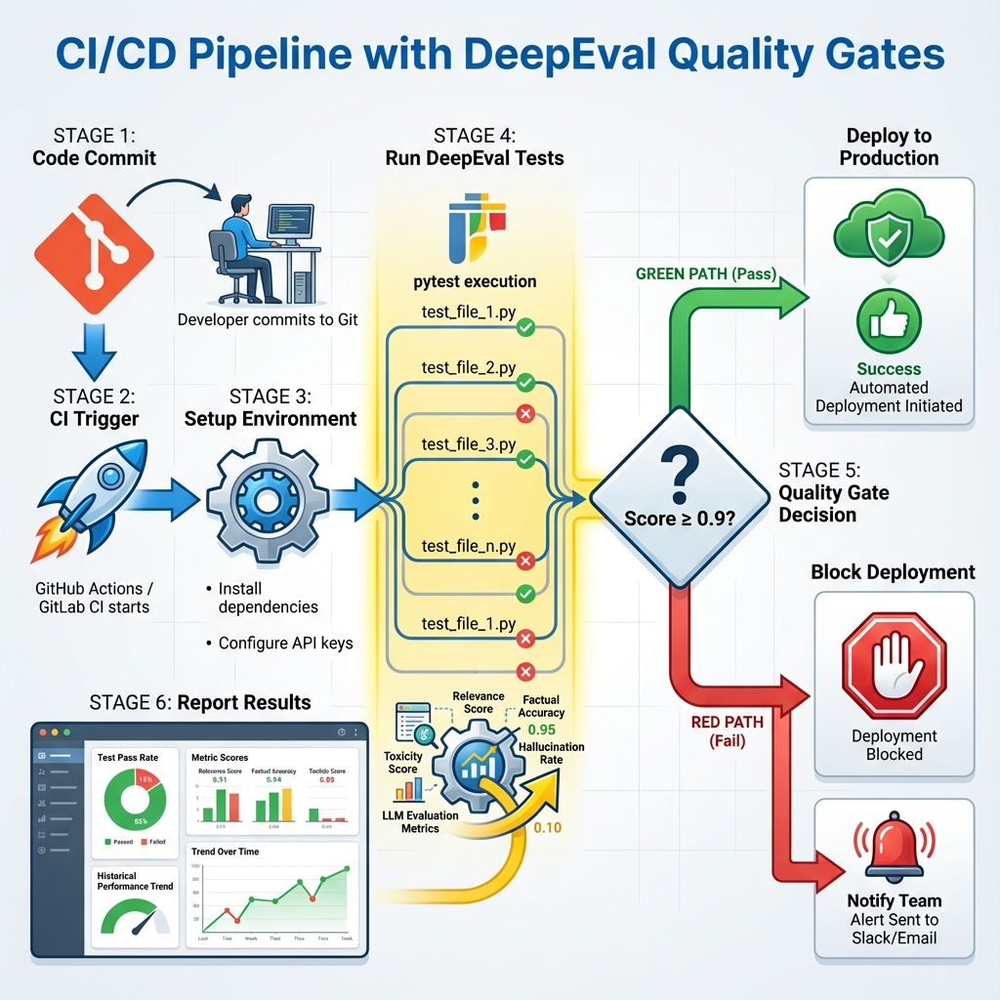

# Building Block 7: CI/CD Integration - Automated Quality Gates

## 🎯 Introduction: From Manual Testing to Continuous Validation

You've built comprehensive tests. You run them locally. They pass. You deploy.

**Then production breaks** because:
- ❌ Someone forgot to run tests before deploying
- ❌ Tests passed locally but fail with real data
- ❌ Model was updated without re-testing
- ❌ No one caught the quality regression

**The solution**: Automated quality gates in CI/CD.

**This chapter covers**:
- GitHub Actions integration (complete workflow)
- GitLab CI, Jenkins, CircleCI examples
- Quality gate strategies (strict, progressive, adaptive)
- Blocking deployments on test failures
- Monitoring and alerting
- Cost optimization in CI
- Parallel test execution
- Team notifications
- Rollback procedures

**By the end**, you'll have bulletproof automated testing preventing bad models from reaching production.

---

## 📊 Architecture: Quality Gates Pipeline



*Figure 1: Complete CI/CD pipeline with DeepEval quality gates*

### The Quality Gate Flow

```
Code Push
    ↓
CI Triggers
    ↓
Install Dependencies
    ↓
Run DeepEval Tests ← QUALITY GATE
    ↓
┌─────────────┐
│ Pass/Fail   │
└─────────────┘
    ├─ PASS → Deploy to Production ✅
    └─ FAIL → Block Deployment ❌
              └─ Notify Team
```

---

## 🎯 GitHub Actions - Complete Implementation

### Basic Workflow

Create `.github/workflows/llm-tests.yml`:

```yaml
name: LLM Quality Tests

on:
  push:
    branches: [main, develop]
  pull_request:
    branches: [main]
  # Manual trigger
  workflow_dispatch:

jobs:
  test:
    runs-on: ubuntu-latest
    timeout-minutes: 30
    
    steps:
      - name: Checkout code
        uses: actions/checkout@v3
      
      - name: Set up Python
        uses: actions/setup-python@v4
        with:
          python-version: '3.11'
          cache: 'pip'
      
      - name: Install dependencies
        run: |
          pip install --upgrade pip
          pip install deepeval pytest
          pip install -r requirements.txt
      
      - name: Run DeepEval tests
        env:
          OPENAI_API_KEY: ${{ secrets.OPENAI_API_KEY }}
          ANTHROPIC_API_KEY: ${{ secrets.ANTHROPIC_API_KEY }}
        run: |
          pytest tests/ -v --junit-xml=test-results.xml
      
      - name: Publish test results
        uses: EnricoMi/publish-unit-test-result-action@v2
        if: always()
        with:
          files: test-results.xml
      
      - name: Comment PR with results
        if: github.event_name == 'pull_request'
        uses: actions/github-script@v6
        with:
          script: |
            github.rest.issues.createComment({
              issue_number: context.issue.number,
              owner: context.repo.owner,
              repo: context.repo.repo,
              body: '✅ LLM quality tests passed!'
            })
```

### Advanced Workflow with Quality Gates

```yaml
name: LLM Quality Gates

on:
  pull_request:
    branches: [main]
  push:
    branches: [main]

env:
  PYTHON_VERSION: '3.11'
  MIN_SCORE_THRESHOLD: 0.8  # Minimum acceptable test score

jobs:
  # Job 1: Quick smoke tests
  smoke-tests:
    runs-on: ubuntu-latest
    timeout-minutes: 10
    
    steps:
      - uses: actions/checkout@v3
      
      - name: Setup Python
        uses: actions/setup-python@v4
        with:
          python-version: ${{ env.PYTHON_VERSION }}
      
      - name: Install deps
        run: pip install deepeval pytest
      
      - name: Run smoke tests
        env:
          OPENAI_API_KEY: ${{ secrets.OPENAI_API_KEY }}
        run: |
          # Only critical tests
          pytest tests/ -m critical -v
  
  # Job 2: Full test suite (parallel)
  full-tests:
    runs-on: ubuntu-latest
    needs: smoke-tests  # Only run if smoke tests pass
    timeout-minutes: 30
    
    strategy:
      matrix:
        test-group: [rag, generation, safety, custom]
    
    steps:
      - uses: actions/checkout@v3
      
      - name: Setup Python
        uses: actions/setup-python@v4
        with:
          python-version: ${{ env.PYTHON_VERSION }}
          cache: 'pip'
      
      - name: Install dependencies
        run: |
          pip install -r requirements.txt
      
      - name: Run test group
        env:
          OPENAI_API_KEY: ${{ secrets.OPENAI_API_KEY }}
          ANTHROPIC_API_KEY: ${{ secrets.ANTHROPIC_API_KEY }}
        run: |
          pytest tests/ -m ${{ matrix.test-group }} -v \
            --junit-xml=results-${{ matrix.test-group }}.xml
      
      - name: Upload results
        uses: actions/upload-artifact@v3
        if: always()
        with:
          name: test-results-${{ matrix.test-group }}
          path: results-${{ matrix.test-group }}.xml
  
  # Job 3: Quality gate decision
  quality-gate:
    runs-on: ubuntu-latest
    needs: full-tests
    
    steps:
      - uses: actions/checkout@v3
      
      - name: Download all test results
        uses: actions/download-artifact@v3
      
      - name: Analyze test results
        id: analyze
        run: |
          # Custom script to parse results
          python scripts/analyze_test_results.py --threshold ${{ env.MIN_SCORE_THRESHOLD }}
      
      - name: Quality gate decision
        if: steps.analyze.outputs.passed == 'false'
        run: |
          echo "❌ Quality gate FAILED: Score below threshold"
          exit 1
      
      - name: Success notification
        if: steps.analyze.outputs.passed == 'true'
        run: |
          echo "✅ Quality gate PASSED: Deploying to production"
```

### analyze_test_results.py

```python
#!/usr/bin/env python3
"""
Analyze test results and apply quality gates
"""
import sys
import argparse
import xml.etree.ElementTree as ET
from pathlib import Path

def analyze_results(threshold: float):
    """Parse JUnit XML and check against threshold"""
    
    result_files = list(Path('.').glob('**/results-*.xml'))
    
    total_tests = 0
    failed_tests = 0
    
    for result_file in result_files:
        tree = ET.parse(result_file)
        root = tree.getroot()
        
        for testsuite in root.findall('testsuite'):
            total_tests += int(testsuite.get('tests', 0))
            failed_tests += int(testsuite.get('failures', 0))
            failed_tests += int(testsuite.get('errors', 0))
    
    pass_rate = (total_tests - failed_tests) / total_tests if total_tests > 0 else 0
    
    print(f"📊 Test Results:")
    print(f"  Total: {total_tests}")
    print(f"  Passed: {total_tests - failed_tests}")
    print(f"  Failed: {failed_tests}")
    print(f"  Pass Rate: {pass_rate:.2%}")
    print(f"  Threshold: {threshold:.2%}")
    
    # Set GitHub Actions output
    passed = pass_rate >= threshold
    print(f"::set-output name=passed::{str(passed).lower()}")
    print(f"::set-output name=pass_rate::{pass_rate:.2f}")
    
    if not passed:
        print(f"\n❌ QUALITY GATE FAILED")
        print(f"   Pass rate {pass_rate:.2%} < Required {threshold:.2%}")
        sys.exit(1)
    else:
        print(f"\n✅ QUALITY GATE PASSED")
        return 0

if __name__ == "__main__":
    parser = argparse.ArgumentParser()
    parser.add_argument('--threshold', type=float, default=0.8)
    args = parser.parse_args()
    
    analyze_results(args.threshold)
```

---

## 🔧 GitLab CI Configuration

### .gitlab-ci.yml

```yaml
stages:
  - test
  - deploy

variables:
  PYTHON_VERSION: "3.11"
  PIP_CACHE_DIR: "$CI_PROJECT_DIR/.cache/pip"

cache:
  paths:
    - .cache/pip
    - venv/

# Quick smoke tests
test:smoke:
  stage: test
  image: python:$PYTHON_VERSION
  before_script:
    - pip install deepeval pytest
  script:
    - pytest tests/ -m critical -v
  only:
    - merge_requests
    - main

# Full test suite
test:full:
  stage: test
  image: python:$PYTHON_VERSION
  parallel:
    matrix:
      - TEST_GROUP: [rag, generation, safety]
  before_script:
    - pip install -r requirements.txt
  script:
    - pytest tests/ -m $TEST_GROUP -v --junit-xml=report.xml
  artifacts:
    when: always
    reports:
      junit: report.xml
  only:
    - merge_requests
    - main

# Quality gate
quality-gate:
  stage: test
  image: python:$PYTHON_VERSION
  script:
    - python scripts/check_quality_metrics.py --threshold 0.85
  allow_failure: false  # Block pipeline if this fails
  only:
    - main

# Deploy only if tests pass
deploy:production:
  stage: deploy
  script:
    - echo "Deploying to production..."
    - ./deploy.sh
  only:
    - main
  when: on_success  # Only if all previous jobs passed
```

---

## 🏗️ Jenkins Pipeline

### Jenkinsfile

```groovy
pipeline {
    agent any
    
    environment {
        PYTHON_VERSION = '3.11'
        OPENAI_API_KEY = credentials('openai-api-key')
    }
    
    stages {
        stage('Setup') {
            steps {
                sh '''
                    python -m venv venv
                    . venv/bin/activate
                    pip install -r requirements.txt
                '''
            }
        }
        
        stage('Smoke Tests') {
            steps {
                sh '''
                    . venv/bin/activate
                    pytest tests/ -m critical -v
                '''
            }
        }
        
        stage('Full Test Suite') {
            parallel {
                stage('RAG Tests') {
                    steps {
                        sh '''
                            . venv/bin/activate
                            pytest tests/ -m rag -v --junit-xml=rag-results.xml
                        '''
                    }
                }
                stage('Generation Tests') {
                    steps {
                        sh '''
                            . venv/bin/activate
                            pytest tests/ -m generation -v --junit-xml=gen-results.xml
                        '''
                    }
                }
                stage('Safety Tests') {
                    steps {
                        sh '''
                            . venv/bin/activate
                            pytest tests/ -m safety -v --junit-xml=safety-results.xml
                        '''
                    }
                }
            }
        }
        
        stage('Quality Gate') {
            steps {
                script {
                    def passed = sh(
                        script: '. venv/bin/activate && python scripts/check_metrics.py',
                        returnStatus: true
                    )
                    
                    if (passed != 0) {
                        error("Quality gate failed!")
                    }
                }
            }
        }
        
        stage('Deploy') {
            when {
                branch 'main'
                expression { currentBuild.result == null || currentBuild.result == 'SUCCESS' }
            }
            steps {
                sh './deploy.sh'
            }
        }
    }
    
    post {
        always {
            junit '*-results.xml'
        }
        failure {
            mail to: 'team@example.com',
                 subject: "Pipeline Failed: ${env.JOB_NAME} - ${env.BUILD_NUMBER}",
                 body: "Check console output at ${env.BUILD_URL}"
        }
    }
}
```

---

## 🎯 Quality Gate Strategies

### Strategy 1: Strict Gate (Production)

**Philosophy**: Zero tolerance for failures

```python
# conftest.py
import os

def pytest_configure(config):
    if os.getenv("CI"):
        # Strict thresholds in CI
        config.option.strict_markers = True
        
@pytest.fixture(autouse=True)
def strict_ci_thresholds():
    """Enforce strict thresholds in CI"""
    if os.getenv("CI"):
        return {
            "answer_relevancy": 0.9,   # Very high
            "faithfulness": 0.95,       # Almost perfect
            "hallucination": 0.1        # Almost none
        }
    else:
        return {
            "answer_relevancy": 0.7,   # More lenient locally
            "faithfulness": 0.8,
            "hallucination": 0.3
        }
```

### Strategy 2: Progressive Gate (Staged Rollout)

**Philosophy**: Increasingly strict as you approach production

```yaml
# Different thresholds per environment
test:dev:
  script:
    - pytest tests/ --threshold 0.6  # Lenient for dev
  only:
    - develop

test:staging:
  script:
    - pytest tests/ --threshold 0.8  # Stricter for staging
  only:
    - staging

test:production:
  script:
    - pytest tests/ --threshold 0.95  # Very strict for prod
  only:
    - main
```

### Strategy 3: Adaptive Gate (ML-Based)

**Philosophy**: Learn acceptable thresholds from history

```python
import json
from pathlib import Path

def calculate_adaptive_threshold():
    """Calculate threshold based on historical performance"""
    
    history_file = Path("test_history.json")
    
    if not history_file.exists():
        return 0.8  # Default
    
    with open(history_file) as f:
        history = json.load(f)
    
    # Get last 10 runs
    recent_scores = [run['pass_rate'] for run in history[-10:]]
    
    # Threshold = mean - 1 std dev (allow some variance)
    import statistics
    mean = statistics.mean(recent_scores)
    stdev = statistics.stdev(recent_scores)
    
    threshold = max(0.7, mean - stdev)  # At least 0.7
    
    print(f"📊 Adaptive threshold: {threshold:.2%}")
    print(f"   Based on recent mean: {mean:.2%} (±{stdev:.2%})")
    
    return threshold
```

---

## 🚨 Monitoring & Alerting

### Slack Notifications

```yaml
# GitHub Actions with Slack
- name: Notify Slack on failure
  if: failure()
  uses: slackapi/slack-github-action@v1
  with:
    payload: |
      {
        "text": "❌ LLM Tests Failed",
        "blocks": [
          {
            "type": "section",
            "text": {
              "type": "mrkdwn",
              "text": "*Build Failed*\nBranch: `${{ github.ref }}`\nCommit: ${{ github.sha }}\n<${{ github.server_url }}/${{ github.repository }}/actions/runs/${{ github.run_id }}|View Run>"
            }
          }
        ]
      }
  env:
    SLACK_WEBHOOK_URL: ${{ secrets.SLACK_WEBHOOK }}
```

### Email Notifications

```python
# scripts/notify_team.py
import smtplib
from email.mime.text import MIMEText
from email.mime.multipart import MIMEMultipart

def send_failure_notification(test_results):
    """Send email on test failure"""
    
    sender = "ci@example.com"
    recipients = ["team@example.com", "qa@example.com"]
    
    msg = MIMEMultipart()
    msg['From'] = sender
    msg['To'] = ", ".join(recipients)
    msg['Subject'] = "🚨 LLM Quality Gate Failed"
    
    body = f"""
    Quality gate has failed!
    
    Pass Rate: {test_results['pass_rate']:.2%}
    Threshold: {test_results['threshold']:.2%}
    
    Failed Tests:
    {chr(10).join(f"  - {test}" for test in test_results['failed_tests'])}
    
    Action Required: Review and fix before deploying.
    
    Build URL: {test_results['build_url']}
    """
    
    msg.attach(MIMEText(body, 'plain'))
    
    with smtplib.SMTP('smtp.gmail.com', 587) as server:
        server.starttls()
        server.login(sender, os.getenv('EMAIL_PASSWORD'))
        server.send_message(msg)
```

---

## 💰 Cost Optimization in CI

### Strategy 1: Use Cheaper Models in CI

```python
# conftest.py
import os

@pytest.fixture
def llm_model():
    """Select model based on environment"""
    if os.getenv("CI"):
        return "gpt-3.5-turbo"  # $0.0005/1K tokens
    else:
        return "gpt-4-turbo"  # $0.01/1K tokens

def test_with_appropriate_model(llm_model):
    metric = AnswerRelevancyMetric(model=llm_model)
    # Test uses cheaper model in CI
```

### Strategy 2: Cache Test Results

```yaml
# GitHub Actions caching
- name: Cache test results
  uses: actions/cache@v3
  with:
    path: .deepeval-cache
    key: tests-${{ hashFiles('tests/**/*.py') }}-${{ hashFiles('src/**/*.py') }}
```

```python
# In tests
from deepeval import cache_test_results

# Enable caching
cache_test_results(enabled=True)
```

### Strategy 3: Run Only Changed Tests

```yaml
- name: Get changed files
  id: changes
  run: |
    echo "files=$(git diff --name-only ${{ github.event.before }} ${{ github.sha }} | grep 'tests/' | xargs)" >> $GITHUB_OUTPUT

- name: Run changed tests only
  if: steps.changes.outputs.files != ''
  run: |
    pytest ${{ steps.changes.outputs.files }} -v
```

---

## 🔄 Rollback Procedures

### Automatic Rollback on Failure

```yaml
deploy:production:
  stage: deploy
  script:
    - |
      # Deploy new version
      ./deploy.sh v$CI_COMMIT_SHORT_SHA
      
      # Run post-deployment tests
      sleep 30  # Wait for warmup
      
      if ! pytest tests/smoke/ -v; then
        echo "❌ Post-deployment tests failed! Rolling back..."
        ./deploy.sh v$PREVIOUS_VERSION
        exit 1
      fi
      
      echo "✅ Deployment successful"
  only:
    - main
```

### Manual Approval Gate

```yaml
# GitHub Actions with environment protection
deploy:
  runs-on: ubuntu-latest
  environment:
    name: production
    url: https://app.example.com
  needs: quality-gate
  
  steps:
    - name: Deploy to production
      run: ./deploy.sh
```

---

## 📊 Complete Example: Production CI/CD

```yaml
# .github/workflows/production-pipeline.yml
name: Production Quality Pipeline

on:
  pull_request:
    branches: [main]
  push:
    branches: [main]

env:
  PYTHON_VERSION: '3.11'
  MIN_PASS_RATE: 0.90

jobs:
  # Stage 1: Code quality
  lint:
    runs-on: ubuntu-latest
    steps:
      - uses: actions/checkout@v3
      - uses: actions/setup-python@v4
        with:
          python-version: ${{ env.PYTHON_VERSION }}
      - run: pip install ruff mypy
      - run: ruff check .
      - run: mypy src/
  
  # Stage 2: Quick validation
  smoke-tests:
    runs-on: ubuntu-latest
    needs: lint
    steps:
      - uses: actions/checkout@v3
      - uses: actions/setup-python@v4
        with:
          python-version: ${{ env.PYTHON_VERSION }}
      - run: pip install -r requirements.txt
      - name: Run critical tests
        env:
          OPENAI_API_KEY: ${{ secrets.OPENAI_API_KEY }}
        run: pytest tests/ -m critical --maxfail=1 -v
  
  # Stage 3: Full test suite (parallel)
  full-tests:
    runs-on: ubuntu-latest
    needs: smoke-tests
    strategy:
      fail-fast: false
      matrix:
        test-suite:
          - rag-retrieval
          - rag-generation
          - safety-checks
          - custom-metrics
    
    steps:
      - uses: actions/checkout@v3
      - uses: actions/setup-python@v4
        with:
          python-version: ${{ env.PYTHON_VERSION }}
          cache: 'pip'
      
      - run: pip install -r requirements.txt
      
      - name: Run ${{ matrix.test-suite }}
        env:
          OPENAI_API_KEY: ${{ secrets.OPENAI_API_KEY }}
          ANTHROPIC_API_KEY: ${{ secrets.ANTHROPIC_API_KEY }}
        run: |
          pytest tests/ -m ${{ matrix.test-suite }} -v \
            --junit-xml=results-${{ matrix.test-suite }}.xml \
            --html=report-${{ matrix.test-suite }}.html
      
      - name: Upload results
        uses: actions/upload-artifact@v3
        if: always()
        with:
          name: test-results-${{ matrix.test-suite }}
          path: |
            results-${{ matrix.test-suite }}.xml
            report-${{ matrix.test-suite }}.html
  
  # Stage 4: Quality gate
  quality-gate:
    runs-on: ubuntu-latest
    needs: full-tests
    steps:
      - uses: actions/checkout@v3
      - uses: actions/download-artifact@v3
      
      - name: Analyze results
        id: analyze
        run: python scripts/analyze_test_results.py --threshold ${{ env.MIN_PASS_RATE }}
      
      - name: Pass/Fail decision
        if: steps.analyze.outputs.passed == 'false'
        run: |
          echo "::error::Quality gate failed - pass rate below ${{ env.MIN_PASS_RATE }}"
          exit 1
  
  # Stage 5: Deploy (only on main, only if tests pass)
  deploy:
    runs-on: ubuntu-latest
    needs: quality-gate
    if: github.ref == 'refs/heads/main'
    environment: production
    
    steps:
      - uses: actions/checkout@v3
      - name: Deploy to production
        run: |
          echo "🚀 Deploying to production..."
          ./scripts/deploy.sh
      
      - name: Post-deployment smoke test
        env:
          OPENAI_API_KEY: ${{ secrets.OPENAI_API_KEY }}
        run: |
          sleep 30  # Warmup
          pytest tests/ -m smoke -v
      
      - name: Notify success
        uses: slackapi/slack-github-action@v1
        with:
          payload: '{"text": "✅ Deployed to production successfully!"}'
        env:
          SLACK_WEBHOOK_URL: ${{ secrets.SLACK_WEBHOOK }}
```

---

## ✅ Best Practices

### 1. Fail Fast
```yaml
# Stop on first critical failure
pytest tests/ -m critical --maxfail=1
```

### 2. Parallel Execution
```yaml
# Run test groups in parallel
strategy:
  matrix:
    test-group: [rag, generation, safety]
```

### 3. Proper Secrets Management
```yaml
# Never hardcode API keys
env:
  OPENAI_API_KEY: ${{ secrets.OPENAI_API_KEY }}
```

### 4. Comprehensive Reporting
```yaml
# Always upload results, even on failure
- uses: actions/upload-artifact@v3
  if: always()
```

---

## 🎯 What You've Achieved

You can now:

✅ **Automate LLM testing** in GitHub Actions, GitLab CI, Jenkins  
✅ **Block bad deployments** with quality gates  
✅ **Run tests in parallel** for speed  
✅ **Monitor and alert** teams on failures  
✅ **Optimize CI costs** with caching and model selection  
✅ **Implement rollback** procedures  
✅ **Use multiple gate strategies** (strict, progressive, adaptive)  
✅ **Deploy with confidence**

---

## 🚦 Next Steps

- **[Next: Real-World Example](./10-real-world-example.md)** - See complete CI/CD in production
- **[Back: Test Datasets](./08-test-datasets.md)** - Generate test data
- **[Summary](./11-summary.md)** - Module wrap-up

---

*From manual testing to automated gates. From hope to certainty. Now you deploy with confidence.* ✨
