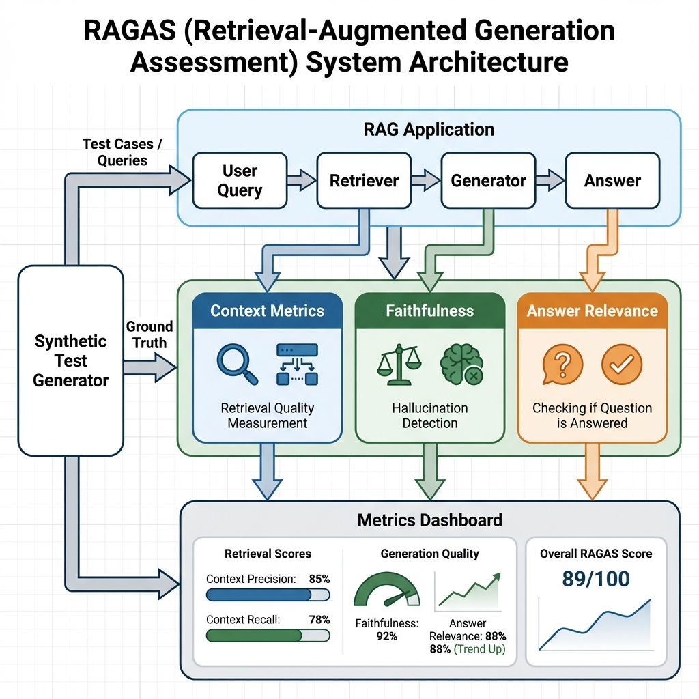

# Module 05: RAGAS - Scientific RAG Optimization

## 🎯 Welcome to Data-Driven RAG Development

You've built a RAG system. It works... sometimes. You chose:
- `chunk_size=1000` — "Because the tutorial said so"
- `chunk_overlap=200` — "Seems reasonable?"
- `top_k=5` — "More is better, right?"

**Question**: Are these the *right* values for YOUR data?

**Answer**: You have no idea. You're guessing.

**The problem**: Guesswork isn't engineering. You need **measurements**.

---

## 📊 What is RAGAS?

**RAGAS** (Retrieval-Augmented Generation Assessment) is a Python framework that brings **scientific rigor** to RAG evaluation.

Unlike other tools, RAG AS doesn't require ground truth labels. Instead, it measures component quality using the **RAG Triad**:

1. **Faithfulness**: Does the answer stick to retrieved context?
2. **Answer Relevance**: Does it actually answer the question?
3. **Context Quality**: Did we retrieve the right documents?

**Philosophy**: "If you can't measure it, you can't improve it."

### RAGAS Architecture



*Figure 1: RAGAS evaluation framework architecture showing the complete RAG assessment pipeline*

---

## 🔍 The RAG Evaluation Problem

### Traditional RAG Development
```
1. Build RAG pipeline
2. Try chunk_size=1000
3. Test with 3 examples
4. "Looks good!"
5. Deploy
6. 💥 Users complain answers are wrong
```

### The Missing Piece: Systematic Evaluation

**Question**: How do you know if `chunk_size=1000` is better than `chunk_size=500`?

**Traditional approach**:
- Manual testing (slow, expensive)
- Ground truth labels (requires experts, doesn't scale)
- Hope (not a strategy)

**RAGAS approach**:
- **Reference-free metrics** (no labels needed)
- **Synthetic test generation** (auto-create 100s of questions)
- **Hyperparameter optimization** (find the best config scientifically)

---

## 🧠 Theoretical Foundations

### The Reference-Free Revolution

**Problem with traditional metrics**:
```python
# Traditional approach
expected_answer = "Paris is the capital of France"  # ← Need human to write this
actual_answer = model.generate("What's the capital of France?")

accuracy = (expected_answer == actual_answer)  # Too strict!
```

**Challenges**:
- Expensive: Humans must label thousands of answers
- Brittle: "Paris" vs "The capital is Paris" both correct but not equal
- Doesn't scale: What about 10,000 documents?

---

**RAGAS solution** - Reference-free evaluation:
```python
# RAGAS approach
question = "What's the capital of France?"
context = ["Paris is the capital and largest city of France..."]
answer = model.generate(question, context)

# No ground truth needed!
faithfulness_score = ragas.evaluate_faithfulness(answer, context)
relevance_score = ragas.evaluate_relevance(question, answer)
```

**How it works**:
- **Faithfulness**: Uses LLM to check if answer claims are supported by context
- **Relevance**: Generates reverse questions from answer, compares to original
- **No human labels required**!

---

### The RAG Triad: Three Lenses on Quality

```
┌─────────────────────────────────────────┐
│         User Question                    │
│   "What's the CEO's compensation?"       │
└──────────────────┬──────────────────────┘
                   │
                   ▼
          ┌────────────────┐
          │   RETRIEVAL    │ ← Context Metrics
          └────────┬───────┘   (Did we find right docs?)
                   │
                   ▼
          ┌────────────────┐
          │   GENERATION   │ ← Faithfulness
          └────────┬───────┘   (Stuck to retrieved context?)
                   │
                   ▼
          ┌────────────────┐
          │    ANSWER      │ ← Answer Relevance
          └────────────────┘   (Addressed the question?)
```

Each stage can fail independently. RAGAS tests them all.

---

## 🆚 How RAGAS Compares to Alternatives

| Feature | RAGAS | DeepEval | Giskard | Manual Testing |
|---------|-------|----------|---------|---------------|
| **RAG-Specific** | ✅ Built for RAG | ⚠️ General LLM | ⚠️ Security focus | ❌ Generic |
| **Reference-Free** | ✅ No labels needed | ❌ Needs expectations | ✅ Model-graded | ❌ Need ground truth |
| **Test Generation** | ✅ Synthetic from docs | ❌ Manual | ✅ RAGET | ❌ All manual |
| **Hyperparam Tuning** | ✅ Built-in | ❌ No | ❌ No | ❌ No |
| **Component Testing** | ✅ Retriever + Generator | ⚠️ End-to-end | ⚠️ End-to-end | ❌ Black box |
| **Framework Agnostic** | ✅ LangChain, LlamaIndex | ✅ Any | ✅ Any | ✅ Any |
| **Cost** | Free (OSS) | Free (OSS) | Free (OSS) | Time $$$$ |

**RAGAS's Differentiator**: The ONLY tool built specifically for **optimizing** RAG retrieval through measurement.

---

### When to Use Each Tool

**Use RAGAS when**:
- Optimizing RAG chunk size, overlap, top_k
- Testing retrieval quality
- Generating test questions from your docs
- Comparing retriever algorithms
- Scientific hyperparameter tuning

**Use DeepEval when**:
- Testing complete LLM applications
- Pytest integration needed
- Custom business metrics
- General QA testing

**Use Giskard when**:
- Security scanning is priority
- Detecting vulnerabilities
- Compliance testing
- RAG security audit

**Use all three when**:
- Building production RAG (each tool covers different concerns)
- RAGAS → optimize retrieval
- DeepEval → test logic
- Giskard → secure system

---

## 🎓 What You'll Learn in This Module

By the end of this comprehensive module, you will:

### Core Skills
1. **Master the RAG Triad**: Faithfulness, Answer Relevance, Context Metrics
2. **Generate Synthetic Tests**: Auto-create 100+ questions from your docs
3. **Optimize Hyperparameters**: Find the best chunk_size scientifically
4. **Build Custom Metrics**: Domain-specific RAG evaluators
5. **Integrate Frameworks**: LangChain and LlamaIndex
6. **Deploy with Confidence**: From testing to production optimization

### Real-World Project
**Legal Search Optimizer**:
- 100-page legal documents
- Synthetic question generation (50 questions)
- Grid search: chunk_size × overlap × top_k
- Pareto frontier analysis
- Deployed optimal configuration

---

## 🚀 What You Will Achieve

### Concrete Outcomes

After completing this module, you will have:

1. **Scientific RAG Development**: Data, not guesswork
2. **Automated Test Generation**: 100s of questions from your docs
3. **Optimal Configuration**: Proven best hyperparameters
4. **Complete Evaluation Suite**: Production-ready testing
5. **Real Project**: Legal Search Optimizer in your portfolio

### Skills Acquired

- **Reference-Free Evaluation**: No labels needed
- **Synthetic Data Generation**: Evolutionary test creation
- **Hyperparameter Optimization**: Grid search, Bayesian opt
- **Component-Level Testing**: Test retriever AND generator separately
- **Framework Integration**: LangChain, LlamaIndex expertise
- **Production Deployment**: From tests to deployed config

### Projects You Can Build

1. **Research Paper Finder**: Academic RAG with optimized chunk sizes
2. **Medical Knowledge Base**: HIPAA-compliant with verified faithfulness
3. **Legal Case Search**: Multi-document reasoning optimization
4. **Corporate Wiki**: Employee Q&A with high context precision
5. **Customer Support**: Product docs with answer relevance validation

### Career Applications

- **ML Engineer Roles**: "Optimized RAG retrieval using RAGAS, improving context recall by 23%"
- **AI Research**: "Systematically evaluated 12 chunking strategies with synthetic test generation"
- **Data Science**: "Applied hyperparameter tuning to RAG, reducing hallucinations by 40%"
- **Senior Developer**: "Deployed production RAG with scientifically validated configuration"

---

## 💡 The RAGAS Philosophy: "Measure, Don't Guess"

### Before RAGAS
```
Developer A: "I think chunk_size=1000 is better"
Developer B: "No, 500 chunks give better results"
Manager: "Can you prove it?"
Both: "...not really"

Decision: Go with whoever is more senior 🤦
```

### After RAGAS
```
Developer: "I ran a grid search across chunk sizes 256-2048"
Results:
- chunk_size=512: Faithfulness=0.89, Context Recall=0.76
- chunk_size=1024: Faithfulness=0.82, Context Recall=0.81

Analysis: 512 is the Pareto optimal (best balance)

Decision: Deploy 512, backed by data ✅
```

---

## 🔬 A Taste of What's Coming: The Legal Search Example

Imagine you're building a legal research tool for a law firm.

**Challenge**: 100-page court verdicts. Where do you split them?
- Too small (256 tokens): Might split "Guilty" verdict from reasoning
- Too large (2048 tokens): LLM gets confused, hallucinates

**RAGAS Workflow**:

### Step 1: Generate Test Questions
```python
from ragas.testset.generator import TestsetGenerator

# Read court case PDFs
generator = TestsetGenerator()
testset = generator.generate_with_documents(
    documents=court_cases,
    test_size=50,
    distributions={"simple": 0.3, "reasoning": 0.4, "multi_context": 0.3}
)
```

**Generated questions** (automatic):
- Simple: "What was the verdict in Case #12345?"
- Reasoning: "Based on the dissenting opinion AND majority ruling, what was the legal precedent set?"
- Multi-context: "How does this verdict differ from the 2015 ruling on the same topic?"

### Step 2: Test Multiple Configurations
```python
configs = [
    {"chunk_size": 256, "overlap": 20},
    {"chunk_size": 512, "overlap": 50},
    {"chunk_size": 1024, "overlap": 100},
    {"chunk_size": 2048, "overlap": 200}
]

for config in configs:
    rag = build_rag_with_config(config)
    metrics = evaluate(rag, testset)
    results.append(metrics)
```

### Step 3: Analyze Results
```
chunk_size=256: High precision (0.91), Low recall (0.65) — TOO SPECIFIC
chunk_size=512: BALANCED (precision=0.88, recall=0.79, faithfulness=0.92) ✅
chunk_size=1024: Medium (precision=0.82, recall=0.84, faithfulness=0.85)
chunk_size=2048: Low faithfulness (0.76) — TOO MUCH CONTEXT
```

**Winner**: `chunk_size=512` is the Goldilocks zone!

**You just saved weeks** of manual testing and countless production hallucinations.

---

## 📊 Module Structure Preview

This module contains 11 comprehensive guides:

1. **Introduction** (this file) - The science of RAG eval
2. **Installation & Setup** - Python environment and frameworks
3. **Faithfulness Metric** - Hallucination detection deep dive
4. **Answer Relevance** - Question-answer alignment
5. **Context Metrics** - Precision, Recall, Relevance
6. **Synthetic Test Generation** - Evolutionary question creation
7. **Hyperparameter Optimization** - Grid search and Bayesian opt
8. **Advanced Metrics** - Custom evaluators
9. **Framework Integration** - LangChain & LlamaIndex
10. **Real-World Example** - Legal Search Optimizer
11. **Summary & Achievements** - Career applications

---

## 🎯 Success Metrics

By the end of this module, you'll be able to:

✅ **Explain** the RAG Triad to stakeholders  
✅ **Generate** 100+ synthetic test questions automatically  
✅ **Measure** faithfulness, relevance, and context quality  
✅ **Optimize** chunk_size, overlap, top_k with data  
✅ **Build** custom metrics for your domain  
✅ **Integrate** RAGAS with LangChain/LlamaIndex  
✅ **Deploy** optimized RAG to production  
✅ **Debug** RAG failures systematically  

---

## 💭 A Note on the Mindset

RAG optimization is like tuning a race car. You wouldn't guess at tire pressure or gear ratios - you'd measure lap times.

Similarly, don't guess at `chunk_size`. Measure retrieval quality.

> "In God we trust. All others must bring data." - W. Edwards Deming

RAGAS brings data to RAG development.

---

## 🚦 Next Steps

Ready to stop guessing and start measuring?

- **[Next: Installation & Setup](./02-installation.md)** - Get RAGAS running
- **[Building Block 1: Faithfulness](./03-faithfulness.md)** - Detect hallucinations
- **[Building Block 2: Answer Relevance](./04-answer-relevance.md)** - QA qual ity

---

*From guesswork to science. From hope to certainty. From amateur to professional.*

*Welcome to Module 05: RAGAS - Scientific RAG Optimization.* ✨
