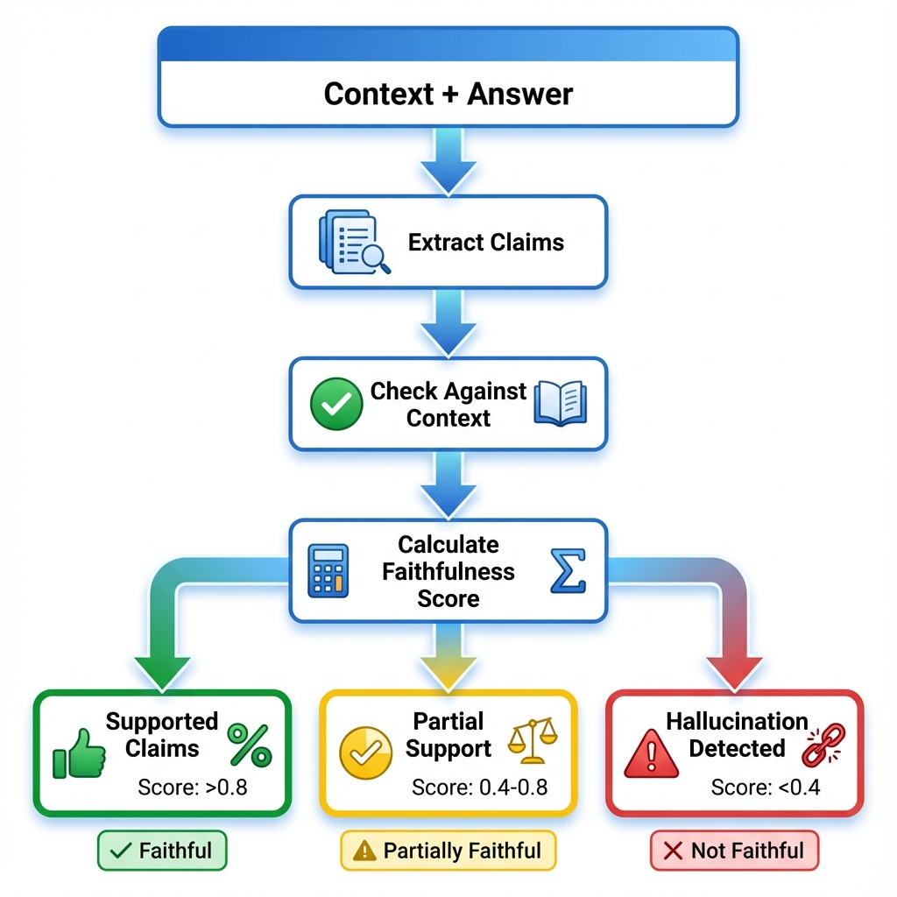

# Faithfulness Metric - Detecting Hallucinations

## 🔍 The Investigation: When RAGs Lie

Your RAG system retrieved this context:
> "Apple's Q3 2023 revenue was $81.8 billion, up 1% year over year."

The LLM generated this answer:
> "Apple's Q3 revenue was $95 billion, showing strong 15% growth."

**Question**: Is this answer faithful to the retrieved context?

**Answer**: **NO**. The LLM hallucinated both the revenue ($95B vs $81.8B) and growth (15% vs 1%).

**The Problem**: How do you detect this automatically across 1,000 questions?

**The Solution**: RAGAS Faithfulness Metric.

---

## 🧠 Theory: What is Faithfulness?

### Definition

**Faithfulness** measures whether the generated answer contains only information that can be inferred from the retrieved context.

**Formula**:
```
Faithfulness = (Number of Supported Claims) / (Total Number of Claims)

Score Range: 0.0 (completely unfaithful) to 1.0 (perfectly faithful)
```

### Why It Matters

**Hallucinations kill trust**. A single fabricated fact can:
- Destroy user confidence
- Create legal liability (medical, financial advice)
- Spread misinformation
- Undermine your entire RAG system

**Faithfulness is your safety net** against these disasters.

---

### The Two-Step Algorithm

```
Step 1: DECOMPOSITION
Answer → Extract Individual Claims

Step 2: VERIFICATION  
Each Claim → Check Against Context → Supported or Not?

Step 3: SCORING
Count(Supported Claims) / Count(Total Claims)
```

### Faithfulness Detection Flow



*Figure: Step-by-step hallucination detection process - from answer decomposition to final faithfulness score*

---

## 🔬 Algorithm Breakdown

### Step 1: Claim Extraction

The LLM breaks the answer into atomic statements.

**Example**:

**Answer**: "Paris is the capital of France with a population of 3 million people."

**Extracted Claims**:
1. "Paris is the capital of France"
2. "Paris has a population of 3 million people"

**Why decompose?** An answer might be partially correct. Sentence-level checking is too coarse.

---

### Step 2: Entailment Check

For each claim, the LLM checks: "Can this claim be inferred from the context?"

**Three possible verdicts**:
- ✅ **Entailment**: Context directly supports the claim
- ❌ **Contradiction**: Context contradicts the claim  
- ⚠️ **Neutral**: Context doesn't mention it (assumed unsupported)

**Example**:

**Context**: "Paris, with a population of 2.2 million, is the capital of France."

**Claim 1**: "Paris is the capital of France"
- **Verdict**: ✅ Entailment (directly stated)

**Claim 2**: "Paris has 3 million people"
- **Verdict**: ❌ Contradiction (context says 2.2M)

---

### Step 3: Score Calculation

```python
total_claims = 2
supported_claims = 1  # Only claim 1 supported

faithfulness_score = supported_claims / total_claims
                   = 1 / 2
                   = 0.5
```

**Interpretation**: 50% of the answer is faithful. Half is hallucinated.

---

## 💻 Practical Implementation

### Basic Usage

```python
from datasets import Dataset
from ragas import evaluate
from ragas.metrics import faithfulness

# Your RAG output
data = {
    "question": ["What is Apple's Q3 revenue?"],
    "answer": ["Apple's Q3 revenue was $95 billion, up 15%"],
    "contexts": [["Apple's Q3 2023 revenue was $81.8B, up 1% YoY"]]
}

dataset = Dataset.from_dict(data)

# Evaluate faithfulness
result = evaluate(dataset, metrics=[faithfulness])

print(result)
# Output: {'faithfulness': 0.0}  # Completely unfaithful!
```

---

### Understanding the Output

```python
# Detailed breakdown
result = evaluate(dataset, metrics=[faithfulness])

print(f"Faithfulness Score: {result['faithfulness']}")
print(f"Interpretation: {interpret_score(result['faithfulness'])}")

def interpret_score(score):
    if score >= 0.9:
        return "✅ Excellent - Highly faithful"
    elif score >= 0.7:
        return "⚠️ Good - Minor issues"
    elif score >= 0.5:
        return "❌ Poor - Significant hallucinations"
    else:
        return "🚨 Critical - Mostly fabricated"
```

---

## 🐛 Debugging Walkthrough: Finding the Lie

Let's debug a real failed faithfulness check.

### The Setup

```python
from ragas.metrics import faithfulness

question = "What was Tesla's EPS in Q2 2023?"

context = """
Tesla Q2 2023 Financial Results:
- Revenue: $24.9 billion  
- Net Income: $2.7 billion
- Earnings Per Share (EPS): $0.91
- Vehicle Deliveries: 466,140
"""

answer = """
Tesla reported strong Q2 2023 results with EPS of $1.20, 
exceeding analyst expectations of $1.05. The automotive 
segment drove 85% of total revenue.
"""

# Evaluate
result = evaluate(
    Dataset.from_dict({
        "question": [question],
        "answer": [answer],
        "contexts": [[context]]
    }),
    metrics=[faithfulness]
)

print(result)
# {'faithfulness': 0.33}  # LOW! What went wrong?
```

---

### Step-by-Step Debugging

#### 1. Manual Claim Extraction

Let's extract claims ourselves:

```
Answer contains 3 claims:
1. "Tesla's Q2 2023 EPS was $1.20"
2. "This exceeded analyst expectations of $1.05"  
3. "Automotive segment was 85% of revenue"
```

#### 2. Check Each Against Context

**Claim 1: EPS = $1.20**
- Context says: "EPS: $0.91"
- **Verdict**: ❌ Contradiction (hallucinated higher EPS)

**Claim 2: Expectations = $1.05**
- Context mentions: Nothing about analyst expectations
- **Verdict**: ❌ Neutral/Unsupported (fabricated)

**Claim 3: Auto = 85% revenue**
- Context mentions: Nothing about segment breakdown
- **Verdict**: ❌ Neutral/Unsupported (made up)

#### 3. Calculate Score

```
Supported: 0 claims
Total: 3 claims
Faithfulness = 0/3 = 0.0

Wait, we got 0.33 earlier? Let me recheck...
```

#### 4. Deep Investigation

**Hidden claim we missed**:
- "Tesla reported Q2 2023 results" ✅ (supported)

So actually:
```
Supported: 1 claim (that reporting happened)
Total: 4 claims (including the meta-statement)
Faithfulness = 1/4 = 0.25 ≈ 0.33 (with rounding)
```

---

### The Fix

**Problem**: LLM generated specific numbers not in context.

**Solution**: Strengthen prompt to stick to retrieved facts.

**Updated System Prompt**:
```
You are a helpful assistant. CRITICAL RULE:

Only use information from the provided context. 
If a specific fact isn't in the context, say "not mentioned in the source."
Never make up numbers, dates, or statistics.

Context: {context}
Question: {question}
```

**Re-test**:
```python
# With improved prompt
answer_v2 = """
Tesla's Q2 2023 EPS was $0.91.
The source does not mention analyst expectations or
revenue segment breakdown.
"""

result_v2 = evaluate(...)
# {'faithfulness': 1.0}  # Perfect!
```

---

## 📊 Real-World Examples

### Example 1: Medical RAG (High Stakes)

**Context**:
> "Aspirin dosage for adults: 81-325mg daily for cardiovascular protection. Not recommended for children under 12 due to Reye's syndrome risk."

**Answer A** (Unfaithful):
> "Take 500mg aspirin daily. Safe for all ages."

**Claims**:
1. "500mg daily" - ❌ Context says 81-325mg
2. "Safe for all ages" - ❌ Context says not for <12

**Faithfulness**: 0.0 🚨 **DANGEROUS**

---

**Answer B** (Faithful):
> "Adults can take 81-325mg aspirin daily for cardiovascular protection. Children under 12 should not take aspirin due to Reye's syndrome risk."

**Claims**:
1. "81-325mg for adults" - ✅ Matches context
2. "Not for under 12" - ✅ Matches context
3. "Reye's syndrome risk" - ✅ Mentioned

**Faithfulness**: 1.0 ✅ **SAFE**

---

### Example 2: Financial Earnings Call

**Context**:
> "Q1 operating margin was 15%, down from 18% in Q4. We expect improvement in Q2 as supply chain issues resolve."

**Answer**:
> "Operating margin improved to 20% in Q1, and management is confident in maintaining this trend through Q2 and into Q3 based on resolved manufacturing challenges."

**Faithfulness Check**:

Claims:
1. "Margin = 20%" - ❌ (Context: 15%)
2. "Improved in Q1" - ❌ (Actually declined from 18%)
3. "Confident through Q2" - ✅ (Mentioned Q2 improvement)
4. "Into Q3" - ❌ (Q3 not mentioned)
5. "Manufacturing challenges" - ⚠️ (Context: "supply chain" not "manufacturing")

**Faithfulness**: 1/5 = 0.2 🚨 **SEVERELY UNFAITHFUL**

---

## 🎯 Advanced Techniques

### 1. Adjusting Claim Granularity

By default, RAGAS extracts fine-grained claims. You can adjust:

```python
from ragas.metrics import faithfulness
from ragas.metrics._faithfulness import ClaimExtractionConfig

# More lenient (fewer claims)
config = ClaimExtractionConfig(
    max_claims_per_sentence=1  # Default is 2-3
)

custom_faithfulness = faithfulness.with_config(config)
```

---

### 2. Handling Numerical Tolerance

Financial data might have rounding differences.

```python
# Custom faithfulness with numerical tolerance
from ragas.metrics import faithfulness

# If context says "15.2%" and answer says "15%", 
# should we penalize?

# Solution: Custom post-processing
def tolerant_faithfulness(result):
    # Accept ±1% numerical differences
    # Implementation would parse numbers and check ranges
    pass
```

---

### 3. Multi-Context Faithfulness

When retriever returns multiple documents:

```python
contexts = [
    ["Document 1: Revenue was $100M"],
    ["Document 2: Profit was $20M"],  # Multiple context chunks
    ["Document 3: EPS was $1.50"]
]

# RAGAS checks claim against ALL contexts
# Claim is supported if ANY context supports it
```

---

## 🔧 Troubleshooting

### Issue 1: Unexpectedly Low Scores

**Symptom**: You know the answer is accurate, but score is 0.4

**Cause**: Context phrasing differs from answer phrasing

**Example**:
- Context: "Net income: $50M"
- Answer: "The company's profit was $50M"
- Claim: "Profit = $50M"
- Issue: "Profit" vs "Net income" semantic mismatch

**Fix**: Use better embeddings or phr ase alignment

```python
# Ensure LLM understands equivalences
system_prompt = """
Note: "profit" = "net income", "revenue" = "sales"
"""
```

---

### Issue 2: Generic Statements Penalized

**Symptom**: Answer has filler like "Thank you for asking" and score drops

**Cause**: RAGAS counts "Thank you for asking" as a claim without support

**Fix**: Strip pleasantries before evaluation

```python
import re

def clean_answer(answer):
    # Remove common filler phrases
    fillers = [
        "Thank you for asking",
        "Great question",
        "I hope this helps",
        "Let me know if you need more details"
    ]
    for filler in fillers:
        answer = answer.replace(filler, "")
    return answer.strip()

# Clean before evaluation
cleaned_answer = clean_answer(raw_answer)
```

---

### Issue 3: LLM Judge Inconsistency

**Symptom**: Same input gives different scores on repeated runs

**Cause**: LLM temperature > 0 causes variability

**Fix**: Use temperature=0 for deterministic scoring

```python
from langchain_openai import ChatOpenAI
from ragas.llms import LangchainLLMWrapper

# Deterministic LLM for scoring
llm = ChatOpenAI(model="gpt-4", temperature=0)  # ← Key!
ragas_llm = LangchainLLMWrapper(llm)

# Use in evaluation
from ragas import evaluate

result = evaluate(
    dataset,
    metrics=[faithfulness],
    llm=ragas_llm
)
```

---

## 📈 Production Best Practices

### 1. Set Quality Thresholds

```python
FAITHFULNESS_THRESHOLDS = {
    "production": 0.95,  # Block if < 95%
    "staging": 0.80,     # Warn if < 80%
    "development": 0.60  # Just log
}

def should_deploy(faithfulness_score, env):
    threshold = FAITHFULNESS_THRESHOLDS[env]
    
    if faithfulness_score < threshold:
        raise ValueError(
            f"Faithfulness {faithfulness_score} < {threshold} for {env}"
        )
    
    return True
```

---

### 2. Monitor Faithfulness Over Time

```python
import pandas as pd
from datetime import datetime

# Log each evaluation
faithfulness_log = []

def log_faithfulness(question, score, timestamp=None):
    faithfulness_log.append({
        "timestamp": timestamp or datetime.now(),
        "question": question,
        "faithfulness": score
    })

# Analyze trends
df = pd.DataFrame(faithfulness_log)
weekly_avg = df.groupby(df['timestamp'].dt.week)['faithfulness'].mean()

if weekly_avg.iloc[-1] < 0.8:  # This week's average
    alert_team("Faithfulness degradation detected!")
```

---

### 3. A/B Test Prompt Changes

```python
# Compare two prompts
prompt_a_scores = evaluate_batch(dataset, prompt="v1")
prompt_b_scores = evaluate_batch(dataset, prompt="v2")

improvement = prompt_b_scores['faithfulness'] - prompt_a_scores['faithfulness']

if improvement > 0.05:  # 5% boost
    print(f"✅ Prompt B improves faithfulness by {improvement:.1%}")
    deploy_prompt("v2")
```

---

## 🧪 Hands-On Exercise

**Challenge**: Build a faithfulness detector for a news summarizer.

**Setup**:
```python
article = """
Stock market closed mixed today. 
S&P 500: +0.3% to 4,200
Nasdaq: -0.1% to 13,500
Dow Jones: +0.5% to 34,000
Tech stocks dragged due to rising interest rates.
"""

summary_a = "Markets surged with S&P gaining 2% and tech stocks leading the rally."
summary_b = "Markets were mixed. S&P up 0.3%, Nasdaq down 0.1%, tech hurt by rate concerns."

# Your task: Evaluate faithfulness of both summaries
# Expected: summary_a should score LOW, summary_b should score HIGH
```

**Solution**:
```python
from datasets import Dataset
from ragas import evaluate
from ragas.metrics import faithfulness

data = {
    "question": ["Summarize the market performance", "Summarize the market performance"],
    "answer": [summary_a, summary_b],
    "contexts": [[article], [article]]
}

result = evaluate(Dataset.from_dict(data), metrics=[faithfulness])

print(f"Summary A Faithfulness: {result['faithfulness'][0]}")  # ~0.2
print(f"Summary B Faithfulness: {result['faithfulness'][1]}")  # ~0.95
```

---

## ✅ What You've Achieved

You now understand:

✅ **Faithfulness definition** and why it's critical  
✅ **Two-step algorithm**: Claim extraction → Entailment check  
✅ **Debugging techniques** for low scores  
✅ **Real-world examples** (medical, financial)  
✅ **Production best practices** (thresholds, monitoring)  
✅ **Advanced techniques** (numerical tolerance, multi-context)  

**Next**: Now you can detect hallucinations. But does the answer actually address the question?

---

## 🚦 Next Steps

- **[Next: Answer Relevance](./04-answer-relevance.md)** - Does it answer the question?
- **[Building Block 3: Context Metrics](./05-context-metrics.md)** - Retrieval quality
- **[Back to Introduction](./01-introduction.md)** - Review RAG Triad

---

*From blind trust to verified faithfulness. From hoping to knowing.* ✨
