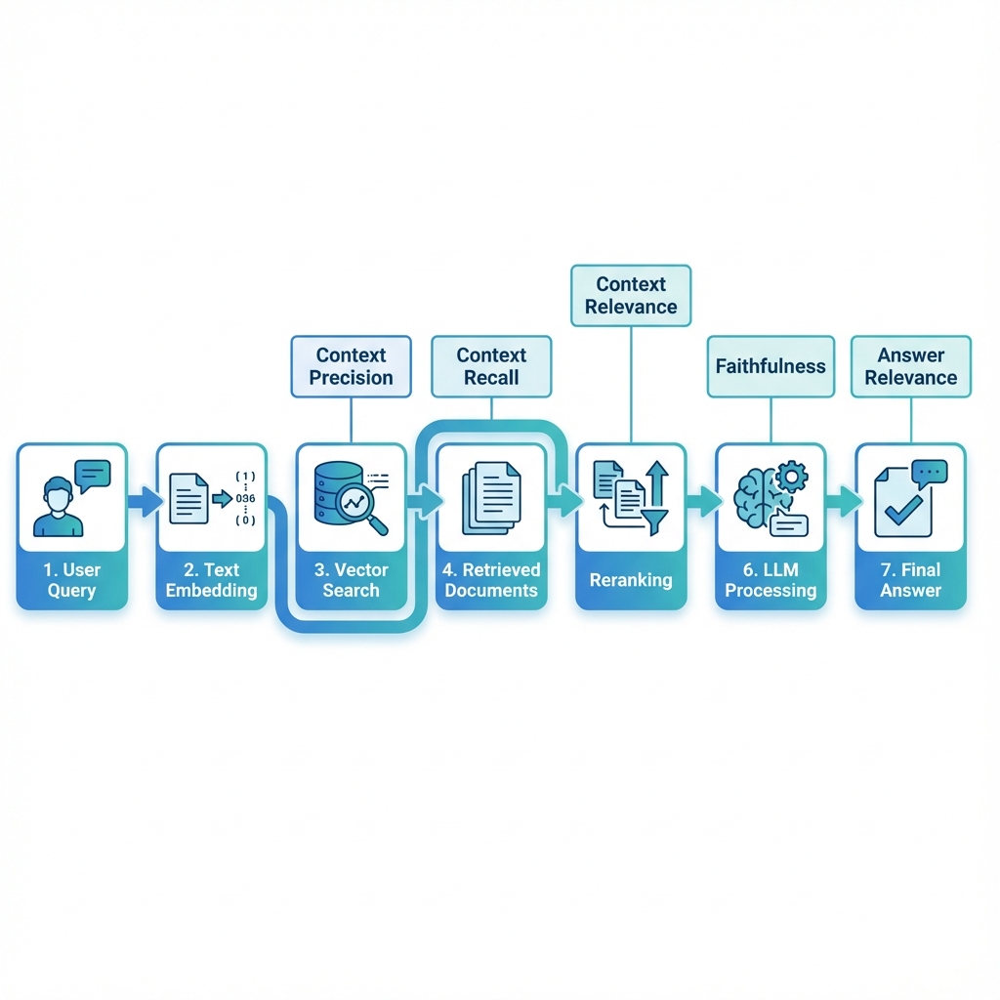
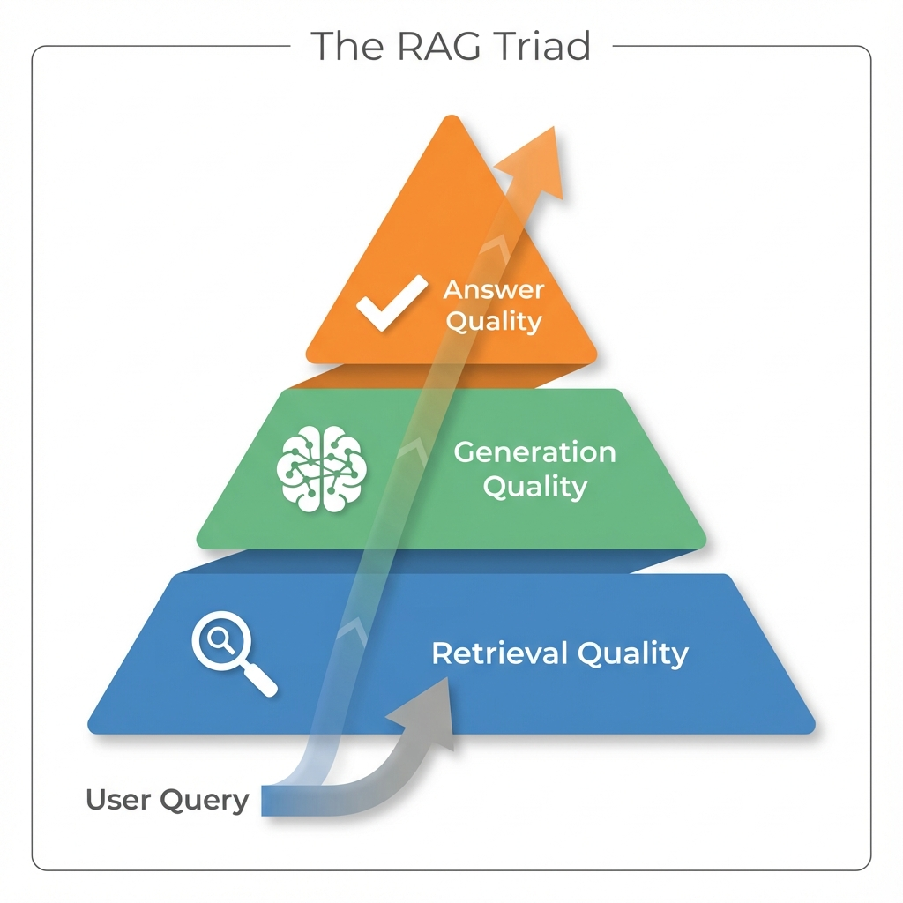

# Context Metrics - Measuring Retrieval Quality

## 🔍 The Investigation: The Retriever's Report Card

You ask: "What's the company's return policy?"

Your retriever fetches 5 documents:
1. ✅ Return Policy (2023) - **RELEVANT**
2. ❌ Shipping Policy - Different topic
3. ❌ Privacy Policy - Different topic  
4. ✅ Refund Guidelines - **RELEVANT**
5. ❌ Company History - Completely unrelated

**Questions**:
- How many of the 5 retrieved docs were actually useful? (**Precision**)
- Did we get ALL the relevant docs that exist? (**Recall**)
- Were the returned docs helpful for answering? (**Relevance**)

**The Problem**: How do you measure retrieval quality systematically?

**The Solution**: RAGAS Context Metrics.

---

## 🧠 Theory: The Three Context Metrics

We've covered two parts of the RAG Triad:
1. ✅ Faithfulness - Answer doesn't hallucinate
2. ✅ Answer Relevance - Answer addresses question

Now the third: **Did we retrieve the right documents?**

### The Context Metrics Trio

```
┌─────────────────────────────────────────┐
│         USER QUESTION                    │
└──────────────────┬──────────────────────┘
                   │
                   ▼
          ┌────────────────┐
          │   RETRIEVAL    │
          │  (Vector DB)   │
          └────────┬───────┘
                   │
        Retrieved: Docs 1,2,3,4,5
                   │
        ┌──────────┴─────────────────┐
        │                            │
        ▼                            ▼
   PRECISION                      RECALL
   "How many retrieved        "Did we get ALL
    docs are relevant?"        relevant docs?"
        │                            │
        └──────────┬─────────────────┘
                   ▼
              RELEVANCE
         "Are these docs useful
          for answering?"
```

---

## 📏 Metric 1: Context Precision

### Definition

**Context Precision** measures what fraction of retrieved documents are actually relevant to the question.

**Formula**:
```
Context Precision = (Relevant Retrieved Docs) / (Total Retrieved Docs)

Range: 0.0 (all noise) to 1.0 (perfect retrieval)
```

### Example

**Question**: "What's the CEO's salary?"

**Retrieved Documents** (top_k=5):
1. ✅ "CEO compensation: $2.5M base + $1M bonus" - RELEVANT
2. ❌ "Company founded in 1995" - NOT RELEVANT
3. ❌ "Product roadmap for Q3" - NOT RELEVANT
4. ✅ "Executive pay disclosure: CEO $3.5M total" - RELEVANT
5. ❌ "Office locations" - NOT RELEVANT

**Calculation**:
```python
relevant_docs = 2  # Docs 1 and 4
total_retrieved = 5

precision = 2 / 5 = 0.40
```

**Interpretation**: 40% precision - We got useful info, but also retrieved 60% noise.

---

### Why Precision Matters

**Low precision means**:
- LLM gets distracted by irrelevant context
- Higher costs (processing unnecessary tokens)
- Slower responses
- Increased hallucination risk (LLM might mix unrelated info)

**Goal**: Precision > 0.8 (at least 80% of retrieved docs are useful)

---

## 📏 Metric 2: Context Recall

### Definition

**Context Recall** measures what fraction of all relevant documents in your corpus were actually retrieved.

**Formula**:
```
Context Recall = (Relevant Retrieved Docs) / (Total Relevant Docs in Corpus)

Range: 0.0 (missed everything) to 1.0 (got it all)
```

### Example

**Question**: "What are all our data privacy policies?"

**All relevant docs in corpus**: 
- Privacy Policy (2023)
- GDPR Compliance Guide
- Data Retention Policy
- Cookie Policy
**Total**: 4 relevant docs exist

**Retrieved** (top_k=3):
- ✅ Privacy Policy (2023)
- ✅ GDPR Compliance Guide  
- ❌ Marketing Guidelines (not relevant)

**Retrieved relevant**: 2 out of 4

**Calculation**:
```python
retrieved_relevant = 2  # Privacy Policy + GDPR Guide
total_relevant = 4      # 4 docs exist about privacy

recall = 2 / 4 = 0.50
```

**Interpretation**: 50% recall - We found half the relevant docs but missed the other half.

---

### Why Recall Matters

**Low recall means**:
- Incomplete answers (missing critical info)
- User has to ask multiple times
- Potential compliance issues (didn't surface all policies)

**Goal**: Recall > 0.7 (retrieve at least 70% of relevant info)

---

### The Precision-Recall Tradeoff

There's often a tradeoff:

**High Precision, Low Recall** (top_k=2):
- Every retrieved doc is perfect
- But you missed some relevant docs

**Low Precision, High Recall** (top_k=20):
- You got all relevant docs
- But also lots of noise

**Sweet Spot**: Balance based on your use case

```
Medical RAG: Favor RECALL (can't miss critical info)
Search Engine: Favor PRECISION (users won't read 20 results)
Legal Research: Need BOTH (complete + clean)
```

---

## 📏 Metric 3: Context Relevance

### Definition

**Context Relevance** measures how useful the retrieved contexts are for answering the specific question.

**Different from Precision**: 
- Precision: "Is this doc about the right topic?"
- Relevance: "Does this doc help answer THIS question?"

**Formula**:
```
Context Relevance = LLM evaluates each retrieved doc
                    for usefulness in answering question

Range: 0.0 to 1.0 (average across all retrieved docs)
```

### Example

**Question**: "How do I reset my password using email?"

**Retrieved Docs**:

**Doc 1**: "Password reset via email: Click 'Forgot Password' and check your inbox"
- **Precision**: ✅ Relevant topic (password reset)
- **Relevance**: ✅ 1.0 - Directly answers the question

**Doc 2**: "Password reset via SMS: Text 'RESET' to 555-1234"
- **Precision**: ✅ Relevant topic (password reset)
- **Relevance**: ⚠️ 0.3 - Related but not what user asked (email method)

**Doc 3**: "Password requirements: Must be 8+ characters with special chars"
- **Precision**: ✅ Relevant topic (passwords)
- **Relevance**: ⚠️ 0.2 - Useful context but doesn't answer "how to reset"

**Calculation**:
```python
relevance_scores = [1.0, 0.3, 0.2]
context_relevance = mean(relevance_scores) = 0.50
```

---

## 💻 Practical Implementation

### Evaluating All Three Metrics

```python
from datasets import Dataset
from ragas import evaluate
from ragas.metrics import (
    context_precision,
    context_recall,
    context_relevancy
)

data = {
    "question": ["What's the return policy?"],
    "answer": ["You can return items within 30 days"],
    "contexts": [[
        "Return policy: 30-day return window",
        "Shipping takes 3-5 days",  # Not relevant to question
        "Founded in 2010"            # Not relevant
    ]],
    "ground_truth": ["Items can be returned within 30 days"]  # For recall
}

dataset = Dataset.from_dict(data)

result = evaluate(
    dataset,
    metrics=[context_precision, context_recall, context_relevancy]
)

print(result)
# Output:
# {
#     'context_precision': 0.33,  # 1/3 docs relevant
#     'context_recall': 1.0,      # Got the relevant doc
#     'context_relevancy': 0.45   # Mixed usefulness
# }
```

---

## 🎯 Complete RAG Evaluation Pipeline

Combining all metrics for comprehensive assessment:

```python
from ragas.metrics import (
    faithfulness,
    answer_relevancy,
    context_precision,
    context_recall,
    context_relevancy
)

# The complete RAG health check
all_metrics = [
    # Answer Quality
    faithfulness,        # No hallucinations
    answer_relevancy,    # Addresses question
    
    # Retrieval Quality
    context_precision,   # Retrieved docs are relevant
    context_recall,      # Got all relevant docs
    context_relevancy    # Retrieved docs are useful
]

result = evaluate(dataset, metrics=all_metrics)

def interpret_rag_health(result):
    """Comprehensive RAG assessment"""
    
    issues = []
    
    # Check each dimension
    if result['faithfulness'] < 0.8:
        issues.append("⚠️ Hallucination risk - answers not grounded in context")
    
    if result['answer_relevancy'] < 0.7:
        issues.append("⚠️ Answer quality - not addressing questions directly")
    
    if result['context_precision'] < 0.6:
        issues.append("⚠️ Retrieval noise - too many irrelevant docs")
    
    if result['context_recall'] < 0.7:
        issues.append("⚠️ Incomplete retrieval - missing relevant docs")
    
    if result['context_relevancy'] < 0.7:
        issues.append("⚠️ Retrieved docs not useful for answering")
    
    if not issues:
        return "✅ RAG system is healthy!"
    
    return "\n".join(issues)

print(interpret_rag_health(result))
```

---

## 📊 Real-World Examples

### Example 1: Customer Support RAG

**Scenario**: Chat bot for tech support

**Question**: "How do I connect to WiFi on iPhone?"

**Retrieved Docs** (top_k=4):
1. ✅ "iOS WiFi setup: Settings > WiFi > Select network"
2. ✅ "Troubleshooting iPhone WiFi issues"
3. ❌ "Android WiFi setup" (Wrong platform)
4. ❌ "Company WiFi password policy" (Different concern)

**Metrics**:
- **Precision**: 2/4 = 0.50 ⚠️ (Half the docs are wrong platform/topic)
- **Recall**: 2/2 = 1.0 ✅ (Got both iPhone WiFi docs that exist)
- **Relevance**: (1.0 + 0.8 + 0.1 + 0.2) / 4 = 0.53 ⚠️

**Diagnosis**: Retrieval is getting Android docs mixed in. Need better filtering.

**Fix**: Add metadata filter for `platform="iOS"`

---

### Example 2: Legal Document Search

**Scenario**: Lawyer searching case law

**Question**: "Precedents for API copyright cases in 9th Circuit"

**Retrieved** (top_k=5):
1. ✅ Oracle v. Google (9th Circuit, API copyright)
2. ✅ Google v. Oracle Supreme Court appeal
3. ❌ Random copyright case (3rd Circuit, not APIs)
4. ❌ Patent case (wrong legal area)
5. ✅ Cisco v. Arista (9th Circuit, APIs)

**Metrics**:
- **Precision**: 3/5 = 0.60 ⚠️ (Some noise)
- **Recall**: 3/5 = 0.60 ⚠️ (Missed 2 relevant cases)
- **Relevance**: 0.70 (Decent but not great)

**Diagnosis**: Missing relevant cases (low recall) AND getting some noise (mediocre precision)

**Fix**: 
- Increase top_k to improve recall
- Add metadata filters (circuit, legal_area) to improve precision

---

### Example 3: Medical Knowledge Base

**Question**: "Side effects of metformin"

**Retrieved** (top_k=6):
1. ✅ "Metformin: Common side effects (nausea, diarrhea)"
2. ✅ "Metformin: Rare side effects (lactic acidosis)"
3. ✅ "Drug interactions with metformin"
4. ✅ "Metformin dosing guidelines"
5. ❌ "Diabetes overview" (Too general)
6. ❌ "Insulin vs metformin" (Different focus)

**Metrics**:
- **Precision**: 4/6 = 0.67 ⚠️
- **Recall**: 4/4 = 1.0 ✅ (Got all side effect docs)
- **Relevance**: 0.75 ⚠️ (Dosing is related but not what user asked)

**Decision**: This is acceptable for medical (recall is critical, precision is decent)

---

## 🔧 Optimization Strategies

### Strategy 1: Tuning top_k

**Problem**: How many documents should you retrieve?

**Experiment**:
```python
# Test different top_k values
configs = [
    {"top_k": 3},
    {"top_k": 5},
    {"top_k": 10},
    {"top_k": 20}
]

results = []
for config in configs:
    retriever = build_retriever(**config)
    metrics = evaluate_retriever(retriever, test_questions)
    results.append({
        "top_k": config["top_k"],
        "precision": metrics['context_precision'],
        "recall": metrics['context_recall']
    })

# Find optimal k
import pandas as pd
df = pd.DataFrame(results)
print(df)
```

**Sample Output**:
```
   top_k  precision  recall
0      3       0.85    0.60  # High precision, but missing docs
1      5       0.75    0.75  # Balanced
2     10       0.55    0.90  # Got most docs, but noisy
3     20       0.35    0.95  # Everything but too much noise
```

**Decision**: top_k=5 is the sweet spot (balanced precision-recall)

---

### Strategy 2: Hybrid Search

**Problem**: Keyword search vs semantic search

**Approach**: Combine both

```python
# Hybrid: BM25 (keyword) + Vector (semantic)

def hybrid_search(query, top_k=5, alpha=0.7):
    """
    alpha: Weight for vector search (1-alpha for BM25)
    """
    vector_results = vector_search(query, top_k=top_k*2)
    keyword_results = bm25_search(query, top_k=top_k*2)
    
    # Weighted combination
    combined_scores = {}
    for doc in vector_results:
        combined_scores[doc.id] = alpha * doc.score
    
    for doc in keyword_results:
        if doc.id in combined_scores:
            combined_scores[doc.id] += (1-alpha) * doc.score
        else:
            combined_scores[doc.id] = (1-alpha) * doc.score
    
    # Return top_k
    sorted_docs = sorted(combined_scores.items(), key=lambda x: x[1], reverse=True)
    return sorted_docs[:top_k]

# Experiment with alpha
for alpha in [0.3, 0.5, 0.7, 0.9]:
    results = evaluate_with_alpha(alpha)
    print(f"Alpha={alpha}: Precision={results['precision']}, Recall={results['recall']}")
```

---

### Strategy 3: Metadata Filtering

**Problem**: Retrieving wrong document types

**Solution**: Add metadata filters

```python
from langchain.vectorstores import FAISS
from langchain.embeddings import OpenAIEmbeddings

# Add metadata when indexing
documents = [
    Document(
        page_content="iOS WiFi setup...",
        metadata={"platform": "iOS", "category": "networking"}
    ),
    Document(
        page_content="Android WiFi setup...",
        metadata={"platform": "Android", "category": "networking"}
    )
]

vectorstore = FAISS.from_documents(documents, OpenAIEmbeddings())

# Filter during retrieval
def filtered_retrieve(question, platform):
    results = vectorstore.similarity_search(
        question,
        k=5,
        filter={"platform": platform}  # Only get iOS docs
    )
    return results

# Much better precision!
results = filtered_retrieve("How to connect WiFi?", platform="iOS")
```

---

## 📈 The Pareto Frontier

When optimizing retrieval, you often face tradeoffs:

```
         ^ Recall
         |
    1.0  |     * (top_k=20, low precision)
         |    *
    0.8  |   *
         |  * (top_k=5, balanced) ← OPTIMAL
    0.6  | *
         |*  (top_k=2, high precision)
    0.4  *
         |
    0.0  +---------------------------→ Precision
         0.4   0.6   0.8   1.0
```

**Goal**: Find the point on the curve that best fits your use case.

**Code**:
```python
import matplotlib.pyplot as plt

# Run experiments
results = []
for k in range(1, 21):
    metrics = evaluate_with_topk(k)
    results.append({
        "top_k": k,
        "precision": metrics['context_precision'],
        "recall": metrics['context_recall']
    })

df = pd.DataFrame(results)

# Plot Pareto frontier
plt.figure(figsize=(10, 6))
plt.scatter(df['precision'], df['recall'], s=df['top_k']*10)
plt.xlabel('Context Precision')
plt.ylabel('Context Recall')
plt.title('Precision-Recall Tradeoff')

for i, row in df.iterrows():
    plt.annotate(f"k={row['top_k']}", (row['precision'], row['recall']))

plt.grid(True)
plt.show()

# Find optimal (closest to top-right corner)
df['distance_to_ideal'] = ((1 - df['precision'])**2 + (1 - df['recall'])**2)**0.5
optimal = df.loc[df['distance_to_ideal'].idxmin()]

print(f"Optimal top_k: {optimal['top_k']}")
```

---

## 🧪 Hands-On Exercise

**Challenge**: Optimize retrieval for a product FAQ

**Setup**:
```python
# 50 product FAQ documents in your vector store
questions = [
    "How long is the battery life?",
    "What's the return policy?",
    "Is it waterproof?",
    # ... 47 more
]

# Task 1: Find optimal top_k
# - Test k in [3, 5, 7, 10, 15]
# - Measure precision and recall
# - Plot results

# Task 2: Try hybrid search
# - Compare pure vector vs hybrid (BM25 + vector)
# - Which gives better precision?

# Task 3: Add metadata filtering
# - Category: ["technical", "policy", "features"]
# - Does filtering improve precision?
```

---

## ✅ What You've Achieved

You now understand:

✅ **Context Precision** - Filtering retrieval noise  
✅ **Context Recall** - Finding all relevant docs  
✅ **Context Relevance** - Usefulness for answering  
✅ **Precision-Recall tradeoff** - Balancing retrieval  
✅ **Optimization strategies** (top_k tuning, hybrid search, filtering)
Let's see how these metrics work together in a complete RAG evaluation.

### RAG Pipeline with All Metrics



*Figure: Complete RAG pipeline showing where each RAGAS metric is applied throughout the system*

### Complete Pipeline Example
✅ **Complete RAG evaluation** - All 5 metrics together  
✅ **Pareto frontier analysis** - Finding optimal config  

**The RAG Triad** works together:

1.  **Faithfulness** (from Module 3) - No hallucinations
2.  **Answer Relevance** (from Module 4) - Actually answers the question
3.  **Context Quality** (this module) - Retrieved the right documents

### The RAG Triad Visualization



*Figure: The three dimensions of RAG quality - all must be optimized for production-grade systems*

All three must be high for a working RAG system.

---

## 🚦 Next Steps

You've mastered the evaluation metrics. But where do test questions come from?

- **[Next: Synthetic Test Generation](./06-synthetic-test-generation.md)** - Auto-create 100+ questions
- **[Back: Answer Relevance](./04-answer-relevance.md)** - Review QA quality
- **[Real Example](./10-real-world-example.md)** - See it all in action

---

*From blind retrieval to measured, optimized information gathering.* ✨
