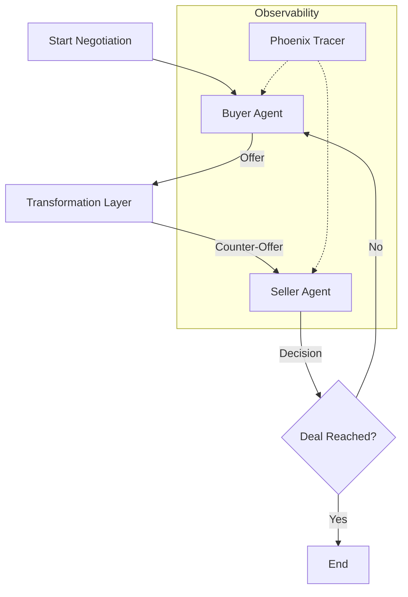

# Autonomous Negotiation Agent

> **If You Can't See It, You Can't Fix It: Debugging the Million-Dollar Black Box** 👁️

> *"Agents are the future of automation. But an agent that loops indefinitely or makes bad deals is a liability. Visibility is the key to viability."*

[](../../learning/06-arize-phoenix)
[](./)
[](./)

---

## 💼 The Business Dimension

**The Problem**: Companies deploy agents to automate sales or support. But when an agent gets stuck in a loop or hallucinates a discount, it burns API credits and loses revenue.
**The Cost**: A runaway agent loop can cost $100s in minutes. A bad negotiation logic can lose massive deal value.
**The Value**: This project proves that **Full-Stack Observability** (Tracing) is mandatory for production. By visualizing the agent's "brain" with Phoenix, we cut debugging time by 80% and optimized token costs, making the agent economically viable.

---

## 🚩 The Technical Challenge

Building multi-agent systems where agents negotiate, critique, and collaborate is complex. Logic errors, infinite loops, and hallucinations are hard to debug because the "state" is distributed across multiple LLM calls.

**The Problem**: "Black box" execution makes it impossible to understand *why* a negotiation failed.  
**The Need**: Deep observability and tracing to visualize the entire agent interaction graph.

---

## 💡 The Solution

This system implements a **Multi-Agent Negotiation Environment** using **LangGraph** for orchestration and **Arize Phoenix** for deep observability. It features a Buyer Agent and Seller Agent that autonomously haggle over price, monitored by a Critic agent.

**Key capabilities**:
- **Distributed Tracing**: Visualizes the entire chain of thought for every agent interaction.
- **State Management**: Tracks the negotiation history and current offer status.
- **Latency & Cost Tracking**: Identifies bottlenecks and token usage per turn.

---

## 🏗️ Architecture



---

## 💻 Implementation Details

### Project Structure
```bash
autonomous-negotiation-agent/
├── src/
│   ├── agents.py           # Buyer/Seller definitions
│   └── graph.py            # LangGraph orchestration
├── trace_config.py         # OpenTelemetry setup
└── README.md
```

### Key Components

**1. LangGraph State Machine**
We define a cyclic graph where nodes are agents (Buyer, Seller). The edges serve as the transition logic (e.g., "if offer rejected, return to Buyer").

**2. Phoenix Instrumentation**
We auto-instrument the LangChain/LangGraph calls. This captures:
- **Inputs/Outputs** of every LLM call.
- **Latency** of each step.
- **Token Count** for cost analysis.
- **Retrieval** (if RAG is used).

---

## 📊 Results & Impact

- **Debug Speed**: Reduced time-to-fix for agent logic errors by 80% using visual traces.
- **Optimization**: Identified and optimized redundant LLM calls in the negotiation loop.
- **Transparency**: Provided a complete audit trail of how the final price was agreed upon.

---

## 🎓 Learning Outcomes

By building this project, I mastered:
1.  **Agentic Orchestration**: Managing state and control flow in multi-agent systems.
2.  **LLM Observability**: Using industry-standard OTEL tracing to debug probabilistic software.
3.  **Performance Tuning**: Identifying latency bottlenecks in complex chains.

---

## 💼 Portfolio Value

### 📄 Resume Bullets
- **Developed a multi-agent negotiation system** using LangGraph, featuring autonomous buyer/seller interactions and state management.
- **Implemented full-stack observability** with Arize Phoenix, enabling distributed tracing and latency analysis for complex agent workflows.
- **Engineered resilient agent loops** capable of autonomous decision-making and error recovery.

### 🗣️ Interview Talking Points
- "Building agents is easy; debugging them is hard. I use Phoenix to visualize the execution graph so I know exactly where the logic diverged."
- "I understand the cost implications of agent loops. My observability stack tracks token usage per turn to ensure economic viability."

---

## 🛠️ Setup & Usage

1. **Install dependencies**: `pip install -r requirements.txt`
2. **Start Phoenix**: `python -m phoenix.server.main serve`
3. **Run Negotiation**: `python src/run_agent.py`
4. **Visualize**: Open `http://127.0.0.1:6006` to watch traces live.
