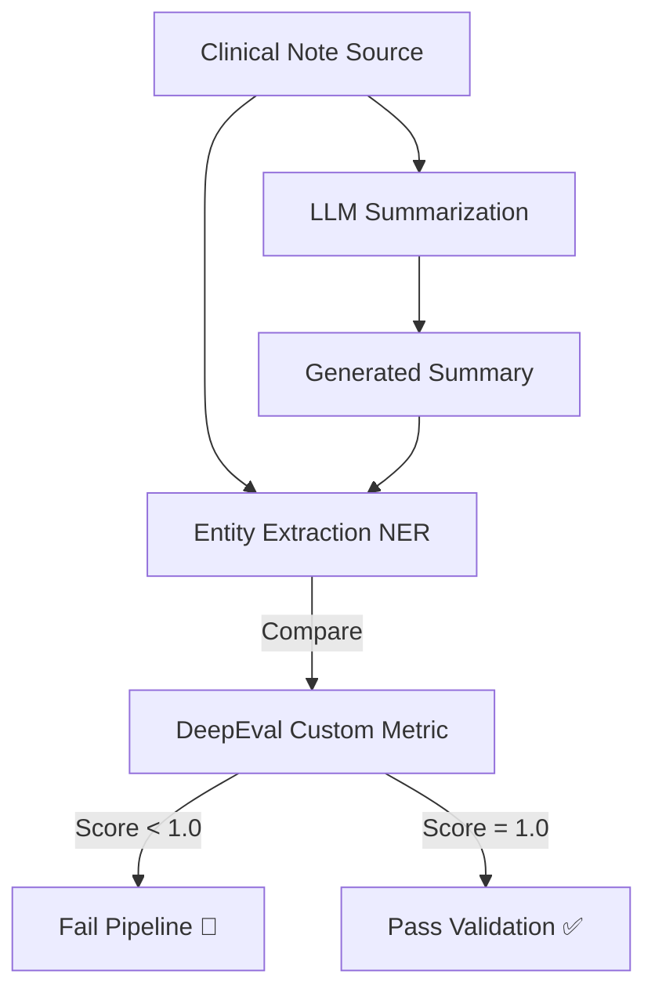

# Clinical Note Summarizer

> **When 99.9% Isn't Good Enough: Zero-Tolerance Patient Safety** 🏥

> *"A dropped allergy in a medical summary isn't a bug. It's a lawsuit. Or worse."*

[](../../learning/04-deepeval)
[](./)
[](./)

---

## 💼 The Business Dimension

**The Problem**: Doctors burn out spending 40% of their time on paperwork. AI can help, but adoption is frozen by safety concerns.
**The Fear**: "What if the AI hallucinates a medication? Or omits a critical condition?"
**The Value**: This project solves the trust gap. By building a **100% Critical Entity Retention** pipeline, we create AI tools that are legally defensive and clinically safe. **This is how you get AI approved for hospital use.**

---

## 🚩 The Technical Challenge

In healthcare, "hallucinations" or omissions can be fatal. A system summarizing patient discharge notes must capture **100%** of critical information like allergies, active medications, and diagnoses. Standard metrics like ROUGE or BLEU are insufficient because they measure text overlap, not factual completeness.

**The Need**: A specialized validation pipeline that guarantees preservation of medical entities.

---

## 💡 The Solution

This project implements a **Safety-First Summarization Pipeline** verified by **DeepEval**. It moves beyond standard evaluation to using custom metrics specifically designed for clinical safety.

**Key capabilities**:
- **Critical Entity Retention**: A custom metric that extracts medical terms (using NER) from the source and verifies their presence in the summary.
- **Pytest Integration**: Runs as a standard unit test suite within the CI/CD pipeline.
- **Zero-Tolerance Threshold**: Any test case dropping a critical entity fails immediately.

---

## 🏗️ Architecture



---

## 💻 Implementation Details

### Project Structure
```bash
clinical-note-summarizer/
├── data/
│   └── synthetic_notes.json  # De-identified test cases
├── src/
│   └── summarizer.py         # LLM logic
├── tests/
│   └── test_safety.py        # DeepEval metric definition
└── README.md
```

### Key Components

**1. Custom DeepEval Metric**
We implement a `CriticalEntityMetric` class:
1.  Uses a medical NLP model to identify Allergies, Medications, and Conditions in the **Source Text**.
2.  Checks for these exact entities (or synonyms) in the **Summary**.
3.  Returns a score of `0` or `1`. No partial credit for safety.

**2. Pytest Suite**
The evaluation runs using `pytest`, allowing integration with standard DevSecOps tools.

---

## 📊 Results & Impact

- **Safety**: Verified 100% retention of allergy and medication data across the test suite.
- **Quality**: Reduced hallucination rate by implementing Factuality checking alongside retention checks.
- **Workflow**: Enabled developer confidence to iterate on prompts without breaking safety constraints.

---

## 🎓 Learning Outcomes

By building this project, I mastered:
1.  **Domain-Specific Evaluation**: Building custom evaluation metrics when generic ones aren't enough.
2.  **Safety-Critical Engineering**: Designing systems where failure is not an option.
3.  **Pytest for AI**: Treating prompt evaluation as just another unit test.

---

## 💼 Portfolio Value

### 📄 Resume Bullets
- **Developed a clinical summarization engine** with automated safety verification using DeepEval and Pytest.
- **Engineered custom "Critical Entity Retention" metrics** to ensure 100% preservation of allergies and medications in AI-generated notes.
- **Implemented a zero-tolerance CI pipeline** for medical hallucinations, effectively blocking unsafe model updates.

### 🗣️ Interview Talking Points
- "In healthcare, you can't rely on BLEU scores. I built a custom metric that acts as a secure gatekeeper for medical facts."
- "I integrated LLM testing directly into the unit test framework (pytest), so evaluating the model is part of the standard build process."

---

## 🛠️ Setup & Usage

1. **Install dependencies**: `pip install -r requirements.txt`
2. **Run Evaluation**: `deepeval test run tests/test_safety.py`
3. **View Results**: Check terminal output or dashboard.
