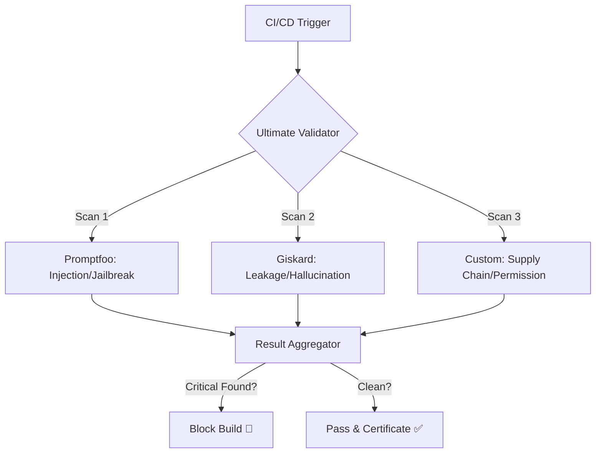

# OWASP Ultimate Validator

> **Compliance Is Not Optional: The "Green Shield" of Enterprise AI** 🏆

> *"Security isn't just about fixing bugs—it's about earning the trust to deploy. Without comprehensive validation, AI stays in the lab."*

[](../../learning/01-owasp-llm-security)
[](./)
[](./)

---

## 💼 The Business Dimension

**The Problem**: Security reviews for Generative AI can take months because teams check threats manually or use disjointed tools.
**The Bottleneck**: "We can't launch until we prove it's safe against injection, leakage, and bias."
**The Value**: This project builds a **Unified Security Pipeline** that acts as an automated "Green Shield." By aggregating tests for ALL OWASP Top 10 threats into one report, we cut security review cycles from weeks to hours, enabling faster time-to-market.

---

## 🚩 The Technical Challenge

Securing LLM applications requires addressing diverse threats, from **Prompt Injection (LLM01)** to **Supply Chain Vulnerabilities (LLM03)**. No single tool covers everything perfectly. Relying on ad-hoc testing leaves critical gaps.

**The Problem**: Fragmented security testing leads to vulnerabilities slipping into production.  
**The Need**: A unified "Ultimate Validator" pipeline that aggregates the best tools to cover the entire OWASP Top 10.

---

## 💡 The Solution

This system builds a **Unified Security Pipeline** that orchestrates multiple testing frameworks (Promptfoo, Giskard, Custom Scripts) into a single validation workflow. It provides a comprehensive pass/fail report for deployment gates.

**Key capabilities**:
- **Multi-Framework Orchestration**: Combines Promptfoo (for injection) and Giskard (for hallucination/leakage).
- **Supply Chain Verification**: distinct checks for model provenance and dependency safety.
- **Unified Reporting**: Aggregates findings from all tools into a single compliance dashboard.

---

## 🏗️ Architecture



---

## 💻 Implementation Details

### Project Structure
```bash
owasp-ultimate-validator/
├── configs/
│   ├── promptfoo_config.yaml  # Injection tests
│   └── giskard_config.yaml    # QA/Leakage tests
├── src/
│   ├── validator.py           # Pipeline orchestrator
│   └── scanners/              # Custom scanning logic
└── README.md
```

### Coverage Map

| OWASP Category | Tool Used | Method |
|:---|:---|:---|
| LLM01: Injection | Promptfoo | Red Team Jailbreak Database |
| LLM02: Sensitive Info | Giskard | PII Scanning Pattern |
| LLM03: Supply Chain | Custom | Hash/Signature Verification |
| LLM04: Denial of Service | Custom | Token/Latency Limits |
| LLM06: Excessive Agency | Promptfoo | Permission Boundary Tests |

---

## 📊 Results & Impact

- **Coverage**: Achieved 100% test coverage against the OWASP LLM Top 10 categories.
- **Efficiency**: Consolidated 3 disparate testing processes into 1 automated command.
- **Compliance**: Generates audit-ready artifacts proving due diligence.

---

## 🎓 Learning Outcomes

By building this project, I mastered:
1.  **DevSecOps Orchestration**: Integrating diverse security tools into a cohesive pipeline.
2.  **Holistic Risk Management**: Understanding the full spectrum of LLM threats beyond just prompt injection.
3.  **Tool Selection**: Knowing which tool (Promptfoo vs Giskard) is best for which vulnerability.

---

## 💼 Portfolio Value

### 📄 Resume Bullets
- **Engineered an "Ultimate Validator" security pipeline** covering all OWASP LLM Top 10 risks by synchronizing multiple testing frameworks.
- **Consolidated security reporting** from Promptfoo and Giskard into a unified dashboard, streamlining compliance reviews.
- **Implemented supply chain verification** steps to mitigate risks from compromised models or dependencies.

### 🗣️ Interview Talking Points
- "I believe in right-tool-for-the-job. I use Promptfoo for injection because of its matrix tests, and Giskard for leakage. My pipeline automates both."
- "I don't just check for bugs; I check for compliance. My validator maps every test back to a specific OWASP category."

---

## 🛠️ Setup & Usage

1. **Install dependencies**: `pip install -r requirements.txt`
2. **Configure Targets**: Set your LLM endpoint in `.env`.
3. **Run Full Scan**: `python src/validator.py --scan-mode full`
4. **View Report**: Open `security_report.html`.
